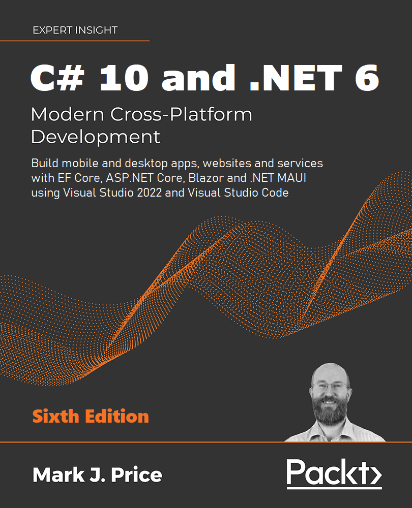

# Repository for the Packt Publishing book
## C# 10 and .NET 6 - Modern Cross-Platform Development, Sixth Edition

To be published in November 2021.

Order the previous edition today!
- [Packt](https://www.packtpub.com/product/c-9-and-net-5-modern-cross-platform-development-fifth-edition/9781800568105)
- [Amazon.com](https://www.amazon.com/dp/180056810X/)
- [Amazon.co.uk](https://www.amazon.co.uk/dp/180056810X/)

Author page on Amazon: https://www.amazon.com/Mark-J-Price/e/B071DW3QGN/ 

## I'm listening to my readers - please complete this survey

If you have come to this GitHub repository then you're probably either a reader of an earlier edition of my book, or you're a potential reader of this and future editions. I would like to hear your opinion about what topics and tools I should cover in the sixth edition. Please tell me what you want by completing the survey at the following link: 

https://www.surveymonkey.co.uk/r/6GQWPX9

## Important
Corrections for typos and other mistakes, and improvements like refactoring code.
- [Errata & Improvements](errata.md)
- [Online step-by-step instructions for code editors](docs/README.md)
- General feedback survey (coming soon): comment box and star rating. For now, feel free to email me at Gmail using my GitHub username.
- Detailed feedback survey (coming soon): 10 questions; 3 minutes.

## Online materials
Supplementary book materials available to download as PDFs: 
- Color images of the screenshots/diagrams used in this book (coming November 2021)
- Appendix A, Answers to the Test Your Knowledge Questions (coming November 2021)
- The [cs9dotnet5-extras](https://github.com/markjprice/cs9dotnet5-extras) repository contains articles that support the book, for example, instructions for using a Raspberry Pi to complete the coding tasks in the book.

## Interviews with me
Podcast interviews with me:
- [The .NET Core Podcast](https://dotnetcore.show/episode-44-learning-net-core-with-mark-j-price/)
- [Yet Another Podcast with Jesse Liberty](http://jesseliberty.com/2020/02/23/mark-price-c-net-core/)
- [Packt Podcasts](https://soundcloud.com/packt-podcasts/csharp-8-dotnet-core-3-the-evolution-of-the-microsoft-ecosystem)

Written interviews with me:
- [C# 9 and .NET 5: Book Review and Q&A](https://www.infoq.com/articles/book-interview-mark-price/?itm_source=infoq&itm_campaign=user_page&itm_medium=link)
- [Q&A with Episerver's Mark J. Price, author of C# 9 and .NET 5 - Modern Cross-Platform Development](https://www.episerver.com/articles/q-and-a-with-mark-price)

## Book cover

