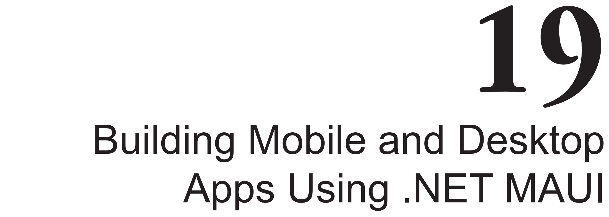
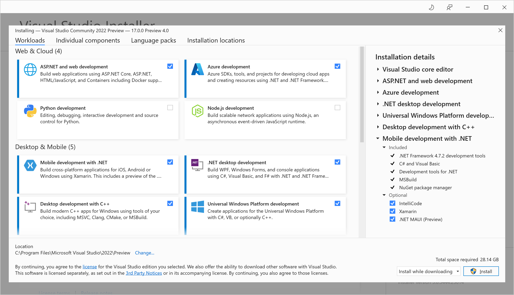
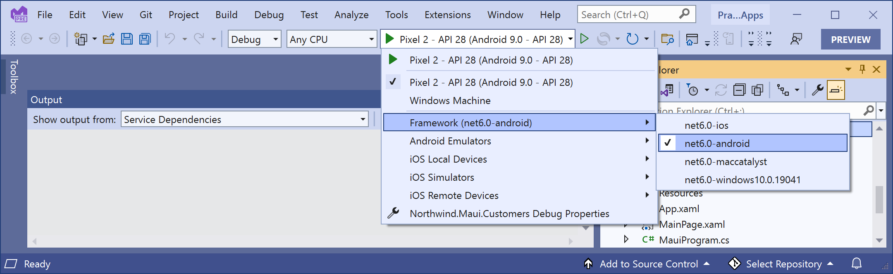
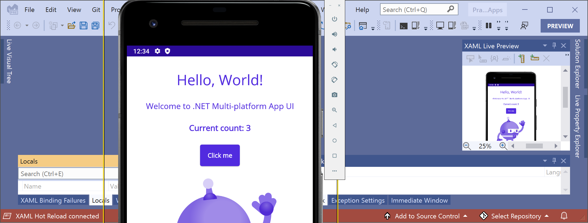
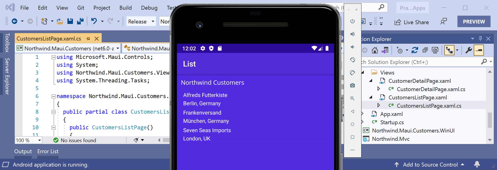
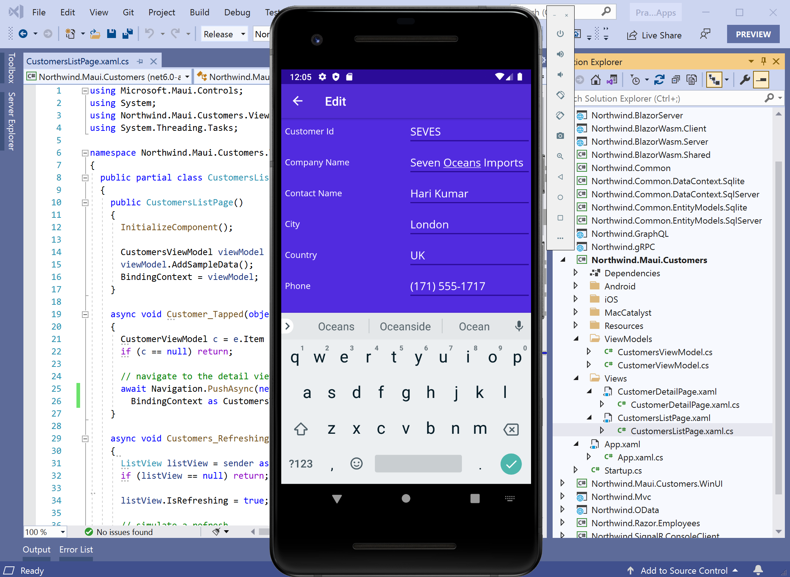
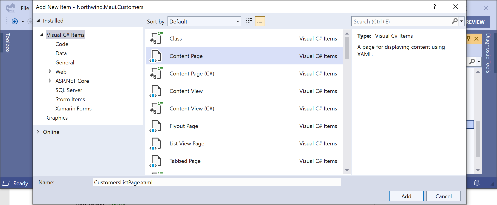
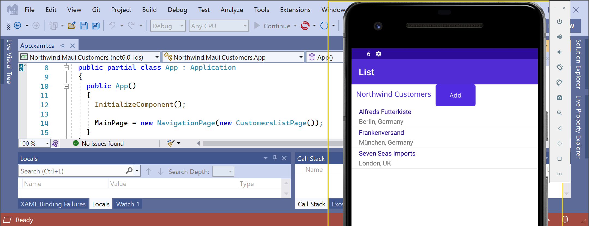

This chapter is about learning how to make **graphical user interface (GUI)** apps by building a cross-platform mobile and desktop app for iOS and Android, macOS Catalyst and Windows using **.NET MAUI (Multi-platform App User Interface)**. 

> **Warning!** This online GitHub chapter was tested using .NET SDK 6.0.200, .NET MAUI Preview 13, and Visual Studio 2022 17.2 Preview 1. I expect to update this chapter in Q1 2022 for the .NET MAUI Release Candidate and in Q2 2022 for the .NET MAUI GA (General Availability) release. You can read the roadmap at the following link: https://github.com/dotnet/maui/wiki/Roadmap

You will see how **eXtensible Application Markup Language (XAML)** makes it easy to define the user interface for a graphical app. 

Cross-platform GUI development cannot be learned in a single chapter, but like web development, it is so important that I want to introduce you to some of what is possible. Think of this chapter as an introduction that will give you a taste to inspire you, and then you can learn more from a book dedicated to mobile or desktop development. 

The app will allow the listing and management of customers in the Northwind database. The mobile app that you create will call the Northwind service that you built using ASP.NET Core Web API in *Chapter 17, Building and Consuming Web Services*. If you have not built the Northwind service, please go back and build it now or download it from the GitHub repository for this book at the following link: https://github.com/markjprice/cs10dotnet6.

Either a Windows computer with Visual Studio or a macOS computer with Visual Studio for Mac can be used to create a .NET MAUI project. But you will need a computer with Windows to compile WinUI 3 apps and you will need a computer with macOS and Xcode to compile for macOS Catalyst and iOS. Although you can create a .NET MAUI project at the command line and then edit it using Visual Studio Code, there is no official tooling to help you. That is expected to come with .NET 7.0 in later 2022. 

In this chapter, we will cover the following topics:
- [Understanding the .NET MAUI delay](#understanding-the-net-maui-delay)
- [Understanding XAML](#understanding-xaml)
  - [Simplifying code using XAML](#simplifying-code-using-xaml)
  - [Choosing common controls](#choosing-common-controls)
  - [Understanding markup extensions](#understanding-markup-extensions)
- [Understanding .NET MAUI](#understanding-net-maui)
  - [Development tools for mobile first, cloud first](#development-tools-for-mobile-first-cloud-first)
  - [Using Windows to create iOS and macOS apps](#using-windows-to-create-ios-and-macos-apps)
  - [Understanding additional functionality](#understanding-additional-functionality)
    - [Understanding MVVM](#understanding-mvvm)
    - [Understanding the INotificationPropertyChanged interface](#understanding-the-inotificationpropertychanged-interface)
    - [Understanding ObservableCollection](#understanding-observablecollection)
    - [Understanding dependency services](#understanding-dependency-services)
  - [Understanding .NET MAUI user interface components](#understanding-net-maui-user-interface-components)
    - [Understanding the ContentPage view](#understanding-the-contentpage-view)
    - [Understanding the ListView control](#understanding-the-listview-control)
    - [Understanding the Entry and Editor controls](#understanding-the-entry-and-editor-controls)
    - [Understanding .NET MAUI handlers](#understanding-net-maui-handlers)
  - [Writing platform-specific code](#writing-platform-specific-code)
- [Building mobile and desktop apps using .NET MAUI](#building-mobile-and-desktop-apps-using-net-maui)
  - [Creating a virtual Android device for local app testing](#creating-a-virtual-android-device-for-local-app-testing)
  - [Creating a .NET MAUI solution](#creating-a-net-maui-solution)
  - [Creating a view model with two-way data binding](#creating-a-view-model-with-two-way-data-binding)
  - [Creating views for the list of customers and customer details](#creating-views-for-the-list-of-customers-and-customer-details)
  - [Implementing the customer list view](#implementing-the-customer-list-view)
  - [Implementing the customer detail view](#implementing-the-customer-detail-view)
  - [Setting the main page for the mobile app](#setting-the-main-page-for-the-mobile-app)
  - [Testing the mobile app](#testing-the-mobile-app)
- [Consuming a web service from a mobile app](#consuming-a-web-service-from-a-mobile-app)
  - [Configuring the web service to allow insecure requests](#configuring-the-web-service-to-allow-insecure-requests)
  - [Configuring the iOS app to allow insecure connections](#configuring-the-ios-app-to-allow-insecure-connections)
  - [Configuring the Android app to allow insecure connections](#configuring-the-android-app-to-allow-insecure-connections)
  - [Getting customers from the web service](#getting-customers-from-the-web-service)
- [Practicing and exploring](#practicing-and-exploring)
  - [Exercise 19.1 – Test your knowledge](#exercise-191--test-your-knowledge)
  - [Exercise 19.2 – Explore topics](#exercise-192--explore-topics)
- [Summary](#summary)

# Understanding the .NET MAUI delay
On September 14, 2021, Microsoft announced that .NET MAUI would be delayed. "Unfortunately, .NET MAUI will not be ready for production with .NET 6 GA in November." – Scott Hunter, Director Program Management, .NET

https://devblogs.microsoft.com/dotnet/update-on-dotnet-maui/

The following seems a likely timeline of preview and release candidate releases leading to the general availability release of .NET MAUI in about six months:

- October 12, 2021: [.NET MAUI Preview 9](https://devblogs.microsoft.com/dotnet/announcing-net-maui-preview-9/) and .NET 6 Release Candidate 2 that were used for this chapter in the published edition of this book. You can [download this version as a PDF](https://github.com/markjprice/cs10dotnet6/blob/main/9781801077361_Bonus_Content.pdf)
- November 9, 2021: [.NET MAUI Preview 10](https://devblogs.microsoft.com/dotnet/announcing-net-maui-preview-10/) and .NET 6
- January 5, 2021: [.NET MAUI Preview 11](https://devblogs.microsoft.com/dotnet/announcing-dotnet-maui-preview-11/)
- January 19, 2022: [.NET MAUI Preview 12](https://devblogs.microsoft.com/dotnet/announcing-net-maui-preview-12/)
- February 15, 2022: [.NET MAUI Preview 13](https://devblogs.microsoft.com/dotnet/announcing-net-maui-preview-13/)
- March 2022: .NET MAUI Release Candidate 1
- April 2022: .NET MAUI Release Candidate 2
- May 2022: .NET MAUI General Availability at Microsoft Build
- November 2022: .NET MAUI included with .NET 7

Let's start by looking at the markup language used by .NET MAUI.

# Understanding XAML

In 2006, Microsoft released **Windows Presentation Foundation (WPF)**, which was the first technology to use **XAML (eXtensible Application Markup Language)**. Silverlight, for web and mobile apps, quickly followed, but it is no longer supported by Microsoft. WPF is still used today to create Windows desktop applications; for example, Visual Studio for Windows is partially built using WPF.

XAML can be used to build parts of the following apps:

- **.NET MAUI apps** for mobile and desktop devices, including Android, iOS, Windows, and macOS. It is an evolution of a technology named **Xamarin.Forms**.
- **WinUI 3 apps** for Windows 10 and 11.
- **Universal Windows Platform (UWP) apps** for Windows 10 and 11, Xbox, and Mixed Reality headsets.
- **WPF apps** for Windows desktop, including Windows 7 and later.
- **Avalonia** and **Uno Platform apps** using cross-platform, third-party technologies.

## Simplifying code using XAML

XAML simplifies C# code, especially when building a user interface.

Imagine that you need two or more buttons laid out horizontally to create a toolbar. 

In C#, you might write this code:

```cs
StackPanel toolbar = new();
toolbar.Orientation = Orientation.Horizontal;

Button newButton = new();
newButton.Content = "New";
newButton.Background = new SolidColorBrush(Colors.Pink);
toolbar.Children.Add(newButton);

Button openButton = new();
openButton.Content = "Open";
openButton.Background = new SolidColorBrush(Colors.Pink);
toolbar.Children.Add(openButton);
```
In XAML, this could be simplified to the following lines of code. When this XAML is processed, the equivalent properties are set, and methods are called to achieve the same goal as the preceding C# code:
```xml
<StackPanel Name="toolbar" Orientation="Horizontal">
  <Button Name="newButton" Background="Pink">New</Button>
  <Button Name="openButton" Background="Pink">Open</Button>
</StackPanel>
```
You can think of XAML as an alternative and easier way of declaring and instantiating .NET types, especially when defining a user interface and the resources that it uses.

XAML allows resources such as brushes, styles, and themes to be declared at different levels, like a UI element, a page, or globally for the application to enable resource sharing.

XAML allows data binding between UI elements or between UI elements and objects and collections.

## Choosing common controls

There are lots of predefined controls that you can choose from for common user interface scenarios. Almost all dialects of XAML support these controls:

| Controls | Description |
| -------- | ----------- |
|Button, ImageButton, Menu, Toolbar|Executing actions|
|CheckBox, RadioButton|Choosing options|
|Calendar, DatePicker|Choosing dates|
|ComboBox, ListBox, ListView, TreeView|Choosing items from lists and hierarchical trees|
|Canvas, DockPanel, Grid, StackPanel, WrapPanel|Layout containers that affect their children in different ways|
|Label, TextBlock|Displaying read-only text|
|RichTextBox, TextBox|Editing text|
|Image, MediaElement|Embedding images, videos, and audio files|
|DataGrid|Viewing and editing data as quickly and easily as possible|
|Scrollbar, Slider, StatusBar|Miscellaneous user interface elements|

## Understanding markup extensions

To support some advanced features, XAML uses markup extensions. Some of the most important enable element and data binding and the reuse of resources, as shown in the following list:

- `{Binding}` links an element to a value from another element or a data source
- `{StaticResource}` links an element to a shared resource
- `{ThemeResource}` links an element to a shared resource defined in a theme
  
# Understanding .NET MAUI

To create a mobile app that only needs to run on iPhones, you might choose to build it with either the Objective-C or Swift language and the UIKit libraries using the Xcode development tool.

To create a mobile app that only needs to run on Android phones, you might choose to build it with either the Java or Kotlin language and the Android SDK libraries using the Android Studio development tool.

But what if you need to create a mobile app that can run on iPhones and Android phones? And what if you only want to create that mobile app once using a programming language and development platform that you are already familiar with? And what if you realized that with a bit more coding effort to adapt the user interface to desktop size devices, you could target macOS and Windows desktops too?

.NET MAUI enables developers to build cross-platform mobile apps for Apple iOS (iPhone), iPadOS, macOS using Catalyst, Windows using WinUI 3, and Google Android using C# and .NET, which are then compiled to native APIs and executed on native phone and desktop platforms.

Business logic layer code can be written once and shared between all platforms. User interface interactions and APIs are different on various mobile and desktop platforms, so the user interface layer is sometimes custom for each platform.

Like WPF and UWP apps, .NET MAUI uses XAML to define the user interface once for all platforms using abstractions of platform-specific user interface components. Applications built with .NET MAUI draw the user interface using native platform widgets, meaning the app's look and feel fit naturally with the target mobile platform.

A user experience built using .NET MAUI will not perfectly fit a specific platform in a way that one custom built with native tools for that platform would, but for mobile and desktop apps that will not have millions of users, it is good enough.

## Development tools for mobile first, cloud first

Mobile apps are often supported by services in the cloud. 

Satya Nadella, CEO of Microsoft, famously said the following:

> *"To me, when we say mobile first, it's not the mobility of the device, it's actually the mobility of the individual experience. [...] The only way you are going to be able to orchestrate the mobility of these applications and data is through the cloud."*

As you have seen earlier in this book, to create an ASP.NET Core Web API service to support a mobile app, we can use Visual Studio Code. To create .NET MAUI apps, developers can use either Visual Studio 2022 for Windows or Visual Studio 2022 for Mac.

When installing Visual Studio 2022, you must select the **.NET MAUI (Preview)** checkbox that is part of the **Mobile development with .NET** workload, as shown in *Figure 19.1*:



Figure 19.1: Selecting the .NET MAUI workload for Visual Studio 2022

## Using Windows to create iOS and macOS apps

If you want to use Visual Studio 2022 for Windows to create an iOS mobile app or a macOS Catalyst desktop app, then you can connect over a network to a Mac build host. Instructions can be found at the following link:

https://docs.microsoft.com/en-us/xamarin/ios/get-started/installation/windows/connecting-to-mac/

## Understanding additional functionality

We will build a cross-platform mobile and desktop app that uses a lot of the skills and knowledge that you learned in previous chapters. We will also use some functionality that you have not seen before.

### Understanding MVVM

**Model-View-ViewModel (MVVM)** is a design pattern like MVC. The letters in the acronym stand for:

- **Model**: an entity class that represents a data object in a store, like a relational database.
- **View**: a way to represent data in a graphical user interface, including fields to show and edit data fields and buttons and other elements to interact with the data.
- **ViewModel**: a class that represents the data fields, actions, and events that can then be bound to elements like textboxes and buttons in a view.

In MVC, models passed to a view are read-only because they are only passed one way into the view. That is why immutable records are good for MVC models. But ViewModels are different. They need to support two-way interactions and if the original data changes during the lifetime of the object, the view needs to dynamically update.

### Understanding the INotificationPropertyChanged interface

The `INotifyPropertyChanged` interface enables a model class to support two-way data binding. It works by forcing the class to have an event named `PropertyChanged`, with a parameter of type `PropertyChangedEventArgs`, as shown in the following code:
```cs
namespace System.ComponentModel
{
  public class PropertyChangedEventArgs : EventArgs
  {
    public PropertyChangedEventArgs(string? propertyName);
    public virtual string? PropertyName { get; }
  }

  public delegate void PropertyChangedEventHandler(
    object? sender, PropertyChangedEventArgs e);

  public interface INotifyPropertyChanged
  {
    event PropertyChangedEventHandler PropertyChanged;
  }
}
```
Inside each property in the class, when setting a new value, you must raise the event (if it is not `null`) with an instance of `PropertyChangedEventArgs` containing the name of the property as a `string` value, as shown in the following code:
```cs
private string companyName;

public string CompanyName
{
  get => companyName;
  set
  {
    companyName = value; // store the new value being set 
    PropertyChanged?.Invoke(this,
      new PropertyChangedEventArgs(nameof(CompanyName)));
  }
}
```
When a user interface control is data-bound to the property, it will automatically update to show the new value when it changes.

To simplify the implementation, we can use a compiler feature to get the name of the property by decorating a `string` parameter with the `[CallerMemberName]` attribute, as shown in the following code:
```cs
private void NotifyPropertyChanged(
  [CallerMemberName] string propertyName = "")
{
  // if an event handler has been set then invoke 
  // the delegate and pass the name of the property 
  PropertyChanged?.Invoke(this,
    new PropertyChangedEventArgs(propertyName));
}

public string CompanyName
{
  get => companyName;
  set
  {
    companyName = value; // store the new value being set
    NotifyPropertyChanged(); // caller member name is "CompanyName" 
  }
}
```
### Understanding ObservableCollection

Related to `INotifyPropertyChanged` is the `INotifyCollectionChanged` interface, which is implemented by the `ObservableCollection<T>` class. This gives notifications when items get added, removed, or when the collection is refreshed. When bound to controls like `ListView` or `TreeView`, the user interface will update dynamically to reflect changes.

### Understanding dependency services

Mobile platforms such as iOS and Android, and desktop platforms like Windows and macOS, implement common features in different ways, so we need a way to get a platform-native implementation of common features. We can do that using dependency services. It works like this:

- Define an interface for the common feature, for example, `IDialer` for a phone number dialer on a phone device, or `INotificationManager` for a pop-up local notification on desktop and mobile devices.
- Implement the interface for all the platforms that you need to support, for example, iOS and Android for a phone dialer, and register the implementations with an attribute, as shown in the following code:
```cs
[assembly: Dependency(typeof(PhoneDialer))]
namespace Northwind.Maui.iOS
{
  public class PhoneDialer : IDialer
```
- Get the platform-native implementation of an interface by using the dependency service, as shown in the following code:
```cs
IDialer dialer = DependencyService.Get<IDialer>();
```

> **.NET MAUI Essentials** includes a `PhoneDialer` component, so we will use that in our project rather than have to define our own phone dialer dependency service.

## Understanding .NET MAUI user interface components

.NET MAUI includes some common controls for building user interfaces. They are divided into four categories:

- **Pages**: represent cross-platform application screens, for example, `ContentPage`, `NavigationPage`, `FlyoutPage`, and `TabbedPage`.
- **Layouts**: represent the structure of a combination of other user interface components, for example, `Grid`, `StackLayout`, and `FlexLayout`.
- **Views**: represent a single user interface component, for example, `CarouselView`, `CollectionView`, `Label`, `Entry`, `Editor`, and `Button`.
- **Cells**: represent a single item in a list or table view, for example, `TextCell`, `ImageCell`, `SwitchCell`, and `EntryCell`.

> You can track the status of the migration progress of .NET MAUI components at the following link: https://github.com/dotnet/maui/wiki/Status

### Understanding the ContentPage view

The `ContentPage` view is for simple user interfaces. It has a `ToolbarItems` property that shows the actions the user can perform in a platform-native way. Each `ToolbarItem` can have an icon and text:

```xml
<ContentPage.ToolbarItems>
  <ToolbarItem Text="Add" Activated="Add_Activated"
    Order="Primary" Priority="0" />
  ...
</ContentPage.ToolbarItems>
```

### Understanding the ListView control

The `ListView` control is used for long lists of data-bound values of the same type. It can have headers and footers and its list items can be grouped.

It has cells to contain each list item. There are two built-in cell types: text and image. Developers can define custom cell types.

Cells can have context actions that appear when the cell is swiped on iPhone or long pressed on Android. A context action that is destructive can be shown in red, as shown in the following markup:

```xml
<TextCell Text="{Binding CompanyName}" Detail="{Binding Location}">
  <TextCell.ContextActions>
    <MenuItem Clicked="Customer_Phoned" Text="Phone" />
    <MenuItem Clicked="Customer_Deleted" Text="Delete" IsDestructive="True" />
  </TextCell.ContextActions>
</TextCell>
```

### Understanding the Entry and Editor controls

The `Entry` and `Editor` controls are used for editing text values and are often data-bound to an entity model property, as shown in the following markup:

```xml
<Editor Text="{Binding CompanyName, Mode=TwoWay}" />
```

Use `Entry` for a single line of text. Use `Editor` for multiple lines of text.

### Understanding .NET MAUI handlers

In .NET MAUI, XAML controls are defined in the `Microsoft.Maui.Controls` namespace. Components called **handlers** map these common controls to native controls on each platform. On iOS, a handler will map a .NET MAUI `Button` to an iOS-native `UIButton` defined by UIKit. On macOS, `Button` is mapped to `NSButton` defined by AppKit. On Android, `Button` is mapped to an Android-native `AppCompatButton`.

Handlers have a `NativeView` property that exposes the underlying native control. This allows you to work with platform-specific features like properties, methods, and events and customize all instances of a native control.

## Writing platform-specific code

If you need to write code statements that only execute for a specific platform like Android, then you can use compiler directives.

For example, by default, `Entry` controls on Android show an underline character.

If you want to hide the underline, you could write some Android-specific code to get the handler for the `Entry` control, use its `NativeView` property to access the underlying native control, and then set the property that controls that feature to `false`, as shown in the following code:

```cs
#if __ANDROID__
  Handlers.EntryHandler.EntryMapper[nameof(IEntry.BackgroundColor)] = (h, v) =>
  {
    (h.NativeView as global::Android.Views.Entry).UnderlineVisible = false;
  };
#endif
```

Predefined compiler constants include the following:

- `__ANDROID__`
- `__IOS__`
- `WINDOWS`
 
The compiler `#if` statement syntax is slightly different from the C# `if` statement syntax, as shown in the following code:

```cs
#if __IOS__
// iOS-specific statements
#elif __ANDROID__
// Android-specific statements
#elif WINDOWS
// Windows-specific statements
#endif
```

# Building mobile and desktop apps using .NET MAUI

We will build a mobile and desktop app for managing customers in Northwind.

> **Good Practice**: If you have never run Xcode, run it now until you see the Start window to ensure that all its required components are installed and registered. If you do not run Xcode, then you might get errors with your projects later in Visual Studio for Mac.

## Creating a virtual Android device for local app testing

To target Android, you must install at least one Android SDK. A default installation of Visual Studio with the mobile development workload already includes one Android SDK, but it is often an older version to support as many Android devices as possible.

To use the latest features of .NET MAUI, you must install a more recent Android SDK:

1. In Windows, start **Visual Studio 2022**.
2. Navigate to **Tools** | **Android** | **Android Device Manager**.
3. In **Android Device Manager**, click the **+ New button** to create a new device.
4. In the **New Device** dialog, make the following choices:
   1. Base Device: Pixel 2 (+ Store)
   2. Processor: x86
   3. OS: Pie 9.0 – API 28
5. Click **Create**.
6. Accept any license agreements.
7. Wait for any required downloads.
8. In **Android Device Manager**, in the list of devices, in the row for the device that you just created, click **Start**.
9. When the Android device has finished starting, click the browser and test that it has access to the network by navigating to https://www.bbc.co.uk/news.
10. Close the emulator.
11. Restart Visual Studio 2022 to ensure that it is aware of the new emulator.

## Creating a .NET MAUI solution

We will now create a project for a cross-platform mobile and desktop app:

1. In Visual Studio for Windows, add a new project, as defined in the following list:
   1. Project template: **.NET MAUI App (Preview)** / `maui`
   2. Workspace/solution file and folder: `PracticalApps`
   3. Project file and folder: `Northwind.Maui.Customers`
2. Open the project file, and uncomment the element to enable Windows targeting, as shown highlighted in the following markup:

```xml
<Project Sdk="Microsoft.NET.Sdk">
    <PropertyGroup>
        <TargetFrameworks>net6.0-ios;net6.0-android;net6.0-maccatalyst</TargetFrameworks>
        <TargetFrameworks Condition="$([MSBuild]::IsOSPlatform('windo
ws')) and '$(MSBuildRuntimeType)' == 'Full'">$(TargetFrameworks);net6.0-
windows10.0.19041</TargetFrameworks>
        <OutputType>Exe</OutputType>
        <RootNamespace>Northwind.Maui.Customers</RootNamespace>
        <UseMaui>true</UseMaui>
        <SingleProject>true</SingleProject>
```

3. To the right of the **Run** button in the toolbar, set the **Framework** to **net6.0-android**, and select the **Pixel 2 - API 28 (Android 9.0 - API 28)** emulator image that you previously created, as shown in *Figure 19.2*:


*Figure 19.2: Selecting Android as the target for startup*

4. Click the **Run** button in the toolbar and wait for the device emulator to start the Android operating system and launch your mobile app.
5. In the .NET MAUI app, click the **Click me** button to increment the counter three times, as shown in *Figure 19.3*:


*Figure 19.3: Incrementing the counter in the Android .NET MAUI app*

6. Note the **XAML Live Preview window** in Visual Studio and that **XAML Hot Reload** is connected so that you could make changes to the XAML and see them reflected in the app without restarting. For example, try changing the text of the Hello World label to something else, save the XAML file, and click the **Hot Reload** button in the toolbar.
7. Close the Android device emulator.
8. Navigate to **Build** | **Configuration Manager**.
9. In the row for the **Northwind.Maui.Customers** project, select the checkbox in the **Deploy** column, as shown in *Figure 19.4*:


*Figure 19.4: Enabling the Windows app to deploy to the Windows machine*

10. To the right of the **Run** button in the toolbar, set the **Framework** to **net6.0-windows**, and then select **Windows Machine**.
11. Make sure that the **Debug** configuration is selected and then click the green triangle start button labeled **Windows Machine**.
12. After a few moments, note that the Windows app displays with the same **Click me** button and counter functionality, as shown in *Figure 19.5*:


*Figure 19.5: Incrementing the counter in the Windows .NET MAUI app*

13. Close the Windows app.

## Creating a view model with two-way data binding

We need to create a view model that will allow us to show and modify a customer entity so the class should implement two-way data binding:

1. In the `Northwind.Maui.Customers` project folder, create two classes, one named `CustomerDetailViewModel.cs` to show the details of a single customer, and one named `CustomersListViewModel.cs` to show a list of customers.
2. In `CustomerDetailViewModel.cs`, modify the statements to define a class that implements the `INotifyPropertyChanged` interface and has six properties, as shown in the following code:

```cs
using System.ComponentModel; // INotifyPropertyChanged 
using System.Runtime.CompilerServices; // [CallerMemberName]

namespace Northwind.Maui.Customers;

public class CustomerDetailViewModel : INotifyPropertyChanged
{
  public event PropertyChangedEventHandler PropertyChanged;

  private string customerId;
  private string companyName;
  private string contactName;
  private string city;
  private string country;
  private string phone;

  // this attribute sets the propertyName parameter 
  // using the context in which this method is called 
  private void NotifyPropertyChanged(
    [CallerMemberName] string propertyName = "")
  {
    // if an event handler has been set then invoke 
    // the delegate and pass the name of the property 
    PropertyChanged?.Invoke(this,
      new PropertyChangedEventArgs(propertyName));
  }

  public string CustomerId
  {
    get => customerId;
    set
    {
      customerId = value;
      NotifyPropertyChanged();
    }
  }

  public string CompanyName
  {
    get => companyName;
    set
    {
      companyName = value;
      NotifyPropertyChanged();
    }
  }

  public string ContactName
  {
    get => contactName;
    set
    {
      contactName = value;
      NotifyPropertyChanged();
    }
  }

  public string City
  {
    get => city;
    set
    {
      city = value;
      NotifyPropertyChanged();
      NotifyPropertyChanged(nameof(Location));
    } 
  }

  public string Country
  {
    get => country;
    set
    {
      country = value;
      NotifyPropertyChanged();
      NotifyPropertyChanged(nameof(Location));
    } 
  }

  public string Phone
  {
    get => phone;
    set
    {
      phone = value;
      NotifyPropertyChanged();
    }
  }

  public string Location
  {
    get => $"{City}, {Country}";
  }
}
```

Note the following:

- The class implements `INotifyPropertyChanged`, so a two-way bound control like `Editor` will update the property and vice versa. There is a `PropertyChanged` event that is raised whenever one of the properties is modified using a `NotifyPropertyChanged` private method to simplify the implementation.
- In addition to properties for storing values retrieved from the HTTP service, the class defines a read-only `Location` property. This will be bound to a summary list of customers to show the location of each one. Whenever the `City` or `Country` property changes, we also need to notify that the `Location` has changed, or any views bound to `Location` would not update correctly.

3. In `CustomersListViewModel.cs`, modify the statements to define a class that inherits from `ObservableCollection<T>` and has a method to populate sample data, as shown in the following code:

```cs
using System.Collections.ObjectModel; // ObservableCollection<T>

namespace Northwind.Maui.Customers;

public class CustomersListViewModel :
  ObservableCollection<CustomerDetailViewModel>
{
  // for testing before calling web service
  public void AddSampleData(bool clearList = true)
  {
    if (clearList) Clear();
    
    Add(new CustomerDetailViewModel
    {
      CustomerId = "ALFKI",
      CompanyName = "Alfreds Futterkiste",
      ContactName = "Maria Anders",
      City = "Berlin",
      Country = "Germany",
      Phone = "030-0074321"
    });
    
    Add(new CustomerDetailViewModel
    {
      CustomerId = "FRANK",
      CompanyName = "Frankenversand",
      ContactName = "Peter Franken",
      City = "München",
      Country = "Germany",
      Phone = "089-0877310"
    });

    Add(new CustomerDetailViewModel
    {
      CustomerId = "SEVES",
      CompanyName = "Seven Seas Imports",
      ContactName = "Hari Kumar",
      City = "London",
      Country = "UK",
      Phone = "(171) 555-1717"
    }); 
  }
}
```

Note the following:

- After loading from the service, which will be implemented later in this chapter,
the customers are cached locally using `ObservableCollection<T>`. This supports notifications to any bound user interface components, such as `ListView`, so that the user interface can redraw itself when the underlying data adds or removes items from the collection.
- For testing purposes, when the HTTP service is not available, there is a static method to populate three sample customers.

## Creating views for the list of customers and customer details

You will now replace the existing MainPage with a view to show a list of customers and a view to show the details for a customer:

1. In the Northwind.Maui.Customers project, delete MainPage.xaml.
2. Open App.xaml and add a style to apply the same background color and font family to Entry controls as are being applied to Label controls, as shown in the following markup:

```xml
<Style TargetType="Entry">
  <Setter Property="TextColor" Value="{DynamicResource PrimaryTextColor}" />
  <Setter Property="FontFamily" Value="OpenSansRegular" />
  <Setter Property="HorizontalOptions" Value="StartAndExpand" />
  <Setter Property="WidthRequest" Value="300" />
</Style>
```

## Implementing the customer list view

First, we will create two views for a list of customers and show details of one customer, and then we will implement the list of customers:

1. Right-click the `Northwind.Maui.Customers` project folder, choose **Add** | **New Item...**, select **Content Page**, enter the name `CustomersListPage`, and click Add, as shown in *Figure 19.6*:


*Figure 19.6: Adding a new XAML Content Page item*

2. Right-click the **Views** folder, choose **Add** | **New Item...**, select **Content Page**, enter the name `CustomerDetailPage`, and click **Add**.

> At the time of writing, Visual Studio 2022 does not have project item templates for .NET MAUI. The `ContentPage` project item template is for the older Xamarin.Forms. In the next step, we will replace almost all the markup and code anyway, so it is not an issue. By May 2022, I expect Visual Studio 2022 to have project item templates for common .NET MAUI file types.

3. Open `CustomersListPage.xaml` and modify its contents, as shown in the following markup:

```xml
<ContentPage
  xmlns="http://schemas.microsoft.com/dotnet/2021/maui"
  xmlns:x="http://schemas.microsoft.com/winfx/2009/xaml"
  x:Class="Northwind.Maui.Customers.CustomersListPage"
  BackgroundColor="{DynamicResource PageBackgroundColor}"
  Title="List">
<ContentPage.Content>
    <ListView ItemsSource="{Binding .}"
              VerticalOptions="Center"
              HorizontalOptions="Center"
              IsPullToRefreshEnabled="True"
              ItemTapped="Customer_Tapped"
              Refreshing="Customers_Refreshing">
      <ListView.Header>
        <StackLayout Orientation="Horizontal">
          <Label Text="Northwind Customers"
                 FontSize="Subtitle" Margin="10" />
          <Button Text="Add" Clicked="Add_Clicked" />
        </StackLayout>
      </ListView.Header>
      <ListView.ItemTemplate>
        <DataTemplate>
          <TextCell Text="{Binding CompanyName}"
                    Detail="{Binding Location}"
                    TextColor="{DynamicResource PrimaryTextColor}"
                    DetailColor="{DynamicResource PrimaryTextColor}" >
            <TextCell.ContextActions>
              <MenuItem Clicked="Customer_Phoned" Text="Phone" />
              <MenuItem Clicked="Customer_Deleted" Text="Delete"
                        IsDestructive="True" />
            </TextCell.ContextActions>
          </TextCell>
        </DataTemplate>
      </ListView.ItemTemplate>
    </ListView>
  </ContentPage.Content>
</ContentPage>
```
Note the following:
- `ContentPage` has had its `Title` attribute set to `List`.
- `ListView` has its `IsPullToRefreshEnabled` attribute set to `true`.
- Handlers have been written for the following events:
  - `Customer_Tapped`: A customer being tapped to show their details.
  - `Customers_Refreshing`: The list being pulled down to refresh its items.
  - `Customer_Phoned`: A cell being swiped left on iPhone or long pressed on Android and then tapping **Phone**.
  - `Customer_Deleted`: A cell being swiped left on iPhone or long pressed on Android and then tapping **Delete**.
  - `Add_Clicked`: The **Add** button being clicked.
- A data template defines how to display each customer: larger text for the company name and smaller text for the location underneath.
- An **Add** button is in the list view header so that users can navigate to a detail view to add a new customer.

4. Open `CustomersListPage.xaml.cs` and modify the contents, as shown in the following code:

```cs
using Microsoft.Maui.Controls; // ContentPage, ListView using Microsoft.Maui.Essentials; // PhoneDialer
using System;
using System.Threading.Tasks;
namespace Northwind.Maui.Customers;
public partial class CustomersListPage : ContentPage
{
  public CustomersListPage()
  {
    InitializeComponent();
    CustomersListViewModel viewModel = new();
    viewModel.AddSampleData();
    BindingContext = viewModel;
}
  async void Customer_Tapped(object sender, ItemTappedEventArgs e)
  {
    if (e.Item is not CustomerDetailViewModel c) return;
    // navigate to the detail view and show the tapped customer
    await Navigation.PushAsync(new CustomerDetailPage(
      BindingContext as CustomersListViewModel, c));
}
  async void Customers_Refreshing(object sender, EventArgs e)
  {
    if (sender is not ListView listView) return;
    listView.IsRefreshing = true;
    // simulate a refresh
    await Task.Delay(1500);
    listView.IsRefreshing = false;
}

void Customer_Deleted(object sender, EventArgs e)
  {
    MenuItem menuItem = sender as MenuItem;
    if (menuItem.BindingContext is not CustomerDetailViewModel c) return;
    (BindingContext as CustomersListViewModel).Remove(c);
}
  async void Customer_Phoned(object sender, EventArgs e)
  {
    MenuItem menuItem = sender as MenuItem;
    if (menuItem.BindingContext is not CustomerDetailViewModel c) return;
    if (await DisplayAlert("Dial a Number",
      "Would you like to call " + c.Phone + "?",
      "Yes", "No"))
    {
      PhoneDialer.Open(c.Phone);
} }
  async void Add_Clicked(object sender, EventArgs e)
  {
    await Navigation.PushAsync(new CustomerDetailPage(
      BindingContext as CustomersListViewModel));
} }
```

Note the following:

- `BindingContext` is set to an instance of `CustomersViewModel`, which is populated with sample data in the constructor of the page.
- When a customer in the list view is tapped, the user is taken to a details view (which you will implement in the next step).
- When the list view is pulled down, it triggers a simulated refresh that takes 1.5 seconds.
- When a customer is deleted in the list view, they are removed from the bound customers view model.
- When a customer in the list view is swiped, and the **Phone** button is tapped, a dialog prompts the user as to whether they want to dial the number, and if so, the platform-native implementation will be retrieved using the dependency resolver and then used to dial the number.
- When the **Add** button is tapped, the user is taken to the customer detail page to enter details for a new customer.

## Implementing the customer detail view

Next, we will implement the customer detail view:

1. Open `CustomerDetailPage.xaml` and modify its contents, as shown in the following markup, and note the following:
   - `Title` of the content page has been set to `Edit`.
   - A customer `Grid` with two columns and six rows is used for the layout.
   - `Entry` views are two-way data bound to properties of the `CustomerViewModel` class.
   - `InsertButton` has an event handler to execute code to add a new customer.

```xml
<ContentPage
  xmlns="http://schemas.microsoft.com/dotnet/2021/maui"
  xmlns:x="http://schemas.microsoft.com/winfx/2009/xaml"
  x:Class="Northwind.Maui.Customers.Views.CustomerDetailPage"
  BackgroundColor="{DynamicResource PageBackgroundColor}"
  Title="Edit">
  <ContentPage.Content>
    <StackLayout VerticalOptions="Fill" HorizontalOptions="Fill">
      <Grid ColumnDefinitions="Auto,Auto"
            RowDefinitions="Auto,Auto,Auto,Auto,Auto,Auto">
        <Label Text="Customer Id" VerticalOptions="Center" Margin="6" />
        <Entry Text="{Binding CustomerId, Mode=TwoWay}" Grid.Column="1"
               MaxLength="5" TextTransform="Uppercase" />
        <Label Text="Company Name" Grid.Row="1"
               VerticalOptions="Center" Margin="6" />
        <Entry Text="{Binding CompanyName, Mode=TwoWay}"
               Grid.Column="1" Grid.Row="1" />
        <Label Text="Contact Name" Grid.Row="2"
             VerticalOptions="Center" Margin="6" />
        <Entry Text="{Binding ContactName, Mode=TwoWay}"
               Grid.Column="1" Grid.Row="2" />
        <Label Text="City" Grid.Row="3"
               VerticalOptions="Center" Margin="6" />
        <Entry Text="{Binding City, Mode=TwoWay}"
               Grid.Column="1" Grid.Row="3" />
        <Label Text="Country" Grid.Row="4"
               VerticalOptions="Center" Margin="6" />
        <Entry Text="{Binding Country, Mode=TwoWay}"
               Grid.Column="1" Grid.Row="4" />
        <Label Text="Phone" Grid.Row="5"
               VerticalOptions="Center" Margin="6" />
        <Entry Text="{Binding Phone, Mode=TwoWay}"
               Grid.Column="1" Grid.Row="5" />
      </Grid>
      <Button x:Name="InsertButton" Text="Insert Customer"
              Clicked="InsertButton_Clicked" />
    </StackLayout>
  </ContentPage.Content>
</ContentPage>
```

2. Open `CustomerDetailPage.xaml.cs` and modify its contents, as shown in the following code:

```cs
using Microsoft.Maui.Controls;
using System;
using System.Threading.Tasks;

namespace Northwind.Maui.Customers;

public partial class CustomerDetailPage : ContentPage
{
  private CustomersListViewModel customers;

  public CustomerDetailPage(CustomersListViewModel customers)
  {
    InitializeComponent();
    this.customers = customers;
    BindingContext = new CustomerDetailViewModel();
    Title = "Add Customer";
  }

  public CustomerDetailPage(CustomersListViewModel customers,
    CustomerDetailViewModel customer)
  {
    InitializeComponent();
    this.customers = customers;
    BindingContext = customer;
    InsertButton.IsVisible = false;
  }

  async void InsertButton_Clicked(object sender, EventArgs e)
  {
    customers.Add((CustomerDetailViewModel)BindingContext);
    await Navigation.PopAsync(animated: true);
  } 
}
```

Note the following:

- The default constructor sets the binding context to a new `customer` instance and the view title is changed to **Add Customer**.
- The constructor with a `customer` parameter sets the binding context to that instance and hides the **Insert** button because it is not needed when editing an existing customer due to two-way data binding.
- When the **Insert** button is tapped, the new customer is added to the customers view model and the navigation is moved back to the previous view asynchronously.

## Setting the main page for the mobile app

Finally, we need to modify the mobile app to use our customer list wrapped in a navigation page as the main page instead of the old one that we deleted, which was created by the project template:

1. Open `App.xaml.cs`.
2. In the `App` constructor, modify the statement that creates a `MainPage` to instead create an instance of `CustomersListPage` wrapped in an instance of `NavigationPage`, as shown highlighted in the following code:

```cs
public App()
{
  InitializeComponent();
  MainPage = new NavigationPage(new CustomersListPage());
}
```

## Testing the mobile app

We will now test the mobile app using the Android device emulator:

1. In Visual Studio, to the right of the **Run** button in the toolbar, set the target **Framework** to **net6.0-android** and select the Android emulator.
2. Start with project debugging. The project will build, and then after a few moments, the Android device emulator will appear with your running .NET MAUI app, as shown in *Figure 19.7*:


*Figure 19.7: The Android device emulator running the Northwind Customers .NET MAUI app*

3. Click **Seven Seas Imports** and modify **Company Name** to **Seven Oceans Imports**, as shown in the following screenshot of the customer detail page in *Figure 19.8*:


*Figure 19.8: Editing a company name on the customer detail page*

4. Click the back button to return to the list of customers and note that the company name has been updated due to the two-way data binding.
5. Click **Add**, and then fill in the fields for a new customer.

> By default, in the Android device emulator, the virtual keyboard is shown when typing on a physical keyboard. To hide the virtual keyboard, click the keyboard icon to the right of the square Android soft button and then toggle **Show virtual keyboard**.

6. On the customer detail page, click **Insert Customer**, and after being returned to the list of customers, note that the new customer has been added to the bottom of the list. (At the time of writing using .NET MAUI Preview 9, there is a bug that means the list view does not update properly. Click, hold, and drag down on the list view and then release to refresh it.)
7. Click and hold on one of the customers to reveal two action buttons, **Phone** and **Delete**, as shown in Figure 19.9:


*Figure 19.9: Extra commands for a selected customer*

8. Click **Phone** and note the pop-up prompt to the user to dial the number of that customer with **Yes** and **No** buttons.
9. Click **No**.
10. Click and hold on one of the customers to reveal two action buttons, **Phone** and **Delete**, and then click on **Delete** and note that the customer is removed.
11. Click, hold, and drag the list down and then release, and note the animation effect for refreshing the list, but remember that this feature is simulated, so the list does not change.
12. Close the Android device emulator.

We will now make the app call the `Northwind.WebApi` service to get the list of customers.

# Consuming a web service from a mobile app

Apple's **App Transport Security (ATS)** forces developers to use good practice, including secure connections between an app and a web service. ATS is enabled by default and your mobile apps will throw an exception if they do not connect securely.

If you need to call a web service that is secured with a self-signed certificate like our `Northwind.WebApi` service is, it is possible but complicated. For simplicity, we will allow insecure connections to the web service and disable the security checks in the mobile app.

## Configuring the web service to allow insecure requests

First, we will enable the web service to handle insecure connections at a new URL:

1. In the `Northwind.WebApi` project, in `Program.cs`, in the section that configures the HTTP pipeline, comment out the HTTPS redirection, as shown in the following code:

```cs
// commented out for the .NET MAUI app project to use
// app.UseHttpsRedirection();
```

2. In `Program.cs`, in the `UseUrls` method, add the insecure URL, as shown highlighted in the following code:

```cs
var builder = WebApplication.CreateBuilder(args);

builder.WebHost.UseUrls(
    "https://localhost:5002"
    , "http://localhost:5008" // for .NET MAUI client 
  );
```

3. Start the `Northwind.WebApi` web service project without debugging.
4. Start Chrome and test that the web service is returning customers as JSON by
navigating to the following URL: http://localhost:5008/api/customers/.
5. Close Chrome but leave the web service running.

## Configuring the iOS app to allow insecure connections

Now you will configure the `Northwind.Maui.Customers` project to disable ATS to allow insecure HTTP requests to the web service:

1. In the `Northwind.Maui.Customers` project, in the `Platforms/iOS` folder, open the `Info.plist` file by right-clicking and open it with the **XML (Text) Editor**.
2. At the bottom of the dictionary, add a new key named `NSAppTransportSecurity`, which is a dictionary, and in it, add a key named `NSAllowsArbitraryLoads` that has a value of `true`, as shown highlighted in the following partial markup:

```xml
<?xml version="1.0" encoding="UTF-8"?>
<!DOCTYPE plist PUBLIC "-//Apple//DTD PLIST 1.0//EN"
          "http://www.apple.com/DTDs/PropertyList-1.0.dtd">
<plist version="1.0">
<dict>
  <key>LSRequiresIPhoneOS</key>
  <true/>
  ... 
  <key>NSAppTransportSecurity</key> 
  <dict>
    <key>NSAllowsArbitraryLoads</key>
    <true/>
  </dict>
</dict>
</plist>
```

3. Save and close `Info.plist`.

## Configuring the Android app to allow insecure connections

In a similar way to Apple and ATS, with Android 9 (API level 28) cleartext (that is, non-HTTPS), support is disabled by default.

Now you will configure the project to enable cleartext to allow insecure HTTP requests to the web service:

1. In the `Platforms/Android` folder, in the `Properties` folder, open `MainApplication.cs`.
2. In the `Application` attribute, enable cleartext, as shown highlighted in the following
code:

```cs
namespace Northwind.Maui.Customers
{
  [Application(UsesCleartextTraffic = true)] 
  public class MainApplication : MauiApplication
```

## Getting customers from the web service

Now, we can modify the customers list page to get its list of customers from the web service instead of using sample data:

1. In the `Northwind.Maui.Customers` project, open `CustomersListPage.xaml.cs`.
2. Import the following additional namespaces:

```cs
using System.Collections.Generic; // IEnumerable<T>
using System.Linq; // OrderBy
using System.Net.Http; // HttpClient
using System.Net.Http.Headers; // MediaTypeWithQualityHeaderValue 
using System.Net.Http.Json; // ReadFromJsonAsync<T>
```

3. Modify the `CustomersListPage` constructor to load the list of customers using the service proxy and only call the `AddSampleData` method if an exception occurs, as shown in the following code:

```cs
public CustomersListPage()
{
  InitializeComponent();

  CustomersListViewModel viewModel = new();
  
  try
  {
    HttpClient client = new()
    {
      BaseAddress = new Uri("http://localhost:5008/")
    };

    client.DefaultRequestHeaders.Accept.Add(
      new MediaTypeWithQualityHeaderValue("application/json"));

    HttpResponseMessage response = client
      .GetAsync("api/customers").Result;

    response.EnsureSuccessStatusCode();

    IEnumerable<CustomerDetailViewModel> customersFromService =
      response.Content.ReadFromJsonAsync
      <IEnumerable<CustomerDetailViewModel>>().Result;

    foreach (CustomerDetailViewModel c in customersFromService
      .OrderBy(customer => customer.CompanyName))
    {
      viewModel.Add(c);
    } 
  }
  catch (Exception ex)
  {
    DisplayAlert(title: "Exception",
      message: $"App will use sample data due to: {ex.Message}",
      cancel: "OK");

    viewModel.AddSampleData();
  }
  BindingContext = viewModel;
}
```

4. Navigate to **Build** | **Clean Northwind.Maui.Customers** because changes to `Info.plist`, such as allowing insecure connections, sometimes require a clean build.
5. Navigate to **Build** | **Build Northwind.Maui.Customers**.
6. Run the `Northwind.Maui.Customers` project in the Android emulator and note that 91 customers are loaded from the web service.
7. Close the Android emulator.

# Practicing and exploring

Test your knowledge and understanding by answering some questions, get some hands-on practice, and explore this chapter's topics with more in-depth research.

## Exercise 19.1 – Test your knowledge

Answer the following questions:

1. What are the four categories of .NET MAUI user interface components, and what do they represent?
2. List four types of cell.
3. How can you enable a user to perform an action on a cell in a list view?
4. When would you use an `Entry` instead of an `Editor`?
5. What is the effect of setting `IsDestructive` to `true` for a menu item in a cell's context actions?
6. When would you call the methods `PushAsync` and `PopAsync` in a .NET MAUI app?
7. What is the difference between `Margin` and `Padding` for an element like a Button?
8. How are event handlers attached to an object using XAML?
9. What do XAML styles do?
10. Where can you define resources?

## Exercise 19.2 – Explore topics

Use the links on the following page to learn more about the topics covered in this chapter:

https://github.com/markjprice/cs10dotnet6/blob/main/book-links.md#chapter-19---building-mobile-and-desktop-apps-using-net-maui

# Summary

In this chapter, you learned how to build a cross-platform mobile and desktop app using .NET MAUI, which consumed data from a web service.

In the next chapter, you will learn to protect data and files using hashing, signing encryption, authentication, and authorization.