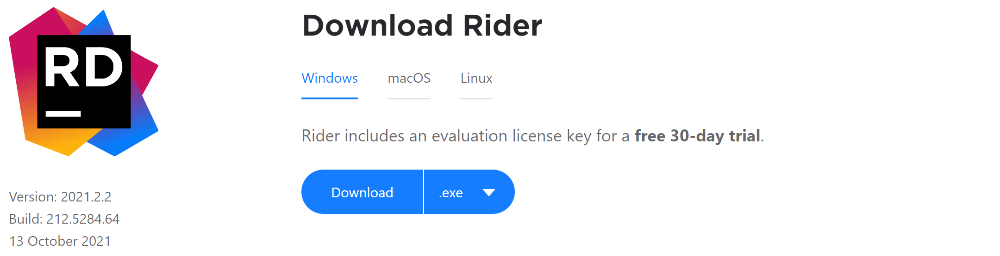
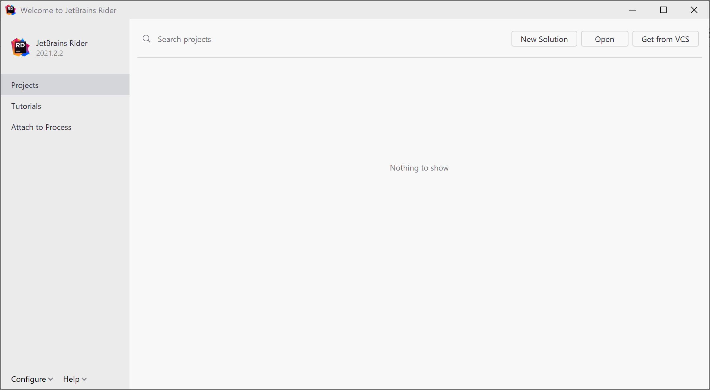
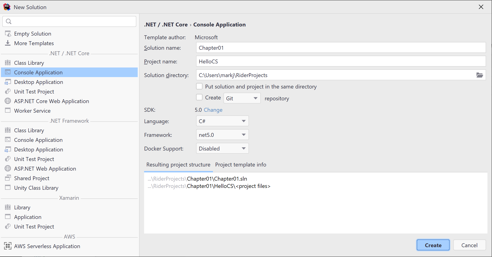
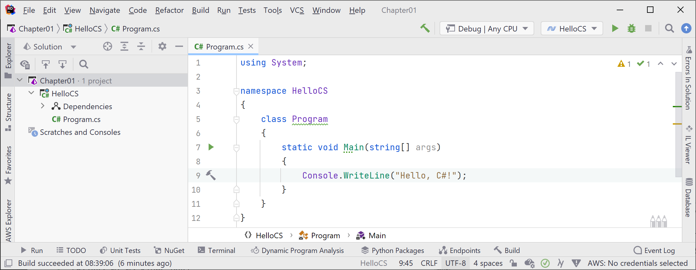
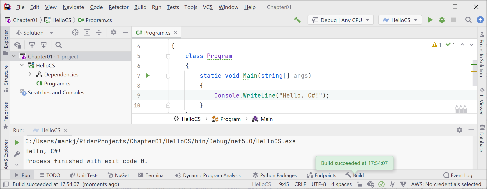
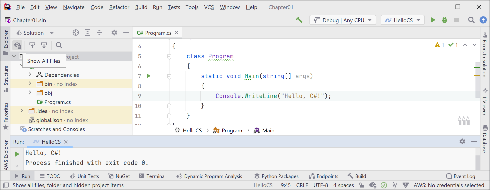
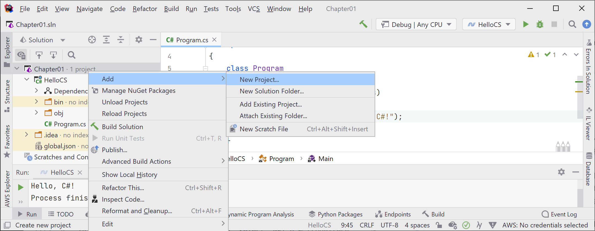
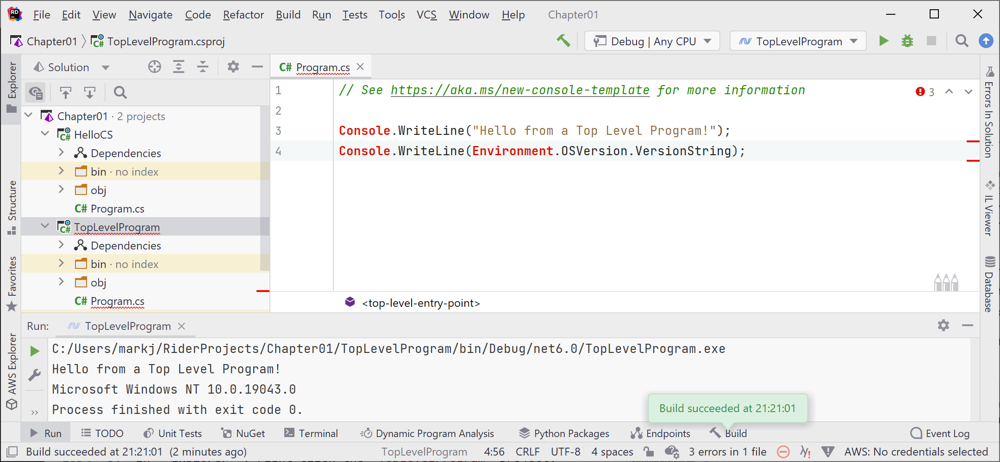

# Using JetBrains Rider

In this article, I provide detailed step-by-step instuctions for using JetBrains Rider for topics like creating a solution with multiple projects and using debugging tools.

# Chapter 1 - Hello, C#! Welcome, .NET!

## Downloading and installing JetBrains Rider

According to the Stackoveflow Survey 2021, about 20% of professional C# and .NET developers use JetBrains Rider in their day-to-day development work. Rider is cross-platform so you can install and run it on Windows, macOS, and varieties of Linux. You can use an evaluation license key for a free 30-day trial. 

If you have not already installed it, let's do so now:

1. Download JetBrains Rider version 2021.2.2 or later from the following link: https://www.jetbrains.com/rider/download/, as shown in *Figure 1.1*:


*Figure 1.1: Download JetBrains Rider*

2. If you’re on Ubuntu 16.04 or later, you can install Rider from the command line: `sudo snap install rider --classic`
3. Run the installer.

## Building console apps using JetBrains Rider

The goal of this section is to showcase how to build a console app using JetBrains Rider. 

## Managing multiple projects using JetBrains Rider

JetBrains Rider uses the same concept of a solution that Visual Studio 2022 does. A solution file (`.sln`) allows you to open and manage multiple projects simultaneously. We will use a solution to manage the two projects that you will create in this chapter.

## Writing code using JetBrains Rider

Let's get started writing code!

1.	Start **JetBrains Rider**.
2.	In the **Welcome to JetBrains Rider** window, click the **New Solution** button, as shown in *Figure 1.4*:


*Figure 1.4: Welcome to JetBrains Rider dialog box with the New Solution button*

We are deliberately going to use the older project template for .NET 5.0 to see what a full console application looks like. In the next section, you will create a console application using .NET 6.0 and see what has changed.

3.	In the **New Solution** dialog, for **SDK**, click **Change** and set it to **5.0**.
4. In the **.NET / .NET Core** section of the project template list, select **Console Application**, and set additional names and options as shown in *Figure 1.5*:
    1. For **Solution name**, enter `Chapter01`.
    2. For **Project name**, enter `HelloWorld`.    3. 
    3. For **Language**, select **C#**.
    4. For **Framework**, select **net5.0**.


*Figure 1.5: Configuring names and options for a .NET 5.0 Console Application project template*

4.	Click **Create**.
5.	In the **Explorer** pane, in its **Solution** view, double-click to open the file named `Program.cs`, and note the code imports the `System` namespace, defines a namespace named `HelloCS`, with a class named `Program`, and a method named `Main`, as shown in *Figure 1.6*:

 
*Figure 1.6: Editing Program.cs in JetBrains Rider*

6.	In `Program.cs`, modify line 9 so that the text that is being written to the console says, `Hello, C#!`.

## Compiling and running code using JetBrains Rider

The next task is to compile and run the code.

1.	In **JetBrains Rider**, navigate to **Run** | **Run 'HelloCS'**. 
2.	The output in the **Run** pane will show the result of running your application, as shown in *Figure 1.7*:


*Figure 1.7: Output of the console application in the Run pane*

3.	Select the `HelloCS` project and then in the **Explorer** pane's toolbar, toggle on the **Show All Files** button, and note the compiler-generated `bin` and `obj` folders are visible, as shown in *Figure 1.8*:


*Figure 1.8: Showing the compiler-generated folders and files*

## Understanding the compiler-generated folders and files

Two compiler-generated folders were created, named `obj` and `bin`. You do not need to look inside these folders or understand their files yet. Just be aware that the compiler needs to create temporary folders and files to do its work. You could delete these folders and their files, and they can be recreated later. Developers often do this to "clean" a project. JetBrains Rider even has a command on the **Build** menu named **Clean Solution** that deletes some of these temporary files for you. 

- The `obj` folder contains one compiled object file for each source code file. These objects haven't been linked together into a final executable yet. 
- The `bin` folder contains the binary executable for the application or class library. We will look at this in more detail in *Chapter 7, Packaging and Distributing .NET Types*.

## Writing top-level programs

You might be thinking that was a lot of code just to output `Hello, C#!`

Although the boilerplate code is written for you by the project template, is there a simpler way?

Well, in C# 9 or later there is, and it is known as **top-level programs**.

Let's compare the console application created by the .NET 5.0 project template, as shown in the following code:
```
using System;

namespace HelloCS
{
  class Program
  {
    static void Main(string[] args)
    {
      Console.WriteLine("Hello World!");
    }
  }
}
```
To the new top-level program minimum console app that it could create, as shown in the following code:
```
using System;

Console.WriteLine("Hello World!");
```
That is a lot simpler, right? If you had to start with a blank file and write all the statements yourself, this is better. But how does it work? 

During compilation, all the boilerplate code to define a namespace, the `Program` class and its `Main` method, is generated and wrapped around the statements you write. 

Key points to remember about top-level programs include the following list:
- Any `using` statements still have to go at the top of the file. 
- There can be only one file like this in a project.

The `using System;` statement at the top of the file imports the `System` namespace. This enables the `Console.WriteLine` statement to work. You will learn more about namespaces in the next chapter. 

## Adding a second project using JetBrains Rider

Let's add a second project to our solution to explore top-level programs.

1. In the **Explorer** pane, right-click the solution named `Chapter01` and navigate to **Manage .NET SDK...**. 
2. For the **.NET / .NET Core SDK**, select **6.0**, and then click **OK**.
2. In the **Explorer** pane, right-click the solution named `Chapter01` and navigate to **Add** | **New Project**, as shown in *Figure 1.9*:


*Figure 1.9: Adding a new project to the solution*

2.	In the **New Project** dialog, in the **.NET / .NET Core** section, select **Console App**, for the **Project name**, enter `TopLevelProgram`, leave the **Project directory** as it is, set the **Framework** to **net6.0**, and then click **Create**.
3.	In `Program.cs`, note the code consists of only a comment and a single statement because it uses the top-level program feature introduced in C# 9, as shown in the following code:
```
// See https://aka.ms/new-console-template for more information

Console.WriteLine("Hello, World!");
```
But when I introduced the concept of top-level programs earlier, we needed a `using System;` statement. Why don't we need that here?

## Implicitly imported namespaces

The trick is that we do still need to import the `System` namespace, but it is now done for us using a feature introduced in C# 10. Let's see how:

1.	In Explorer, expand the `obj` folder, expand the `Debug` folder, expand the `net6.0` folder, and open the file named `TopLevelProgram.GlobalUsings.g.cs.`
3.	Note this file is automatically created by the compiler for projects that target .NET 6, and that it uses a feature introduced in C# 10 called **global imports** that imports some commonly used namespaces like `System` for use in all code files, as shown in the following code:
```
// <autogenerated />
global using global::System;
global using global::System.Collections.Generic;
global using global::System.IO;
global using global::System.Linq;
global using global::System.Net.Http;
global using global::System.Threading;
global using global::System.Threading.Tasks;
```
I will explain more about this feature in the next chapter. For now, just note that a significant change between .NET 5 and .NET 6 is that many of the project templates like the one for console applications use new language features to hide what is really happening.

4.	In the `TopLevelProgram` project, in `Program.cs`, modify the statement to output a different message and the version of the operating system, as shown in the following code:
```
Console.WriteLine("Hello from a Top Level Program!");
Console.WriteLine(Environment.OSVersion.VersionString);
```
5.	In **Explorer**, right-click the `TopLevelProgram` project, navigate to **Run 'TopLevelProgram'**, and note the result, as shown in *Figure 1.10*:
 

*Figure 1.10: Running a top-level program in a Rider solution with two projects on Windows*

# Chapter 4 (coming soon)