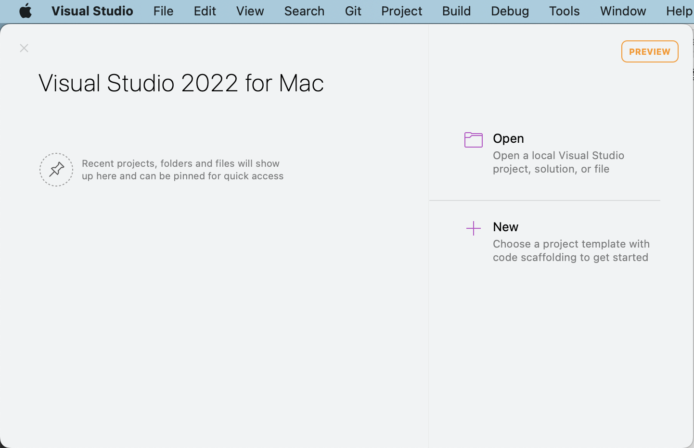
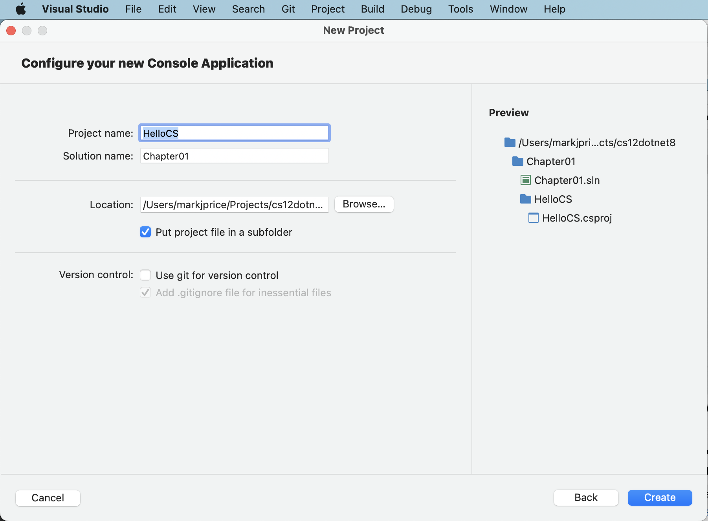
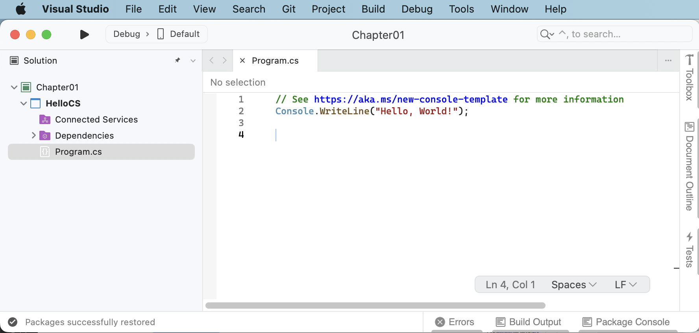
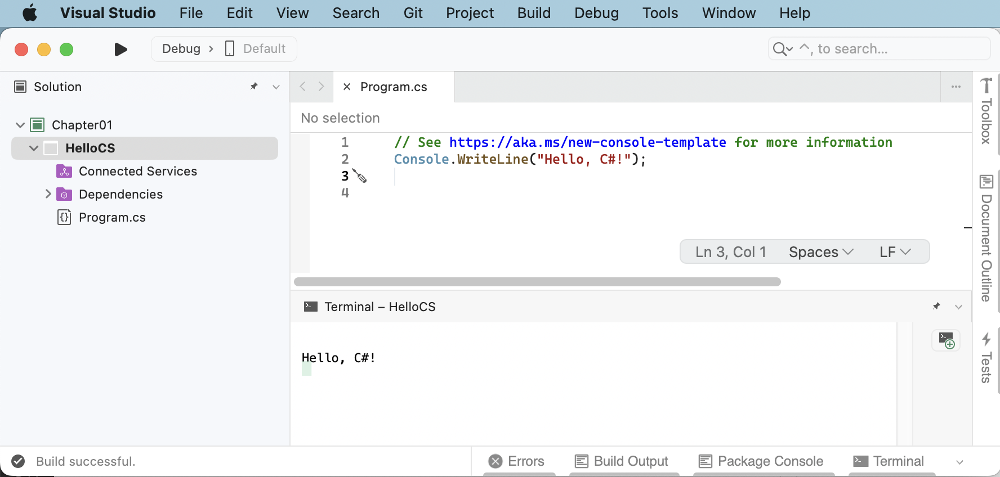
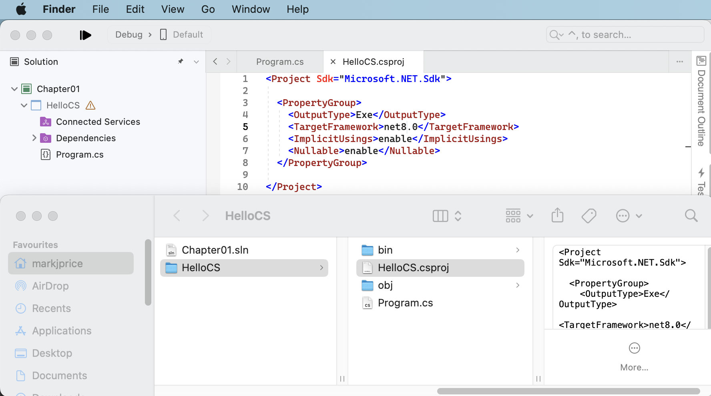
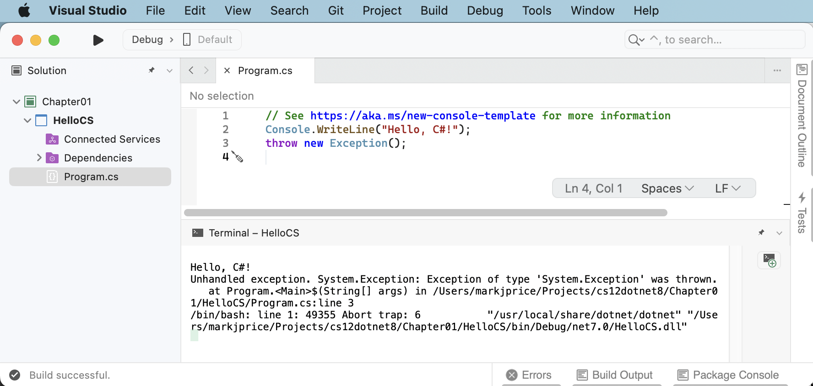
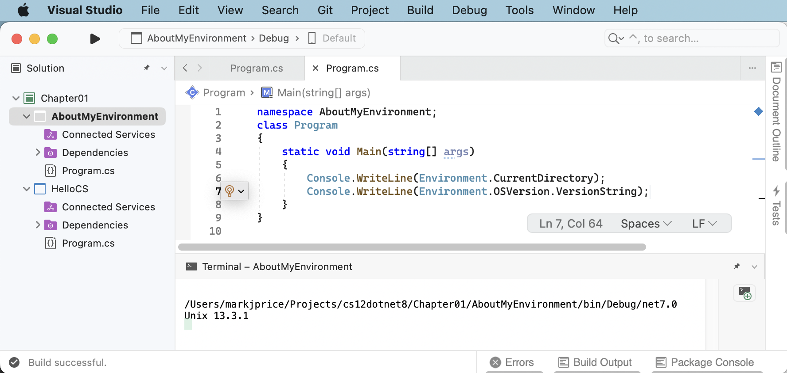

**Using Visual Studio 2022 for Mac**

> **Warning!** Visual Studio 2022 for Mac will reach end-of-life in August 2024. You should switch to an alternative as soon as possible. You can read the retirement announcement at the following link: https://devblogs.microsoft.com/visualstudio/visual-studio-for-mac-retirement-announcement/.

In this article, I provide detailed step-by-step instuctions for using Visual Studio 2022 for Mac for topics like creating a solution with multiple projects and using debugging tools.

- [Chapter 1](#chapter-1)
  - [Downloading and installing Visual Studio 2022 for Mac](#downloading-and-installing-visual-studio-2022-for-mac)
  - [Building console apps using Visual Studio 2022 for Mac](#building-console-apps-using-visual-studio-2022-for-mac)
    - [Managing multiple projects using Visual Studio 2022 for Mac](#managing-multiple-projects-using-visual-studio-2022-for-mac)
    - [Writing code using Visual Studio 2022 for Mac](#writing-code-using-visual-studio-2022-for-mac)
  - [Compiling and running code using Visual Studio](#compiling-and-running-code-using-visual-studio)
  - [Understanding the compiler-generated folders and files](#understanding-the-compiler-generated-folders-and-files)
  - [Understanding top-level programs](#understanding-top-level-programs)
    - [Requirements for top-level programs](#requirements-for-top-level-programs)
    - [Implicitly imported namespaces](#implicitly-imported-namespaces)
    - [Revealing the hidden code by throwing an exception](#revealing-the-hidden-code-by-throwing-an-exception)
  - [Adding a second project using Visual Studio 2022 for Mac](#adding-a-second-project-using-visual-studio-2022-for-mac)

# Chapter 1

## Downloading and installing Visual Studio 2022 for Mac

If you have not already installed Visual Studio 2022 for Mac, let's do so now:

1.	Download Microsoft Visual Studio 2022 version 17.7 or later for Mac from the following link: https://visualstudio.microsoft.com/downloads/
2.	Start the installer.
3.	In the **What would you like to install** window, select the following:
    -	**.NET**
    -	**.NET WebAssembly build tools**
Optionally, if you would like to build .NET MAUI apps for mobile and desktop, select the following:
    -	**.NET Multi-platform App UI**
    -	**macOS (Cocoa)**
    - **Android**
    - **iOS**
5.	Click **Install and Update**, and then wait for the installer to acquire the selected software and install it.
6.	When the installation is complete, click **Launch**.
7.	The first time that you run Visual Studio, you will be prompted to sign in. If you have a Microsoft account, you can use that account. If you don't, then register for a new one at the following link: https://signup.live.com/

## Building console apps using Visual Studio 2022 for Mac

The goal of this section is to showcase how to build a console app using Visual Studio 2022 for Mac. 

### Managing multiple projects using Visual Studio 2022 for Mac

Visual Studio 2022 has a concept named a solution that allows you to open and manage multiple projects simultaneously. We will use a solution to manage the two projects that you will create in this chapter.

### Writing code using Visual Studio 2022 for Mac

Let's get started writing code!

1.	Start **Visual Studio**.
2.	In the **Visual Studio 2022 for Mac** start dialog, click **+ New**, as shown in *Figure 1.3*:


*Figure 1.3: Creating a new project in Visual Studio 2022 for Mac*

3.	In the **New Project** dialog, in the Web and Console section, select **App**, and then in the **General** section, select **Console Application**, making sure that you have chosen the C# project template rather than F#, so that it is selected as shown in *Figure 1.4*:

 
*Figure 1.4: Selecting the C# Console Application project template*

4.	Click **Continue**.
5.	In the **Configure your new Console Application** dialog, in the **Target framework** drop-down list, select **.NET 8.0**.

> If you are missing a .NET SDK version, then you can install it from the following link: https://dotnet.microsoft.com/en-us/download/dotnet. 

6. Leave the check box labelled **Do not use top-level statements** cleared, and then click **Continue**. (Later in this chapter you will create a console app that selects this option so you can see the difference.)
7. In the **Configure your new Console Application** dialog, enter `HelloCS` for the project name, enter `Chapter01` for the solution name, and enter `/Users/<your name>/Projects/cs12dotnet8` for the location, as shown in *Figure 1.5*:

 
*Figure 1.5: Configuring names and locations for your new project*

6.	Click **Create**.
7. If you cannot see the **Solution** window, then navigate to **View** | **Solution**.
8.	If code is not shown, then in  **Solution**, double-click the file named `Program.cs` to open it, and note that **Solution** shows the `HelloCS` project, as shown in *Figure 1.6*:
 

*Figure 1.6: Editing Program.cs in Visual Studio 2022*

9.	In `Program.cs`, note the code consists of only a comment and a single statement. This is because it uses the top-level program feature introduced in C# 9, as shown in the following code:
```cs
// See https://aka.ms/new-console-template for more information
Console.WriteLine("Hello, World!");
```
> As the comment in the code says, you can read more about this template at the following link: https://aka.ms/new-console-template.

10.  In `Program.cs`, modify line 2 so that the text that is being written to the console says `Hello, C#!`.

> All code examples and commands that the reader must review or type are shown in plain text so you will never have to read code or commands from a screenshot like in *Figure 1.6* that might be too small or too faint in print.

## Compiling and running code using Visual Studio

The next task is to compile and run the code.

1.	In Visual Studio, navigate to **Debug** | **Start Without Debugging**. 

> **Good Practice**: When you start a project in Visual Studio 2022, you can choose to attach a debugger or not. If you do not need to debug, then it is better not to attach one because attaching a debugger requires more resources and slows everything down. Attaching a debugger also limits you to only starting one project. If you want to run more than one project, each with a debugger attached, then you must start multiple instances of Visual Studio. In the toolbar, click the green outline triangle button to start without debugging instead of the green solid triangle button unless you need to debug.

2.	The output in the **Terminal** will show the result of running your application, as shown in *Figure 1.7*: 
 

*Figure 1.7: Running the console app on Mac*

3. Double-click the `HelloCS` project and note the dialog for graphially editing project properties.
4. Right-click the `HelloCS` project, select **Edit Project File**, and note the `HelloCS.csproj` project file shows that this console app targets `net8.0`.
6.	Right-click the `HelloCS` project, select **Show in Finder**, and note the compiler-generated `bin` and `obj` folders are visible, as shown in *Figure 1.8*: 


*Figure 1.8: Showing the compiler-generated folders and files*

## Understanding the compiler-generated folders and files

Two compiler-generated folders were created, named `obj` and `bin`. You do not need to look inside these folders or understand their files yet. Just be aware that the compiler needs to create temporary folders and files to do its work. You could delete these folders and their files, and they can be recreated later. Developers often do this to "clean" a project. Visual Studio even has a command on the **Build** menu named **Clean Chapter01** or **Clean All** that deletes some of these temporary files for you. 

-	The `obj` folder contains one compiled object file for each source code file. These objects haven't been linked together into a final executable yet. 
-	The `bin` folder contains the binary executable for the application or class library. We will look at this in more detail in *Chapter 7, Packaging and Distributing .NET Types*.

## Understanding top-level programs

If you have seen older .NET projects before then you might have expected more code, even just to output a simple message. This project has minimal statements because some of the required code is written for you by the compiler when you target .NET 6 or later. 

If you had created the project with .NET SDK 5.0 or earlier, or if you had selected the check box labelled **Do not use top-level statements**, then the `Program.cs` file would have more statements, as shown in the following code:
```cs
using System;

namespace HelloCS
{
  class Program
  {
    static void Main(string[] args)
    {
      Console.WriteLine("Hello, World!");
    }
  }
}
```

During compilation with .NET SDK 6.0 or later, all the boilerplate code to define a namespace, the `Program` class, and its `Main` method, is generated and wrapped around the statements you write. This uses a feature introduced in .NET 5 called top-level programs, but it was not until .NET 6 that Microsoft updated the project template for console apps to use it by default.

### Requirements for top-level programs

Key points to remember about top-level programs include the following:
- There can be only one file like this in a project.
- Any using statements must go at the top of the file.
- If you declare any classes or other types, they must go at the bottom of the file.
- Although you should name the method `Main` if you explicitly define it, the method is named `<Main>$` when created by the compiler.

### Implicitly imported namespaces

The `using System;` statement at the top of the file imports the `System` namespace. This enables the `Console.WriteLine` statement to work. Why do we not have to import it in our project? 

The trick is that we do still need to import the `System` namespace, but it is now done for us using a combination of features introduced in C# 10 and .NET 6. 

Let's see how:

1.	In **Finder**, expand the `obj` folder, expand the `Debug` folder, expand the `net8.0` folder, and open the file named `HelloCS.GlobalUsings.g.cs`.
2. Note that this file is automatically created by the compiler for projects that target .NET 6 or later, and that it uses a feature introduced in C# 10 called **global namespace imports** that imports some commonly used namespaces like `System` for use in all code files, as shown in the following code:
```cs
// <autogenerated />
global using global::System;
global using global::System.Collections.Generic;
global using global::System.IO;
global using global::System.Linq;
global using global::System.Net.Http;
global using global::System.Threading;
global using global::System.Threading.Tasks;
```

I will explain more about the implicit imports feature in the next chapter. For now, just note that a significant change that happened between .NET 5 and .NET 6 is that many of the project templates, like the one for console apps, use new SDK and language features to hide what is really happening.

### Revealing the hidden code by throwing an exception

Now let's discover how the hidden `<Main>$` method has been written:

1. In `Program.cs`, after the statement that outputs the message, add a statement to throw a new exception, as shown in the following code:
```cs
throw new Exception();
```

2. In Visual Studio, navigate to **Debug** | **Start Without Debugging**. (Do not start the project with debugging or the exception will be caught by the debugger!)
3. The output in the terminal will show the result of running your application, including that a hidden `Program` class was defined by the compiler with a method named `<Main>$` that has a parameter named `args` for passing in arguments, as shown in *Figure 1.9*:
 

*Figure 1.9: Throwing an exception to reveal the hidden `Program.<Main>$` method*

## Adding a second project using Visual Studio 2022 for Mac

Let's add a second project to our solution to work with multiple projects.

1.	In Visual Studio, navigate to **File** | **Add** | **Project**.

> **Warning!** The above step adds a new project to the existing solution. Do NOT navigate to **File** | **New Project…*** which instead is meant to be used to create a new project and solution.

2.	In the **New Project** dialog, in **Recently used templates**, select **Console Application** and then click **Continue**.
3.	In the **Configure your new Console Application** dialog, for **Target framework**, select **.NET 8.0**, select the **Do not use top-level statements** check box, and click **Continue**.

> **Warning!** Make sure you have *selected* the check box, so we get to see the older style of `Program.cs`.

3.	In the **Configure your new Console Application** dialog, for the **Project name**, enter `AboutMyEnvironment`, leave the location as it is, and then click **Create**.
4.	In **Solution**, in the `AboutMyEnvironment` project, double-click `Program.cs` to open it.
5.	In the `AboutMyEnvironment` project, in `Program.cs`, note the statements to define a namespace that matches the project name, a class named `Program`, and a method named `Main` with a parameter named `args`, as shown in the following code:
```cs
namespace AboutMyEnvironment;
class Program
{
  static void Main(string[] args)
  {
    Console.WriteLine("Hello, World!");
  }
}
```

6. In `Program.cs`, in the `Main` method, delete the existing `Console.WriteLine` statement and then add statements to output the current directory and the version of the operating system, as shown in the following code:
```cs
Console.WriteLine(Environment.CurrentDirectory);
Console.WriteLine(Environment.OSVersion.VersionString);
```

7. In **Solution**, right-click the `AboutMyEnvironment` project, and then select **Set As Startup Project**, and note that Visual Studio indicates that **AboutMyEnvironment** is now the startup project by making the project name bold.

8. Navigate to **Debug** | **Start Without Debugging** to run the `AboutMyEnvironment` project, and note the result, as shown in the following output and in *Figure 1.10*:

```
/Users/markjprice/Projects/cs12dotnet8/Chapter01/AboutMyEnvironment/bin/Debug/net8.0
Unix 13.3.1
```


*Figure 1.10: Running a console app in a Visual Studio for Mac solution with two projects*

> When using Visual Studio 2022 for Mac to run a console app, it executes the app from the `<projectname>\bin\Debug\net8.0` folder. It will be important to remember this when we work with the filesystem in later chapters. When using Visual Studio Code, or more accurately, the dotnet CLI, it has different behavior.
