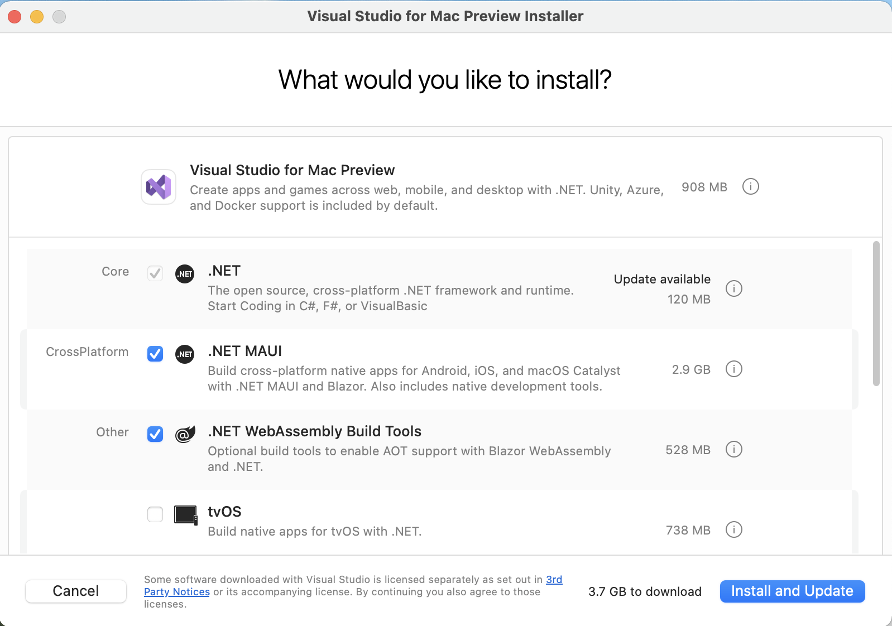

# Using Visual Studio 2022 for Mac

In this article, I provide detailed step-by-step instuctions for using Visual Studio 2022 for Mac for topics like creating a solution with multiple projects and using debugging tools.

# Chapter 1

## Downloading and installing Visual Studio 2022 for Mac

If you have not already installed Visual Studio 2022 for Mac, let's do so now:

1.	Download Microsoft Visual Studio 2022 version 17.0 or later for Mac from the following link: https://visualstudio.microsoft.com/downloads/
2.	Start the installer.
3.	On the **What would you like to install** window, select the following:
•	.NET
•	.NET MAUI
•	.NET WebAssembly Build Tools
•	macOS (Cocoa)
•	You can leave legacy components selected.

5.	Click **Install and Update**, and then wait for the installer to acquire the selected software and install it.
6.	When the installation is complete, click **Launch**.
7.	The first time that you run Visual Studio, you will be prompted to sign in. If you have a Microsoft account, you can use that account. If you don't, then register for a new one at the following link: https://signup.live.com/
8.	The first time that you run Visual Studio, you will be prompted to configure your environment. For Development Settings, choose Visual C#. For the color theme, I chose Blue, but you can choose whatever tickles your fancy.
9.	If you want to customize your keyboard shortcuts, navigate to Tools | Options…, and then select the Keyboard section.

## Building console apps using Visual Studio 2022 for Mac

The goal of this section is to showcase how to build a console app using Visual Studio 2022 for Mac. 

### Managing multiple projects using Visual Studio 2022 for Mac

Visual Studio 2022 has a concept named a solution that allows you to open and manage multiple projects simultaneously. We will use a solution to manage the two projects that you will create in this chapter.

### Writing code using Visual Studio 2022 for Mac

Let's get started writing code!

1.	Start Visual Studio 2022 for Mac.
2.	In the Start window, click Create a new project.
3.	In the Create a new project dialog, enter console in the Search for templates box, and select Console Application, making sure that you have chosen the C# project template rather than another language like F# or Visual Basic, as shown in Figure 1.4:
 
Figure 1.4: Selecting the Console Application project template
4.	Click Next.
5.	In the Configure your new project dialog, enter HelloCS for the project name, enter C:\Code for the location, and enter Chapter01 for the solution name, as shown in Figure 1.5:
 
Figure 1.5: Configuring names and locations for your new project
6.	Click Next.
We are deliberately going to use the older project template for .NET 5.0 to see what a full console application looks like. In the next section, you will create a console application using .NET 6.0 and see what has changed.
7.	In the Additional information dialog, in the Target Framework dropdown list, note the choices of Current and long-term support versions of .NET, and then select .NET 5.0 (Current) and click Create.
8.	In Solution Explorer, double-click to open the file named Program.cs, and note the Solution Explorer shows the HelloCS project, as shown in Figure 1.6:
 
Figure 1.6: Editing Program.cs in Visual Studio 2022
9.	In Program.cs, modify line 9 so that the text that is being written to the console says, Hello, C#!
Compiling and running code using Visual Studio
The next task is to compile and run the code.
1.	In Visual Studio, navigate to Debug | Start Without Debugging. 
2.	The output in the console window will show the result of running your application, as shown in Figure 1.7:
 
Figure 1.7: Running the console app on Windows
3.	Press any key to close the console window and return to Visual Studio.
4.	Select the HelloCS project and then in the Solution Explorer toolbar, toggle on the Show All Files button, and note the compiler-generated bin and obj folders are visible, as shown in *Figure 1.8*:
 
 Figure 1.8: Showing the compiler-generated folders and files
Understanding the compiler-generated folders and files
Two compiler-generated folders were created, named obj and bin. You do not need to look inside these folders or understand their files yet. Just be aware that the compiler needs to create temporary folders and files to do its work. You could delete these folders and their files, and they can be recreated later. Developers often do this to "clean" a project. Visual Studio even has a command on the Build menu named Clean Solution that deletes some of these temporary files for you. The equivalent command with Visual Studio Code is: dotnet clean
•	The obj folder contains one compiled object file for each source code file. These objects haven't been linked together into a final executable yet. 
•	The bin folder contains the binary executable for the application or class library. We will look at this in more detail in *Chapter 7, Packaging and Distributing .NET Types*.

### Writing top-level programs

You might be thinking that was a lot of code just to output Hello, C#! 

Although the boilerplate code is written for you by the project template, is there a simpler way?

Well, in C# 9 or later there is, and it is known as top-level programs.

Let's compare the console app created by the project template, as shown in the following code:
```
using System;

namespace HelloCS
{
  class Program
  {
    static void Main(string[] args)
    {
      Console.WriteLine("Hello World!");
    }
  }
}
```
To the new top-level program minimum console app, as shown in the following code:
```
using System;

Console.WriteLine("Hello World!");
```
That is a lot simpler, right? If you had to start with a blank file and write all the statements yourself, this is better. But how does it work? 
During compilation, all the boilerplate code to define a namespace, the Program class and its Main method, is generated and wrapped around the statements you write. 
Key points to remember about top-level programs include the following list:
•	Any using statements still have to go at the top of the file. 
•	There can be only one file like this in a project.
The `using System;` statement at the top of the file imports the `System` namespace. This enables the `Console.WriteLine` statement to work. You will learn more about namespaces in the next chapter. 

### Adding a second project using Visual Studio 2022

Let's add a second project to our solution to explore top-level programs.

1.	In Visual Studio, navigate to File | Add | New Project.
2.	In the Add a new project dialog, in Recent project templates, select Console Application [C#] and then click Next.
3.	In the Configure your new project dialog, for the Project name, enter TopLevelProgram, leave the location as C:\Code\Chapter01, and then click Next.
4.	In the Additional information dialog, select .NET 6.0 (Long-term support), and then click Create.
5.	In Solution Explorer, in the TopLevelProgram project, double-click Program.cs to open it.
6.	In Program.cs, note the code consists of only a comment and a single statement because it uses the top-level program feature introduced in C# 9, as shown in the following code:
// See https://aka.ms/new-console-template for more information
Console.WriteLine("Hello, World!");
But when I introduced the concept of top-level programs earlier, we needed a using System; statement. Why don't we need that here?
Implicitly imported namespaces
The trick is that we do still need to import the System namespace, but it is now done for us using a feature introduced in C# 10. Let's see how:
1.	In Solution Explorer, select the TopLevelProgram project and toggle on the Show All Files button, and note the compiler-generated bin and obj folders are visible.
2.	Expand the obj folder, expand the Debug folder, expand the net6.0 folder, and open the file named TopLevelProgram.ImplicitNamespaceImports.cs.
3.	Note this file is automatically created by the compiler for projects that target .NET 6, and that it uses a feature introduced in C# 10 called global imports that imports some commonly used namespaces like System for use in all code files, as shown in the following code:
```
// <autogenerated />
global using global::System;
global using global::System.Collections.Generic;
global using global::System.IO;
global using global::System.Linq;
global using global::System.Net.Http;
global using global::System.Threading;
global using global::System.Threading.Tasks;
```
I will explain more about this feature in the next chapter. For now, just note that a significant change between .NET 5 and .NET 6 is that many of the project templates like the one for console applications use new language features to hide what is really happening.
4.	In the TopLevelProgram project, in Program.cs, modify the statement to output a different message and the version of the operating system, as shown in the following code:
Console.WriteLine("Hello from a Top Level Program!");
Console.WriteLine(Environment.OSVersion.VersionString);
5.	In Solution Explorer, right-click the Chapter01 solution, select Set Startup Projects…, set Current selection, and then click OK. 
6.	In Solution Explorer, click the TopLevelProgram project (or any file or folder within it), and note that Visual Studio indicates that TopLevelProgram is now the startup project by making the project name bold.
7.	Navigate to Debug | Start Without Debugging to run the TopLevelProgram project, and note the result, as shown in Figure 1.9:
 
Figure 1.9: Running a top-level program in a Visual Studio solution with two projects on Windows


# Chapter 4

