**Using Visual Studio 2022 for Windows**

In this article, I provide detailed step-by-step instuctions for using Visual Studio 2022 for Windows for topics like creating a solution with multiple projects and using debugging tools.

- [Chapter 1 - Hello, C#! Welcome, .NET!](#chapter-1---hello-c-welcome-net)
  - [Downloading and installing Visual Studio 2022](#downloading-and-installing-visual-studio-2022)
  - [Building console apps using Visual Studio 2022](#building-console-apps-using-visual-studio-2022)
    - [Managing multiple projects using Visual Studio 2022](#managing-multiple-projects-using-visual-studio-2022)
    - [Writing code using Visual Studio 2022](#writing-code-using-visual-studio-2022)
  - [Compiling and running code using Visual Studio](#compiling-and-running-code-using-visual-studio)
  - [Understanding the compiler-generated folders and files](#understanding-the-compiler-generated-folders-and-files)
  - [Understanding top-level programs](#understanding-top-level-programs)
    - [Requirements for top-level programs](#requirements-for-top-level-programs)
    - [Implicitly imported namespaces](#implicitly-imported-namespaces)
    - [Revealing the hidden code by throwing an exception](#revealing-the-hidden-code-by-throwing-an-exception)
  - [Adding a second project using Visual Studio 2022](#adding-a-second-project-using-visual-studio-2022)
- [Chapter 4 - Writing, Debugging, and Testing Functions](#chapter-4---writing-debugging-and-testing-functions)
  - [Debugging during development](#debugging-during-development)
    - [Creating code with a deliberate bug](#creating-code-with-a-deliberate-bug)
    - [Setting a breakpoint and starting debugging](#setting-a-breakpoint-and-starting-debugging)
    - [Using Visual Studio 2022](#using-visual-studio-2022)
    - [Navigating with the debugging toolbar](#navigating-with-the-debugging-toolbar)
    - [Debugging windows](#debugging-windows)
    - [Stepping through code](#stepping-through-code)
    - [Customizing breakpoints](#customizing-breakpoints)
  - [Hot reloading during development](#hot-reloading-during-development)
    - [Hot reloading using Visual Studio 2022](#hot-reloading-using-visual-studio-2022)
- [Chapter 7 - Packaging and Distributing .NET Types](#chapter-7---packaging-and-distributing-net-types)
  - [Decompiling using the ILSpy extension for Visual Studio 2022 (coming soon)](#decompiling-using-the-ilspy-extension-for-visual-studio-2022-coming-soon)

# Chapter 1 - Hello, C#! Welcome, .NET!

## Downloading and installing Visual Studio 2022

If you have not already installed Visual Studio 2022 for Windows, let's do so now:

1.	Download Microsoft Visual Studio 2022 version 17.8 or later for Windows from the following link: https://visualstudio.microsoft.com/downloads/.
2.	Start the installer.
3.	On the **Workloads** tab, select the following:
    -	**ASP.NET and web development**
    -	**.NET desktop development**
    - **Desktop development with C++** with all default components (because this enables publishing console apps and web services that start faster and have smaller memory footprints).
4.	Click **Install** and wait for the installer to acquire the selected software and install it.
5.	When the installation is complete, click **Launch**.
6.	The first time that you run Visual Studio 2022, you will be prompted to sign in. If you have a Microsoft account, you can use that account. If you don't, then register for a new one at the following link: https://signup.live.com/
7.	The first time that you run Visual Studio 2022, you will be prompted to configure your environment. For **Development Settings**, choose **Visual C#**. For the color theme, I chose **Blue**, but you can choose whatever tickles your fancy.
8.	If you want to customize your keyboard shortcuts, navigate to **Tools** | **Options...**, and then select the **Keyboard** section.

## Building console apps using Visual Studio 2022

The goal of this section is to showcase how to build a console app using Visual Studio 2022 for Windows. 

### Managing multiple projects using Visual Studio 2022

Visual Studio 2022 has a concept named a solution that allows you to open and manage multiple projects simultaneously. We will use a solution to manage the two projects that you will create in this chapter.

### Writing code using Visual Studio 2022

Let's get started writing code!

1.	Start **Visual Studio 2022**. You might see an experimental new **Welcome** tab that replaces the old model dialog box, as shown in *Figure 1.3*. This was introduced with previews of version 17.6 but in more recent previews it has been removed again. Microsoft is surveying what "Welcome Experience" developers prefer so it might return.
2.	In the **Welcome** tab, click **New Project**, or if you are using a version with the **Visual Studio 2022** modal dialog box, then in the **Get started** section, click **Create a new project**.

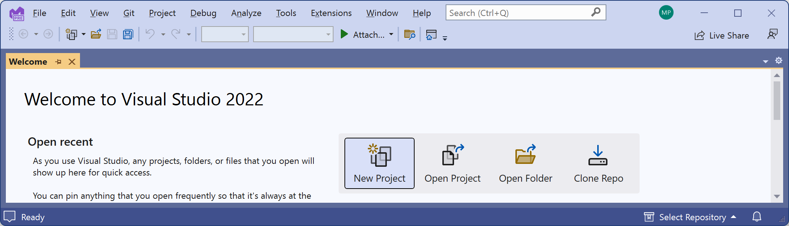
*Figure 1.3: Creating a new project in Visual Studio 2022*

3.	In the **Create a new project** dialog,  select the C# language to filter the project templates, and then enter `console` in the **Search for templates** box, and select **Console App**, making sure that you have chosen the cross-platform project template, not the one for .NET Framework, which is Windows-only, and the C# project template rather than another language, such as Visual Basic or TypeScript, so that it is selected as shown in *Figure 1.4*:

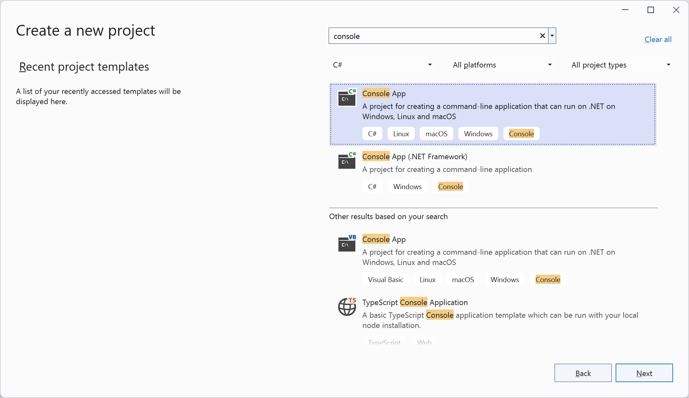 
*Figure 1.4: Selecting the Console App project template*

4.	Click **Next**.
5.	In the **Configure your new project** dialog, enter `HelloCS` for the project name, enter `C:\cs12dotnet8` for the location, and enter `Chapter01` for the solution name, as shown in *Figure 1.5*:

 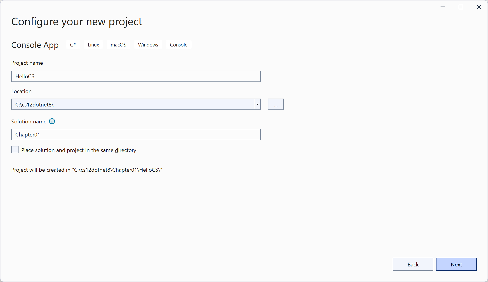
*Figure 1.5: Configuring names and locations for your new project*

6.	Click **Next**.
7.	In the **Additional information** dialog, in the **Framework** drop-down list, note that your .NET SDK choices indicate if that version is **Standard Term Support**, **Long Term Support**, **Preview**, or **Out of support**, and then select **.NET 8.0 (Long Term Support)**.

> If you are missing a .NET SDK version, then you can install it from the following link: https://dotnet.microsoft.com/en-us/download/dotnet. 

8. Leave the check box labelled **Do not use top-level statements** cleared, and then click **Create**. (Later in this chapter you will create a console app that selects this option so you can see the difference.)
9. If you cannot see the **Solution Explorer**, then navigate to **View** | **Solution Explorer**.
10.	If code is not shown, then in  **Solution Explorer**, double-click the file named `Program.cs` to open it, and note that **Solution Explorer** shows the `HelloCS` project, as shown in *Figure 1.6*:
 
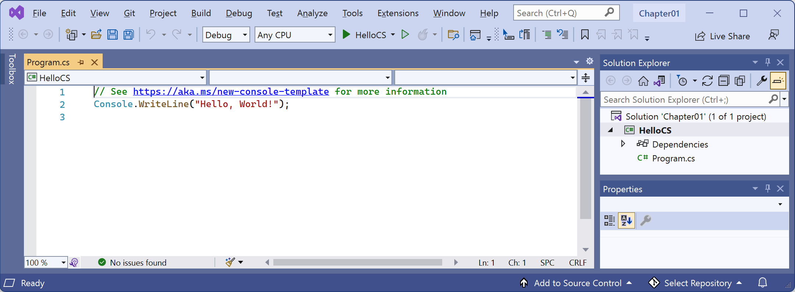
*Figure 1.6: Editing Program.cs in Visual Studio 2022*

11.	In `Program.cs`, note the code consists of only a comment and a single statement. This is because it uses the top-level program feature introduced in C# 9, as shown in the following code:
```cs
// See https://aka.ms/new-console-template for more information
Console.WriteLine("Hello, World!");
```
> As the comment in the code says, you can read more about this template at the following link: https://aka.ms/new-console-template.

12. In `Program.cs`, modify line 2 so that the text that is being written to the console says `Hello, C#!`.

> All code examples and commands that the reader must review or type are shown in plain text so you will never have to read code or commands from a screenshot like in *Figure 1.6* that might be too small or too faint in print.

## Compiling and running code using Visual Studio

The next task is to compile and run the code.

1.	In Visual Studio, navigate to **Debug** | **Start Without Debugging**. 

> **Good Practice**: When you start a project in Visual Studio 2022, you can choose to attach a debugger or not. If you do not need to debug, then it is better not to attach one because attaching a debugger requires more resources and slows everything down. Attaching a debugger also limits you to only starting one project. If you want to run more than one project, each with a debugger attached, then you must start multiple instances of Visual Studio. In the toolbar, click the green outline triangle button to start without debugging instead of the green solid triangle button unless you need to debug.

2.	The output in the console window will show the result of running your application, as shown in *Figure 1.7*: 
 
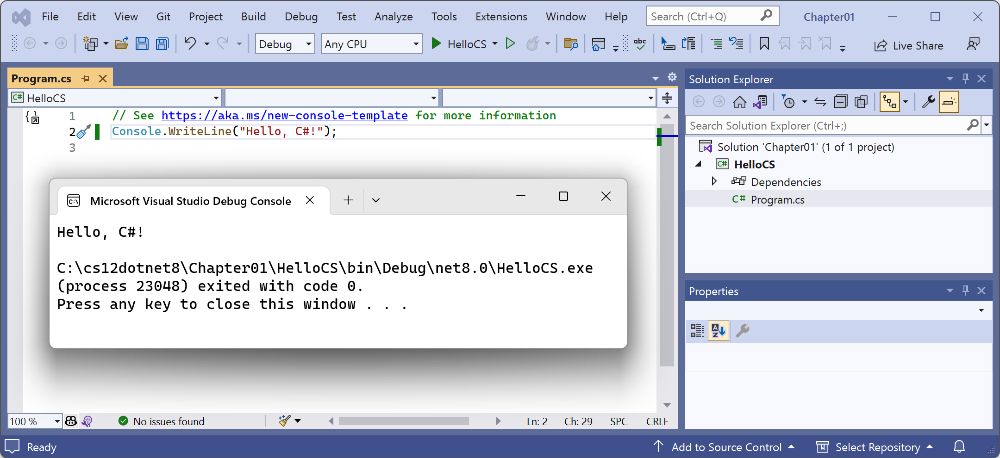
*Figure 1.7: Running the console app on Windows*

3.	Press any key to close the console window and return to Visual Studio 2022.
4. Optionally, close the **Properties** pane to make more vertical space for **Solution Explorer**.
5. Double-click the `HelloCS` project and note the `HelloCS.csproj` project file shows that this console app targets `net8.0`, as shown in *Figure 1.8*.
6.	In the **Solution Explorer** toolbar, toggle on the **Show All Files** button, and note the compiler-generated `bin` and `obj` folders are visible, as shown in *Figure 1.8*: 

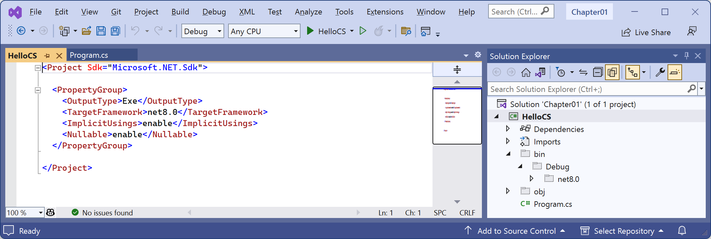
*Figure 1.8: Showing the compiler-generated folders and files*

## Understanding the compiler-generated folders and files

Two compiler-generated folders were created, named `obj` and `bin`. You do not need to look inside these folders or understand their files yet. Just be aware that the compiler needs to create temporary folders and files to do its work. You could delete these folders and their files, and they can be recreated later. Developers often do this to "clean" a project. Visual Studio even has a command on the **Build** menu named **Clean Solution** that deletes some of these temporary files for you. 

-	The `obj` folder contains one compiled object file for each source code file. These objects haven't been linked together into a final executable yet. 
-	The `bin` folder contains the binary executable for the application or class library. We will look at this in more detail in *Chapter 7, Packaging and Distributing .NET Types*.

## Understanding top-level programs

If you have seen older .NET projects before then you might have expected more code, even just to output a simple message. This project has minimal statements because some of the required code is written for you by the compiler when you target .NET 6 or later. 

If you had created the project with .NET SDK 5.0 or earlier, or if you had selected the check box labelled **Do not use top-level statements**, then the `Program.cs` file would have more statements, as shown in the following code:
```cs
using System;

namespace HelloCS
{
  class Program
  {
    static void Main(string[] args)
    {
      Console.WriteLine("Hello, World!");
    }
  }
}
```

During compilation with .NET SDK 6.0 or later, all the boilerplate code to define a namespace, the `Program` class, and its `Main` method, is generated and wrapped around the statements you write. This uses a feature introduced in .NET 5 called top-level programs, but it was not until .NET 6 that Microsoft updated the project template for console apps to use it by default.

### Requirements for top-level programs

Key points to remember about top-level programs include the following:
- There can be only one file like this in a project.
- Any using statements must go at the top of the file.
- If you declare any classes or other types, they must go at the bottom of the file.
- Although you should name the method `Main` if you explicitly define it, the method is named `<Main>$` when created by the compiler.

### Implicitly imported namespaces

The `using System;` statement at the top of the file imports the `System` namespace. This enables the `Console.WriteLine` statement to work. Why do we not have to import it in our project? 

The trick is that we do still need to import the `System` namespace, but it is now done for us using a combination of features introduced in C# 10 and .NET 6. Let's see how:

1.	In **Solution Explorer**, expand the `obj` folder, expand the `Debug` folder, expand the `net8.0` folder, and open the file named `HelloCS.GlobalUsings.g.cs`.
2. Note that this file is automatically created by the compiler for projects that target .NET 6 or later, and that it uses a feature introduced in C# 10 called **global namespace imports** that imports some commonly used namespaces like `System` for use in all code files, as shown in the following code:
```cs
// <autogenerated />
global using global::System;
global using global::System.Collections.Generic;
global using global::System.IO;
global using global::System.Linq;
global using global::System.Net.Http;
global using global::System.Threading;
global using global::System.Threading.Tasks;
```

3. In **Solution Explorer**, click the **Show All Files** button to hide the `bin` and `obj` folders. 

I will explain more about the implicit imports feature in the next chapter. For now, just note that a significant change that happened between .NET 5 and .NET 6 is that many of the project templates, like the one for console apps, use new SDK and language features to hide what is really happening.

### Revealing the hidden code by throwing an exception

Now let's discover how the hidden code has been written:

1. In `Program.cs`, after the statement that outputs the message, add a statement to throw a new exception, as shown in the following code:
```cs
throw new Exception();
```

2. In Visual Studio, navigate to **Debug** | **Start Without Debugging**. (Do not start the project with debugging or the exception will be caught by the debugger!)
3. The output in the console window will show the result of running your application, including that a hidden `Program` class was defined by the compiler with a method named `<Main>$` that has a parameter named `args` for passing in arguments, as shown in *Figure 1.9*:
 
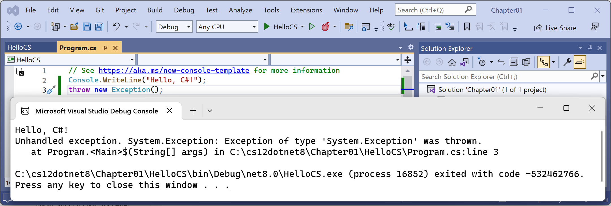
*Figure 1.9: Throwing an exception to reveal the hidden `Program.<Main>$` method*

4. Press any key to close the console app window and return to Visual Studio.

## Adding a second project using Visual Studio 2022

Let's add a second project to our solution to work with multiple projects.

1.	In Visual Studio 2022, navigate to **File** | **Add** | **New Project**.

> **Warning!** The above step adds a new project to the existing solution. Do NOT navigate to **File** | **New** | **Project…** which instead is meant to be used to create a new project and solution (although the dialog box has a dropdown to choose to add to an existing solution too).

2.	In the **Add a new project** dialog, in **Recent project templates**, select **Console App [C#]** and then click **Next**.
3.	In the **Configure your new project** dialog, for the **Project name**, enter `AboutMyEnvironment`, leave the location as `C:\cs12dotnet8\Chapter01`, and then click **Next**.
4.	In the **Additional information** dialog, select **.NET 8.0 (Long Term Support)**, select the **Do not use top-level statements** check box.

> **Warning!** Make sure you have selected the check box, so we get to see the older style of `Program.cs`.

5. Click **Create**.
6.	In **Solution Explorer**, in the `AboutMyEnvironment` project, double-click `Program.cs` to open it.
7.	In the `AboutMyEnvironment` project, in `Program.cs`, note the statements to define a namespace that matches the project name, a class named `Program`, and a method named `Main` with a parameter named `args`, as shown highlighted in the following code:
```cs
namespace AboutMyEnvironment
{
  internal class Program
  {
    static void Main(string[] args)
    {
      Console.WriteLine("Hello, World!");
    }
  }
}
```

8. In `Program.cs`, in the `Main` method, delete the existing `Console.WriteLine` statement and then add statements to output the current directory and the version of the operating system, as shown in the following code:
```cs
Console.WriteLine(Environment.CurrentDirectory);
Console.WriteLine(Environment.OSVersion.VersionString);
```

9. In **Solution Explorer**, right-click the `Chapter01` solution, and then select **Configure Startup Projects…**.
10. In the **Solution 'Chapter01' Property Pages** dialog box, set **Startup Project** to **Current selection**, and then click **OK**.
11. In **Solution Explorer**, click the `AboutMyEnvironment` project (or any file or folder within it), and note that Visual Studio indicates that **AboutMyEnvironment** is now the startup project by making the project name bold.

> **Good Practice**: I recommend this way of setting the startup project because it then makes it very easy to switch startup projects by simply clicking a project (or any file in a project) to make it the startup project. Although you can right-click a project and set it as a startup project, if you then want to run a different project, you must manually change it again. Simply clicking anywhere in the project is easier.

12. Navigate to **Debug** | **Start Without Debugging** to run the `AboutMyEnvironment` project, and note the result, as shown in the following output and in *Figure 1.10*:

```
C:\cs12dotnet8\Chapter01\AboutMyEnvironment\bin\Debug\net8.0
Microsoft Windows NT 10.0.22621.0
```

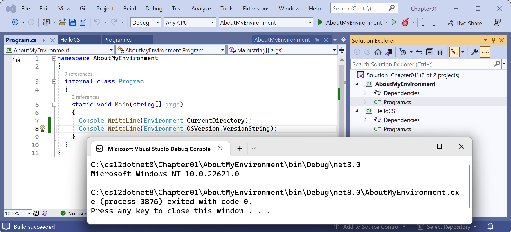
*Figure 1.10: Running a top-level program in a Visual Studio solution with two projects*

> Windows 11 is just branding. Its official name is Windows NT, and its major version number is still 10! But its patch version is 22000 or higher.

13. Press any key to close the console app window and return to Visual Studio.

> When using Visual Studio 2022 for Windows to run a console app, it executes the app from the `<projectname>\bin\Debug\net8.0` folder. It will be important to remember this when we work with the filesystem in later chapters. When using Visual Studio Code, or more accurately, the dotnet CLI, it has different behavior.

# Chapter 4 - Writing, Debugging, and Testing Functions

## Debugging during development

In this section, you will learn how to debug problems at development time. You must use a code editor that has debugging tools, such as Visual Studio 2022 or Visual Studio Code.

### Creating code with a deliberate bug

Let's explore debugging by creating a console app with a deliberate bug that we will then use the debugger tools in your code editor to track down and fix:
1.	Use your preferred coding tool to add a new **Console App** / `console` project named `Debugging` to the `Chapter04` solution.
2.	Modify `Debugging.csproj` to statically import `System.Console` for all code files.
3.	In `Program.cs`, delete any existing statements and then at the bottom of the file, add a function with a deliberate bug, as shown in the following code:
```cs
// Functions in Program.cs must be at the bottom of the file.
double Add(double a, double b)
{
  return a * b; // deliberate bug!
}
```

4.	Above the `Add` function, write statements to declare and set some variables and then add them together using the buggy function, as shown in the following code:
```cs
double a = 4.5;
double b = 2.5;
double answer = Add(a, b);

WriteLine($"{a} + {b} = {answer}");
WriteLine("Press Enter to end the app.");
ReadLine(); // Wait for user to press Enter.
```

5.	Run the console application and view the result, as shown in the following output:
```
4.5 + 2.5 = 11.25
Press Enter to end the app.
```

But wait, there's a bug! 4.5 added to 2.5 should be 7, not 11.25!

We will use the debugging tools to hunt for and squish the bug.

### Setting a breakpoint and starting debugging

Breakpoints allow us to mark a line of code that we want to pause at to inspect the program state and find bugs.

### Using Visual Studio 2022
Let's set a breakpoint and then start debugging using Visual Studio 2022:

1.	Click in line 1, which is the statement that declares the variable named `a`.
2.	Navigate to **Debug** | **Toggle Breakpoint** or press *F9*. A red circle will appear in the margin bar on the left-hand side and the statement will be highlighted in red to indicate that a breakpoint has been set, as shown in *Figure 4.3*:

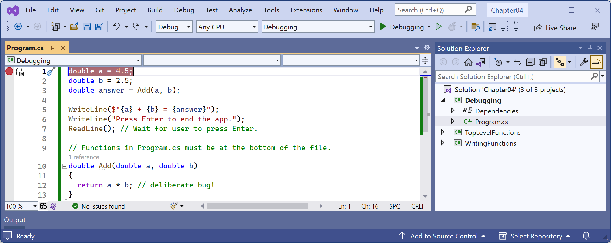
*Figure 4.3: Toggling breakpoints using Visual Studio 2022*

Breakpoints can be toggled off with the same action. You can also left-click in the margin to toggle a breakpoint on and off, or right-click a breakpoint to see more options, such as delete, disable, or edit conditions or actions for an existing breakpoint.

3.	Navigate to **Debug** | **Start Debugging** or press *F5*. Visual Studio starts the console application and then pauses when it hits the breakpoint. This is known as break mode. Extra windows titled **Locals** (showing current values of local variables), **Watch 1** (showing any watch expressions you have defined), **Call Stack**, **Exception Settings**, and **Immediate Window** may appear. The **Debugging** toolbar appears. The line that will be executed next is highlighted in yellow, and a yellow arrow points at the line from the margin bar, as shown in *Figure 4.4*:

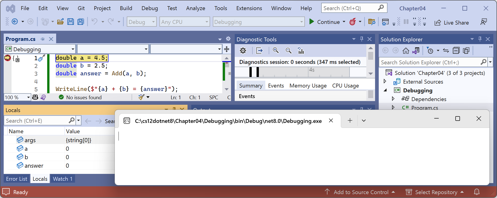
*Figure 4.4: Break mode in Visual Studio 2022*

### Navigating with the debugging toolbar

Visual Studio Code shows a floating toolbar with buttons to make it easy to access debugging features, as shown in *Figure 4.7* and as described in the following list:

 
*Figure 4.7: Debugging toolbars in Visual Studio 2022 and Visual Studio Code*

- **Start**/**Continue**/*F5*: This button is context sensitive. It will either start a project running or continue running the project from the current position until it ends or hits a breakpoint.
- **Hot Reload**: This button will reload compiled code changes without needing to restart the app.
- **Break All**: This button will break into the next available line of code in a running app.
- **Stop Debugging**/**Stop**/*Shift* + *F5* (red square): This button will stop the debugging session.
- **Restart**/*Ctrl* or *Cmd* + *Shift* + *F5* (circular arrow): This button will stop and then immediately restart the program with the debugger attached again.
- **Show Next Statement**: This button will move the current cursor to the next statement that will execute.
- **Step Into**/*F11*, **Step Over**/*F10*, and **Step Out**/*Shift* + *F11* (blue arrows over dots): These buttons step through the code statements in various ways, as you will see in a moment.
- **Show Threads in Source**: This button allows you to examine and work with threads in the application that you're debugging.

### Debugging windows

While debugging, both Visual Studio 2022 and Visual Studio Code show extra windows that allow you to monitor useful information, such as variables, while you step through your code.

The most useful windows are described in the following list:

- **VARIABLES**, including **Locals**, which shows the name, value, and type for any local variables automatically. Keep an eye on this window while you step through your code.
- **WATCH**, or **Watch 1**, which shows the value of variables and expressions that you manually enter.
- **CALL STACK**, which shows the stack of function calls.
- **BREAKPOINTS**, which shows all your breakpoints and allows finer control over them.

When in break mode, there is also a useful window at the bottom of the edit area:
- **DEBUG CONSOLE** or **Immediate Window** enables live interaction with your code. You can interrogate the program state, for example, by entering the name of a variable. For example, you can ask a question such as "What is 1+2?" by typing `1+2` and pressing *Enter*.

### Stepping through code

Let's explore some ways to step through the code using Visual Studio 2022:

1.	Navigate to **Debug** | **Step Into**, click on the **Step Into** button in the toolbar, or press *F11*. The yellow highlight steps forward one line.
2.	Navigate to **Debug** | **Step Over**, click on the **Step Over** button in the toolbar, or press *F10*. The yellow highlight steps forward one line. At the moment, you can see that there is no difference between using **Step Into** or **Step Over** because we are executing single statements.
3.	You should now be on the line that calls the `Add` method.

The difference between **Step Into** and **Step Over** can be seen when you are about to execute a method call:
- If you click on **Step Into**, the debugger steps into the method so that you can step through every line in that method.
- If you click on **Step Over**, the whole method is executed in one go; it does not skip over the method without executing it.

4.	Click on **Step Into** to step inside the `Add` method.
5.	Hover your mouse pointer over the `a` or `b` parameters in the code editing window and note that a tooltip appears showing their current value.
6.	Select the expression `a * b`, right-click the expression, and select **Add Watch**. The expression is added to the **Watch 1** window, showing that this operator is multiplying `a` by `b` to give the result `11.25`.
7.	In the **Watch 1** window, right-click the expression and choose **Delete Watch**.
8.	Fix the bug by changing `*` to `+` in the `Add` function.
9.	Restart debugging by clicking the circular arrow **Restart** button or pressing *Ctrl* or *Cmd* + *Shift* + *F5*.
10.	Step over the function, take a minute to note how it now calculates correctly, and click the **Continue** button or press *F5*.

### Customizing breakpoints

It is easy to make more complex breakpoints:
1.	If you are still debugging, click the **Stop** button in the debugging toolbar, navigate to **Debug** | **Stop Debugging**, or press *Shift* + *F5*.
2.	Navigate to **Debug** | **Delete All Breakpoints**.
3.	Click on the `WriteLine` statement that outputs the answer.
4.	Set a breakpoint by pressing *F9* or navigating to **Debug** | **Toggle Breakpoint**.
5.	Right-click the breakpoint and choose **Conditions...**.
6.	Type an expression, such as the answer variable must be greater than 9, and then press *Enter* to accept it, and note the expression must evaluate to true for the breakpoint to activate.
7.	Start debugging and note the breakpoint is not hit.
8.	Stop debugging.
9.	Edit the breakpoint or its conditions and change its expression to less than 9.
10.	Start debugging and note the breakpoint is hit.
11.	Stop debugging.
12.	Edit the breakpoint or its conditions (in Visual Studio 2022 click Add condition), select **Hit Count**, then enter a number such as 3, meaning that you would have to hit the breakpoint three times before it activates, as shown in *Figure 4.13*:

 
*Figure 4.13: Customizing a breakpoint with an expression and hot count using Visual Studio 2022*

13.	Hover your mouse over the breakpoint's red circle to see a summary.

You have now fixed a bug using some debugging tools and seen some advanced possibilities for setting breakpoints.

## Hot reloading during development

**Hot Reload** is a feature that allows a developer to apply changes to code while the app is running and immediately see the effect. This is great for fixing bugs quickly. **Hot Reload** is also known as **Edit and Continue**. A list of the types of changes that you can make that support Hot Reload is found at the following link: https://aka.ms/dotnet/hot-reload.

Just before the release of .NET 6, a high-level Microsoft employee caused controversy by attempting to make the feature Visual Studio-only. Luckily the open-source contingent within Microsoft successfully had the decision overturned. Hot Reload remains available using the command-line tool as well.

Let's see it in action:
1.	Use your preferred coding tool to add a new **Console App** / `console` project named `HotReloading` to the `Chapter04` solution.
2.	Modify `HotReloading.csproj` to statically import `System.Console` for all code files.
3.	In `Program.cs`, delete the existing statements and then write a message to the console every two seconds, as shown in the following code:
```cs
/* Visual Studio 2022: run the app, change the message, click Hot Reload.
 * Visual Studio Code: run the app using dotnet watch, change the message. */

while (true)
{
  WriteLine("Hello, Hot Reload!");
  await Task.Delay(2000);
}
```

### Hot reloading using Visual Studio 2022
If you are using Visual Studio, Hot Reload is built into the user interface:
1.	In Visual Studio 2022, start the project and note that the message is output every two seconds.
2.	Leave the project running.
3.	In `Program.cs`, change `Hello` to `Goodbye`.
4.	Navigate to **Debug** | **Apply Code Changes** or click the **Hot Reload** button in the toolbar as shown in *Figure 4.15*, and note the change is applied without needing to restart the console app.
5.	Drop down the Hot Reload button menu and select Hot Reload on File Save, as shown in *Figure 4.15*:

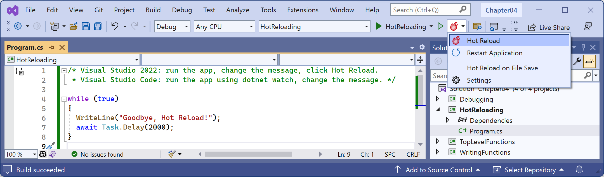
*Figure 4.15: Changing Hot Reload options*

6.	Change the message again, save the file, and note the console app updates automatically.

# Chapter 7 - Packaging and Distributing .NET Types

## Decompiling using the ILSpy extension for Visual Studio 2022 (coming soon)
