**Using Visual Studio Code**

In this article, I provide detailed step-by-step instuctions for using Visual Studio Code for topics like creating a solution with multiple projects and using debugging tools.

- [Chapter 1 - Hello, C#! Welcome, .NET!](#chapter-1---hello-c-welcome-net)
  - [Downloading and installing Visual Studio Code](#downloading-and-installing-visual-studio-code)
    - [Installing other extensions](#installing-other-extensions)
    - [Managing Visual Studio Code extensions at the command prompt](#managing-visual-studio-code-extensions-at-the-command-prompt)
    - [Understanding Microsoft Visual Studio Code versions](#understanding-microsoft-visual-studio-code-versions)
    - [Keyboard shortcuts for Visual Studio Code](#keyboard-shortcuts-for-visual-studio-code)
  - [Building console apps using Visual Studio Code](#building-console-apps-using-visual-studio-code)
    - [Writing code using Visual Studio Code](#writing-code-using-visual-studio-code)
    - [Compiling and running code using the dotnet CLI](#compiling-and-running-code-using-the-dotnet-cli)
  - [Adding a second project using Visual Studio Code](#adding-a-second-project-using-visual-studio-code)
  - [Summary of steps for Visual Studio Code](#summary-of-steps-for-visual-studio-code)
- [Chapter 4 - Writing, Debugging, and Testing Functions](#chapter-4---writing-debugging-and-testing-functions)
  - [Debugging during development](#debugging-during-development)
    - [Creating code with a deliberate bug](#creating-code-with-a-deliberate-bug)
    - [Setting a breakpoint and starting debugging Using Visual Studio Code](#setting-a-breakpoint-and-starting-debugging-using-visual-studio-code)
    - [Navigating with the debugging toolbar](#navigating-with-the-debugging-toolbar)
    - [Debugging windows](#debugging-windows)
    - [Stepping through code](#stepping-through-code)
    - [Using the Visual Studio Code integrated terminal during debugging](#using-the-visual-studio-code-integrated-terminal-during-debugging)
    - [Customizing breakpoints](#customizing-breakpoints)
  - [Hot reloading during development](#hot-reloading-during-development)
    - [Hot reloading using Visual Studio Code and dotnet watch](#hot-reloading-using-visual-studio-code-and-dotnet-watch)
- [Chapter 7 - Packaging and Distributing .NET Types](#chapter-7---packaging-and-distributing-net-types)
  - [Decompiling using the ILSpy extension for Visual Studio Code](#decompiling-using-the-ilspy-extension-for-visual-studio-code)

# Chapter 1 - Hello, C#! Welcome, .NET!

## Downloading and installing Visual Studio Code

Visual Studio Code has rapidly improved over the past couple of years and has pleasantly surprised Microsoft with its popularity. If you are brave and like to live on the bleeding edge, then there is an **Insiders** edition, which is a daily build of the next version.

Even if you plan to only use Visual Studio 2022 for Windows for development, I recommend that you download and install Visual Studio Code and try the coding tasks in this chapter using it, and then decide if you want to stick with just using Visual Studio 2022 for the rest of the book.

Let's now download and install Visual Studio Code, the .NET SDK, and the C# Dev Kit extension:
1.	Download and install either the Stable build or the Insiders edition of Visual Studio Code from the following link: https://code.visualstudio.com/.

> **More Information**: If you need more help installing Visual Studio Code, you can read the official setup guide at the following link: https://code.visualstudio.com/docs/setup/setup-overview.

2.	Download and install the .NET SDKs for version 8.0 and at least one other version like 6.0 or 7.0 from the following link: https://www.microsoft.com/net/download.

> To fully learn how to control .NET SDKs, we need multiple versions installed. .NET 6, .NET 7, and .NET 8 are supported versions at the time of publishing in November 2023. You can safely install multiple SDKs side by side. The most recent SDK will be used to build your projects.

3.	To install the **C# Dev Kit** extension, you must first launch the Visual Studio Code application.
4.	In Visual Studio Code, click the **Extensions** icon or navigate to **View** | **Extensions**.
5.	**C# Dev Kit** is one of the most popular extensions available, so you should see it at the top of the list, and you can enter C# in the search box.

> **C# Dev Kit** has a dependency on the **C#** extension version 2.x, so you do not have to install the C# extension separately. Note that C# extension version 2.x no longer uses OmniSharp since it has a new **Language Service Protocol (LSP)** host. **C# Dev Kit** also has dependencies on the **.NET Install Tool for Extension Authors** and **IntelliCode for C# Dev Kit** extensions so they will be installed too.

6.	Click **Install** and wait for supporting packages to download and install.

> **Good Practice**: Be sure to read the license agreement for the **C# Dev Kit**. It has a more restrictive license than the **C#** extension: https://aka.ms/vs/csdevkit/license.

### Installing other extensions

In later chapters of this book, you will use more Visual Studio Code extensions. If you want to install them now, all the extensions that we will use are shown in the following table:

Extension name and identifier|Description
---|---
C# Dev Kit<br/>`ms-dotnettools.csdevkit`|Official C# extension from Microsoft. Manage your code with a solution explorer and test your code with integrated unit test discovery and execution. Includes the C# and IntelliCode for C# Dev Kit extensions.
C#<br/>`ms-dotnettools.csharp`|C# editing support, including syntax highlighting, IntelliSense, Go To Definition, Find All References, debugging support for .NET, and support for csproj projects on Windows, macOS, and Linux.
IntelliCode for C# Dev Kit<br/>`ms-dotnettools.vscodeintellicode-csharp`|Provides AI-assisted development features for Python, TypeScript/JavaScript, C# and Java developers.
MSBuild project tools<br/>`tintoy.msbuild-project-tools`|Provides IntelliSense for MSBuild project files, including autocomplete for <PackageReference> elements.
Polyglot Notebooks<br/>`ms-dotnettools.dotnet-interactive-vscode`|This extension adds support for using .NET and other languages in a notebook. It has a dependency on the Jupyter extension (`ms-toolsai.jupyter`) that itself has dependencies.
ilspy-vscode<br/>`icsharpcode.ilspy-vscode`|Decompile MSIL assemblies – support for modern .NET, .NET Framework, .NET Core, and .NET Standard.
REST Client<br/>`humao.rest-client`|Send an HTTP request and view the response directly in Visual Studio Code.

### Managing Visual Studio Code extensions at the command prompt

You can install a Visual Studio Code extension at the command prompt or terminal, as shown in the following table:

Command|Description
---|---
`code --list-extensions`|List installed extensions.
`code --install-extension <extension-id>`|Install the specified extension.
`code --uninstall-extension <extension-id>`|Uninstall the specified extension.

For example, to install the **C# Dev Kit** extension, enter the following at the command prompt:
```
code --install-extension ms-dotnettools.csdevkit
```

I have created PowerShell scripts to install and uninstall the Visual Studio Code extensions in the preceding table. You can find them at the following link: https://github.com/markjprice/cs12dotnet8/tree/main/scripts/extension-scripts/.

### Understanding Microsoft Visual Studio Code versions

Microsoft releases a new feature version of Visual Studio Code (almost) every month and bug fix versions more frequently. For example:

- Version 1.79.0, May 2023 feature release
- Version 1.79.1, May 2023 bug fix release

The version used in this book is 1.82.0, August 2023 feature release, but the version of Visual Studio Code is less important than the version of the C# Dev Kit or C# extension that you install. I recommend C# extension v2.0.238 or later.

While the C# extension is not required, it provides IntelliSense as you type, code navigation, and debugging features, so it's something that's very handy to install and keep updated to support the latest C# language features.

### Keyboard shortcuts for Visual Studio Code

If you want to customize your keyboard shortcuts for Visual Studio Code, then you can, as shown at the following link: https://code.visualstudio.com/docs/getstarted/keybindings.

I recommend that you download a PDF of Visual Studio Code keyboard shortcuts for your operating system from the following list:

- Windows: https://code.visualstudio.com/shortcuts/keyboard-shortcuts-windows.pdf
- macOS: https://code.visualstudio.com/shortcuts/keyboard-shortcuts-macos.pdf
- Linux: https://code.visualstudio.com/shortcuts/keyboard-shortcuts-linux.pdf

## Building console apps using Visual Studio Code

The goal of this section is to showcase how to build a console app using Visual Studio Code and the `dotnet` command-line interface (CLI).

Both the instructions and screenshots in this section are for Windows, but the same actions will work with Visual Studio Code on the macOS and Linux variants.

The main differences will be native command-line actions such as deleting a file: both the command and the path are likely to be different on Windows or macOS and Linux. Luckily, the `dotnet` CLI tool itself and its commands are identical on all platforms.

### Writing code using Visual Studio Code

Let's get started writing code!

1. Start your favorite tool for working with the filesystem, for example, **File Explorer** on Windows or **Finder** on Mac.
2.	Navigate to your `C:` drive on Windows, your user folder on macOS (mine is named `markjprice`), or any directory or drive in which you want to save your projects.
3.	Create a new folder named `cs12dotnet8`. (If you completed the section for Visual Studio 2022, then this folder will already exist.)
4.	In the `cs12dotnet8` folder, create a new folder named `Chapter01-vscode`.

> If you did not complete the section for Visual Studio 2022, then you could name this folder `Chapter01`, but I will assume you will want to complete both sections and therefore need to use a non-conflicting name.

5.	In the `Chapter01-vscode` folder, open the command prompt or terminal.
6.	At the command prompt or terminal, use the dotnet CLI to create a new solution named `Chapter01`, as shown in the following command:
```
dotnet new sln --name Chapter01
```

> You can use either `-n` or `--name` as the switch to specify a name. The default would match the name of the folder, for example, `Chapter01-vscode`.

7.	Note the result, as shown in the following output:
```
The template "Solution File" was created successfully.
```

8.	At the command prompt or terminal, use the `dotnet` CLI to create a new subfolder and project for a console app named `HelloCS`, as shown in the following command:
```
dotnet new console --output HelloCS
```

> You can use either `-o` or `--output` as the switch. The `dotnet new console` command targets your latest .NET SDK version by default. To target a different version, use the `-f` or `--framework` switch to specify a target framework, for example .NET 6, as shown in the following command: `dotnet new console -f net6.0`.

9.	At the command prompt or terminal, use the dotnet CLI to add the project to the solution, as shown in the following command:
```
dotnet sln add HelloCS
```

10.	Note the results, as shown in the following output:
```
Project `HelloCS\HelloCS.csproj` added to the solution.
```

11.	At the command prompt or terminal, start Visual Studio Code and open the current folder indicated with a `.` (dot), as shown in the following command:
```
code .
```

12.	In Visual Studio Code, in **EXPLORER**, in the **CHAPTER01-VSCODE** folder view, expand the **HelloCS** project, and you will see that the `dotnet` command-line tool created a new console app project for you, with two files created, `HelloCS.csproj` and `Program.cs`, and `bin` and `obj` folders, as shown in *Figure 1.11*:

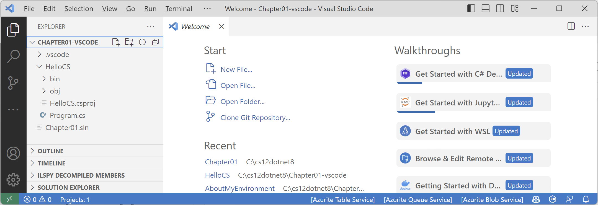 
*Figure 1.11: EXPLORER shows that two files and a folder have been created*

13.	Navigate to **View** | **Output**.
14.	In the **OUTPUT** pane, select **C# Dev Kit** and note the tool has recognized and processed the solution, as shown in *Figure 1.12*:

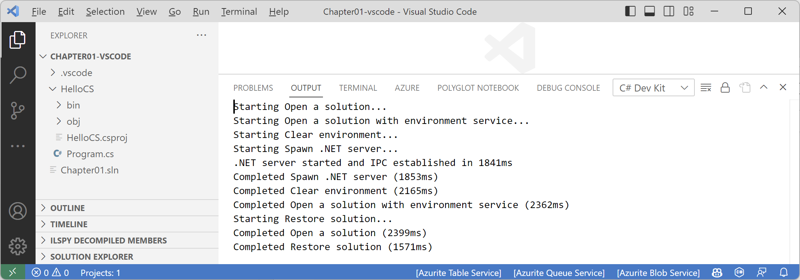 
*Figure 1.12: C# Dev Kit processing a solution file*

15.	At the bottom of **EXPLORER**, note the **SOLUTION EXPLORER**.
16.	Drag **SOLUTION EXPLORER** to the top of the **EXPLORER** pane and expand it.
17.	In **SOLUTION EXPLORER**, click on the file named `Program.cs` to open it in the editor window.
18.	In `Program.cs`, modify line 2 so that the text that is being written to the console says `Hello, C#!`

> **Good Practice**: Navigate to **File** | **Auto Save**. This toggle will save the annoyance of remembering to save before rebuilding your application each time.

### Compiling and running code using the dotnet CLI

The next task is to compile and run the code:
1.	In **SOLUTION EXPLORER**, right-click on any file in the `HelloCS` project and choose **Open in Integrated Terminal**.
2.	In **TERMINAL**, enter the following command: `dotnet run`.
3.	The output in the **TERMINAL** window will show the result of running your application, as shown in *Figure 1.13*:

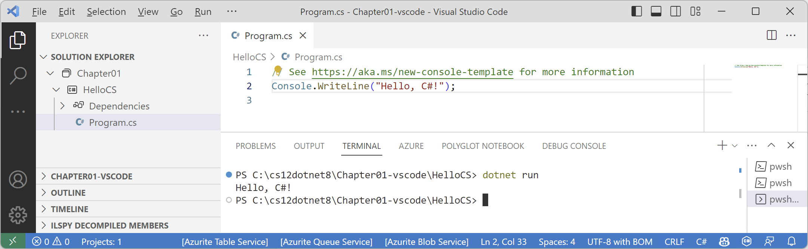 
*Figure 1.13: The output of running your first console app*

4.	In `Program.cs`, after the statement that outputs the message, add statements to get the name of the namespace of the `Program` class, write it to the console, and then throw a new exception, as shown in the following code:
```cs
string name = typeof(Program).Namespace ?? "None!";
Console.WriteLine($"Namespace: {name}");

throw new Exception();
```

5.	In **TERMINAL**, enter the following command: `dotnet run`.

> In **TERMINAL**, you can press the up and down arrows to loop through previous commands and then press the left and right arrows to edit the command before pressing *Enter* to run them.

6.	The output in the **TERMINAL** window will show the result of running your application, including that a hidden `Program` class was defined by the compiler with a method named `<Main>$` that has a parameter named `args` for passing in arguments, and that it does not have a namespace, as shown in the following output:
```
Hello, C#!
Namespace: None!
Unhandled exception. System.Exception: Exception of type 'System.Exception' was thrown.
   at Program.<Main>$(String[] args) in C:\cs12dotnet8\Chapter01-vscode\HelloCS\Program.cs:line 7
```

## Adding a second project using Visual Studio Code

Let's add a second project to explore how to work with multiple projects:
1.	In **TERMINAL**, switch to a terminal in the `Chapter01-vscode` folder, and then enter the command to create a new console app project named `AboutMyEnvironment` using the older non-top-level program style, as shown in the following command:
```
dotnet new console -o AboutMyEnvironment --use-program-main
```

> **Good Practice**: Be careful when entering commands in **TERMINAL**. Be sure that you are in the correct folder before entering potentially destructive commands!

2.	In **TERMINAL**, use the `dotnet` CLI to add the new project folder to the solution, as shown in the following command:
```
dotnet sln add AboutMyEnvironment
```

3.	Note the results, as shown in the following output:
```
Project `AboutMyEnvironment\AboutMyEnvironment.csproj` added to the solution.
```

4.	In **SOLUTION EXPLORER**, in the `AboutMyEnvironment` project, open `Program.cs` and then in the `Main` method, change the existing statement to output the current directory, the operating system version string, and the namespace of the `Program` class, as shown in the following code:
```cs
Console.WriteLine(Environment.CurrentDirectory);
Console.WriteLine(Environment.OSVersion.VersionString);
Console.WriteLine("Namespace: {0}", typeof(Program).Namespace);
```

5.	In **SOLUTION EXPLORER**, right-click on any file in the `AboutMyEnvironment` project and choose **Open in Integrated Terminal**.
6.	In **TERMINAL**, enter the command to run the project, as shown in the following command: `dotnet run`.
7.	Note the output in the **TERMINAL** window, as shown in the following output and in *Figure 1.14*:
```
C:\cs12dotnet8\Chapter01-vscode\AboutMyEnvironment
Microsoft Windows NT 10.0.22621.0
Namespace: AboutMyEnvironment
```

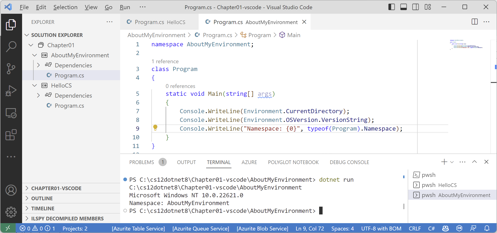
*Figure 1.14: Running a console app in Visual Studio Code with two projects*

Note that once you open multiple terminal windows, you can toggle between them by clicking their names in the panel on the right-side of **TERMINAL**. By default, the name will be `pwsh` (PowerShell) followed by the active folder. Right-click and choose rename to assign something else.

When using Visual Studio Code, or more accurately, the `dotnet` CLI, to run a console app, it executes the app from the `<projectname>` folder. When using Visual Studio 2022 for Windows, it executes the app from the `<projectname>\bin\Debug\net8.0` folder. It will be important to remember this when we work with the filesystem in later chapters. 

If you were to run the program on macOS Big Sur, the environment operating system would be different, as shown in the following output:
```
Unix 11.2.3
```

> **Good Practice**: Although the source code, like the `.csproj` and `.cs` files, is identical, the `bin` and `obj` folders that are automatically generated by the compiler could have content mismatches that give you errors. If you want to open the same project in both Visual Studio 2022 and Visual Studio Code, delete the temporary `bin` and `obj` folders before opening the project in the other code editor. This potential problem is why I asked you to create a different folder for the Visual Studio Code projects in this chapter.

## Summary of steps for Visual Studio Code

Follow these steps to create a solution and projects using Visual Studio Code:
1.	Create a folder for the solution, for example, `Chapter01`.
2.	Create a solution file in the folder: `dotnet new sln`.
3.	Create a folder and project: `dotnet new console -o HelloCS`.
4.	Add the folder to the solution: `dotnet sln add HelloCS`.
5.	Repeat steps 4 and 5 to create and add any other projects.
6.	Open the folder containing the solution using Visual Studio Code: `code .`

**Console Apps** (`dotnet new console`) are just one type of project template. In this book you will also create **Class Libraries** (`dotnet new classlib`), empty websites (`dotnet new web`), MVC websites (`dotnet new mvc`), Web API services (`dotnet new webapi`), Blazor websites (`dotnet new blazor`), and so on.

# Chapter 4 - Writing, Debugging, and Testing Functions

## Debugging during development

In this section, you will learn how to debug problems at development time. You must use a code editor that has debugging tools, such as Visual Studio 2022 or Visual Studio Code.

### Creating code with a deliberate bug

Let's explore debugging by creating a console app with a deliberate bug that we will then use the debugger tools in your code editor to track down and fix:
1.	Use your preferred coding tool to add a new **Console App** / `console` project named `Debugging` to the `Chapter04` solution.
2.	Modify `Debugging.csproj` to statically import `System.Console` for all code files.
3.	In `Program.cs`, delete any existing statements and then at the bottom of the file, add a function with a deliberate bug, as shown in the following code:
```cs
// Functions in Program.cs must be at the bottom of the file.
double Add(double a, double b)
{
  return a * b; // deliberate bug!
}
```

4.	Above the `Add` function, write statements to declare and set some variables and then add them together using the buggy function, as shown in the following code:
```cs
double a = 4.5;
double b = 2.5;
double answer = Add(a, b);

WriteLine($"{a} + {b} = {answer}");
WriteLine("Press Enter to end the app.");
ReadLine(); // Wait for user to press Enter.
```

5.	Run the console application and view the result, as shown in the following output:
```
4.5 + 2.5 = 11.25
Press Enter to end the app.
```

But wait, there's a bug! 4.5 added to 2.5 should be 7, not 11.25!

We will use the debugging tools to hunt for and squish the bug.

### Setting a breakpoint and starting debugging Using Visual Studio Code

Breakpoints allow us to mark a line of code that we want to pause at to inspect the program state and find bugs.

Let's set a breakpoint and then start debugging using Visual Studio Code:

1.	Click in line 1, which is the statement that declares the variable named `a`.
2.	Navigate to **Run** | **Toggle Breakpoint** or press *F9*. A red circle will appear in the margin bar on the left-hand side to indicate that a breakpoint has been set.

Breakpoints can be toggled off with the same action. You can also left-click in the margin to toggle a breakpoint on and off, or right-click to see more options, such as remove, edit, or disable an existing breakpoint; or add a breakpoint, conditional breakpoint, or logpoint when a breakpoint does not yet exist.

Logpoints, also known as tracepoints, indicate that you want to record some information without having to stop executing the code at that point.

3.	Navigate to **View** | **Run**, or in the left navigation bar you can click the **Run and Debug** icon (the triangle "play" button and "bug") or press *Ctrl* + *Shift* + *D* (on Windows).
4.	At the top of the **RUN AND DEBUG** window, click the **Run and Debug** button, and then select the `Debugging` project, as shown in *Figure 4.5*:

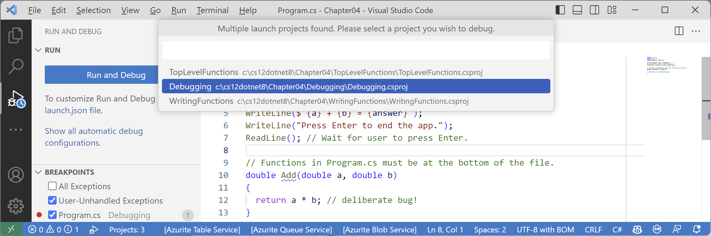 
*Figure 4.5: Selecting the project to debug using Visual Studio Code*

> If you are first prompted to choose a debugger, select **C#**, not **.NET 5+ or .NET Core**.

5.	Visual Studio Code starts the console app and then pauses when it hits the breakpoint. This is known as break mode. The line that will be executed next is highlighted in yellow, and a yellow block points at the line from the margin bar, as shown in *Figure 4.6*:
 
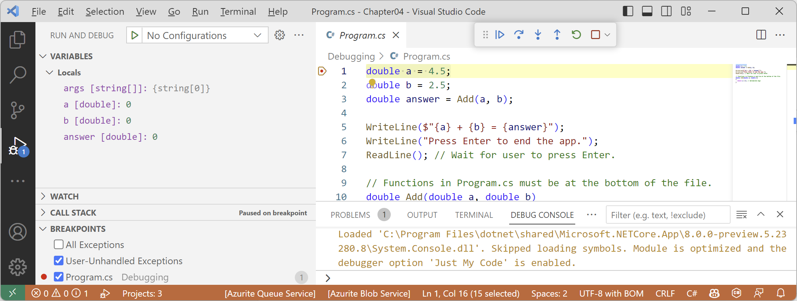
*Figure 4.6: Break mode in Visual Studio Code*

### Navigating with the debugging toolbar

Visual Studio Code shows a floating toolbar with buttons to make it easy to access debugging features, as shown in *Figure 4.7* and as described in the following list:

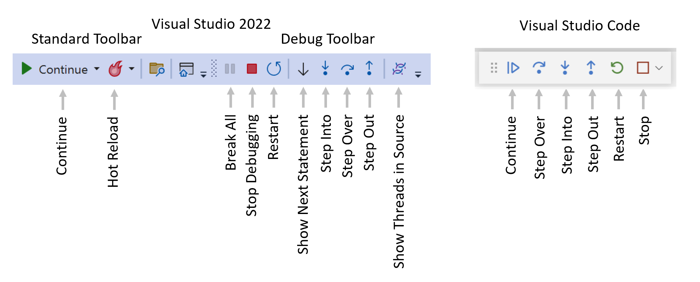 
*Figure 4.7: Debugging toolbars in Visual Studio 2022 and Visual Studio Code*

- **Start**/**Continue**/*F5*: This button is context sensitive. It will either start a project running or continue running the project from the current position until it ends or hits a breakpoint.
- **Hot Reload**: This button will reload compiled code changes without needing to restart the app.
- **Break All**: This button will break into the next available line of code in a running app.
- **Stop Debugging**/**Stop**/*Shift* + *F5* (red square): This button will stop the debugging session.
- **Restart**/*Ctrl* or *Cmd* + *Shift* + *F5* (circular arrow): This button will stop and then immediately restart the program with the debugger attached again.
- **Show Next Statement**: This button will move the current cursor to the next statement that will execute.
- **Step Into**/*F11*, **Step Over**/*F10*, and **Step Out**/*Shift* + *F11* (blue arrows over dots): These buttons step through the code statements in various ways, as you will see in a moment.
- **Show Threads in Source**: This button allows you to examine and work with threads in the application that you're debugging.

### Debugging windows

While debugging, Visual Studio Code shows extra windows that allow you to monitor useful information, such as variables, while you step through your code.

The most useful windows are described in the following list:

- **VARIABLES**, including **Locals**, which shows the name, value, and type for any local variables automatically. Keep an eye on this window while you step through your code.
- **WATCH**, or **Watch 1**, which shows the value of variables and expressions that you manually enter.
- **CALL STACK**, which shows the stack of function calls.
- **BREAKPOINTS**, which shows all your breakpoints and allows finer control over them.

When in break mode, there is also a useful window at the bottom of the edit area:
- **DEBUG CONSOLE** enables live interaction with your code. You can interrogate the program state, for example, by entering the name of a variable. For example, you can ask a question such as "What is 1+2?" by typing `1+2` and pressing *Enter*.

### Stepping through code

Let's explore some ways to step through the code using Visual Studio Code:

1.	Navigate to **Run** | **Step Into**, click on the **Step Into** button in the toolbar, or press *F11*. The yellow highlight steps forward one line.
2.	Navigate to **Run** | **Step Over**, click on the **Step Over** button in the toolbar, or press *F10*. The yellow highlight steps forward one line. At the moment, you can see that there is no difference between using **Step Into** or **Step Over** because we are executing single statements.
3.	You should now be on the line that calls the `Add` method.

The difference between **Step Into** and **Step Over** can be seen when you are about to execute a method call:
- If you click on **Step Into**, the debugger steps into the method so that you can step through every line in that method.
- If you click on **Step Over**, the whole method is executed in one go; it does not skip over the method without executing it.

4.	Click on **Step Into** to step inside the `Add` method.
5.	Hover your mouse pointer over the `a` or `b` parameters in the code editing window and note that a tooltip appears showing their current value.
6.	Select the expression `a * b`, right-click the expression, and select **Add to Watch**. The expression is added to the **WATCH** window, showing that this operator is multiplying `a` by `b` to give the result `11.25`.
7.	In the **WATCH** window, right-click the expression and choose **Remove Expression**.
8.	Fix the bug by changing `*` to `+` in the `Add` function.
9.	Restart debugging by clicking the circular arrow **Restart** button or pressing *Ctrl* or *Cmd* + *Shift* + *F5*.
10.	Step over the function, take a minute to note how it now calculates correctly, and click the **Continue** button or press *F5*.
11.	Note that when writing to the console during debugging, the output appears in the **DEBUG CONSOLE** window instead of the **TERMINAL** window, as shown in *Figure 4.8*:

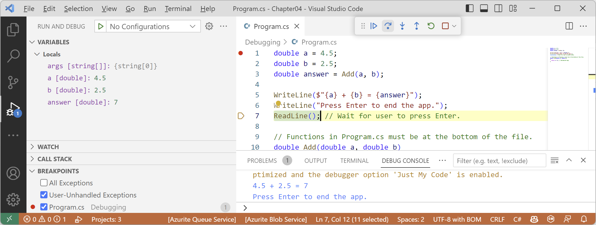
*Figure 4.8: Writing to the DEBUG CONSOLE during debugging*

### Using the Visual Studio Code integrated terminal during debugging

By default, the console is set to use the internal **DEBUG CONSOLE** during debugging, which does not allow interactions like entering text from the `ReadLine` method.

To improve the experience, we can change a setting to use the integrated terminal instead. First, let's modify the code to require interaction with the user:
1.	At the top of `Program.cs`, add statements to prompt to user to enter a number and parse that as a `double` into the variable `a`, as shown highlighted in the following code:
```cs
Write("Enter a number: ");
string number = ReadLine()!;

double a = double.Parse(number);
```

2.	Set a breakpoint on line 1 that writes the prompt, `Enter a number`.
3.	At the top of the **RUN AND DEBUG** window, click the **Run and Debug** button, and then select the `Debugging` project.
4.	Note that the `Enter a number` prompt is not written to either **TERMINAL** or **DEBUG CONSOLE** and neither window is waiting for the user to enter a number and press *Enter*.
5.	Stop debugging.
6.	At the top of the **RUN AND DEBUG** window, click the **create a launch.json file** link, and then when prompted for the debugger select **C#**, as shown in *Figure 4.9*:
 
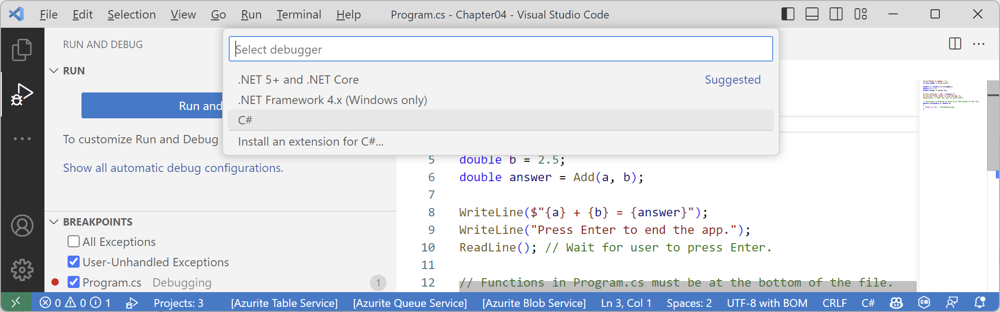
*Figure 4.9: Selecting a debugger for the launch.json file*

7.	In the `launch.json` file editor, click the **Add Configuration...** button, and then select **.NET: Launch .NET Core Console App**, as shown in *Figure 4.10*:

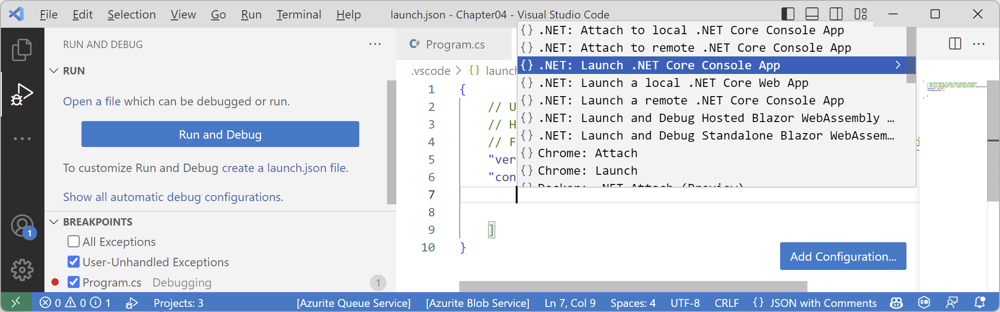 
*Figure 4.10: Adding a launch configuration for a .NET Console App*

8.	In `launch.json`, make the following additions and changes, as shown highlighted in the following configuration:
    - Comment out the `preLaunchTask` setting.
    - In the program path, add the `Debugging` project folder after the workspace folder variable.
    - In the program path, change `<target-framework>` to `net8.0`.
    - In the program path, change `<project-name.dll>` to `Debugging.dll`.
    - Change the console setting from `internalConsole` to `integratedTerminal`.

```json
{
  // Use IntelliSense to learn about possible attributes.
  // Hover to view descriptions of existing attributes.
  // For more information, visit: https://go.microsoft.com/fwlink/?linkid=830387
  "version": "0.2.0",
  "configurations": [
    {
      "name": ".NET Core Launch (console)",
      "type": "coreclr",
      "request": "launch",
      //"preLaunchTask": "build",
      "program": "${workspaceFolder}/Debugging/bin/Debug/net8.0/Debugging.dll",
      "args": [],
      "cwd": "${workspaceFolder}",
      "stopAtEntry": false,
      "console": "integratedTerminal"
    }
  ]
}
```

> Remember that with Visual Studio Code, we open the `Chapter04` folder to process the solution file, so the workspace folder is `Chapter04`, not the `Debugging` project.

9.	At the top of the **RUN AND DEBUG** window, note the dropdown list of launch configurations, and click the **Start Debugging** button (green triangle), as shown in *Figure 4.11*.
10.	Navigate to **View** | **Terminal** and note the **TERMINAL** window is attached to the **Debugging.dll**, as shown in *Figure 4.11*.
11.	Step over the statement that writes `Enter a number:` to the console.
12.	Step over the statement that calls `ReadLine`.
13.	Type `5.5` and press *Enter*.
14.	Continue stepping through the statements or press *F5* or click **Continue**, and note the output written to the integrated terminal, as shown in *Figure 4.11*:

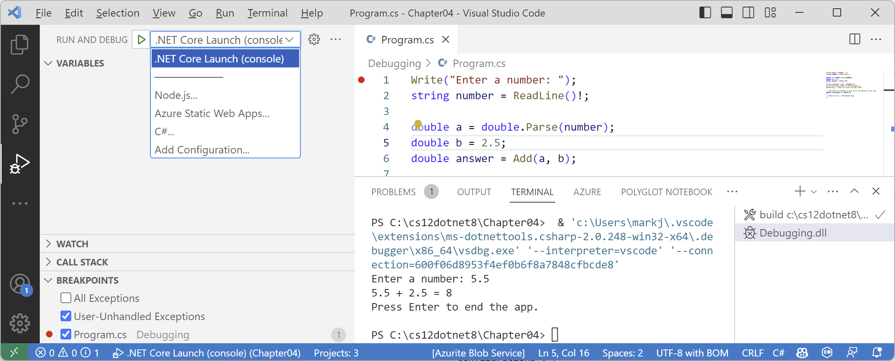 
*Figure 4.11: A launch configuration set to use the integrated terminal for user interaction*

### Customizing breakpoints

It is easy to make more complex breakpoints:
1.	If you are still debugging, click the **Stop** button in the debugging toolbar, navigate to **Run** | **Stop Debugging**, or press *Shift* + *F5*.
2.	Navigate to **Run** | **Remove All Breakpoints**.
3.	Click on the `WriteLine` statement that outputs the answer.
4.	Set a breakpoint by pressing *F9* or navigating to **Run** | **Toggle Breakpoint**.
5.	Right-click the breakpoint and choose **Edit Breakpoint...**.
6.	Type an expression, such as the answer variable must be greater than 9, and then press *Enter* to accept it, and note the expression must evaluate to true for the breakpoint to activate, as shown in *Figure 4.12*:

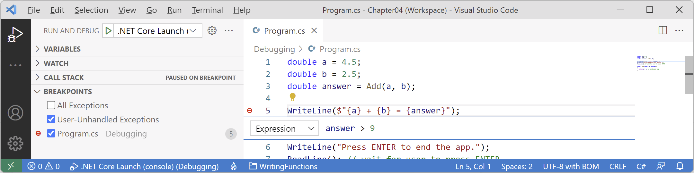 
*Figure 4.12: Customizing a breakpoint with an expression using Visual Studio Code*

7.	Start debugging and note the breakpoint is not hit.
8.	Stop debugging.
9.	Edit the breakpoint or its conditions and change its expression to less than 9.
10.	Start debugging and note the breakpoint is hit.
11.	Stop debugging.
12.	Edit the breakpoint or its conditions (in Visual Studio 2022 click Add condition), select **Hit Count**, then enter a number such as 3, meaning that you would have to hit the breakpoint three times before it activates.
13.	Hover your mouse over the breakpoint's red circle to see a summary, as shown in *Figure 4.14*:

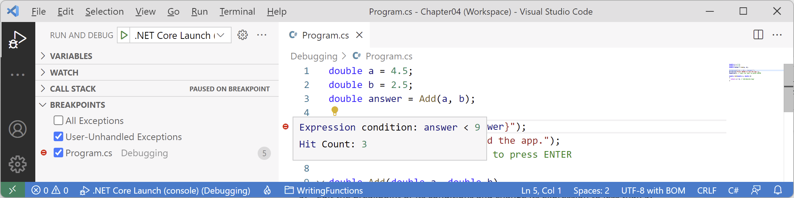 
*Figure 4.14: A summary of a customized breakpoint in Visual Studio Code*

You have now fixed a bug using some debugging tools and seen some advanced possibilities for setting breakpoints.

## Hot reloading during development

**Hot Reload** is a feature that allows a developer to apply changes to code while the app is running and immediately see the effect. This is great for fixing bugs quickly. **Hot Reload** is also known as **Edit and Continue**. A list of the types of changes that you can make that support Hot Reload is found at the following link: https://aka.ms/dotnet/hot-reload.

Just before the release of .NET 6, a high-level Microsoft employee caused controversy by attempting to make the feature Visual Studio-only. Luckily the open-source contingent within Microsoft successfully had the decision overturned. Hot Reload remains available using the command-line tool as well.

Let's see it in action:
1.	Use your preferred coding tool to add a new **Console App** / `console` project named `HotReloading` to the `Chapter04` solution.
2.	Modify `HotReloading.csproj` to statically import `System.Console` for all code files.
3.	In `Program.cs`, delete the existing statements and then write a message to the console every two seconds, as shown in the following code:
```cs
/* Visual Studio 2022: run the app, change the message, click Hot Reload.
 * Visual Studio Code: run the app using dotnet watch, change the message. */

while (true)
{
  WriteLine("Hello, Hot Reload!");
  await Task.Delay(2000);
}
```

### Hot reloading using Visual Studio Code and dotnet watch

If you are using Visual Studio Code, you must issue a special command when starting the console app to activate Hot Reload:
1.	In Visual Studio Code, in **TERMINAL**, start the console app using `dotnet watch`, and note the output that shows that hot reload is active, as shown in the following output:
```
dotnet watch 🔥 Hot reload enabled. For a list of supported edits, see https://aka.ms/dotnet/hot-reload.
  💡 Press "Ctrl + R" to restart.
dotnet watch 🔧 Building...
  Determining projects to restore...
  All projects are up-to-date for restore.
  HotReloading -> C:\cs12dotnet8\Chapter04\HotReloading\bin\Debug\net8.0\HotReloading.dll
dotnet watch 🚀 Started
Hello, Hot Reload!
Hello, Hot Reload!
Hello, Hot Reload!
```

2.	In Visual Studio Code, change `Hello` to `Goodbye`, and note that after a couple of seconds the change is applied without needing to restart the console app, as shown in the following output:
```
Hello, Hot Reload!
dotnet watch ⌚ File changed: .\Program.cs.
Hello, Hot Reload!
Hello, Hot Reload!
dotnet watch 🔥 Hot reload of changes succeeded.
Goodbye, Hot Reload!
Goodbye, Hot Reload!
```

3.	Press *Ctrl* + *C* to stop it running, as shown in the following output:
```
Goodbye, Hot Reload!
dotnet watch 🛑 Shutdown requested. Press Ctrl+C again to force exit.
```

# Chapter 7 - Packaging and Distributing .NET Types

## Decompiling using the ILSpy extension for Visual Studio Code

A similar capability is available cross-platform as an extension for Visual Studio Code.

1.	If you have not already installed the ILSpy .NET Decompiler extension for Visual Studio Code, then search for it and install it now.
2.	On macOS or Linux the extension has a dependency on Mono so you will also need to install Mono from the following link: https://www.mono-project.com/download/stable/.
3.	In Visual Studio Code, navigate to **View** | **Command Palette…**.
4.	Type `ilspy` and then select **ILSpy: Pick assembly from file system**.
5.	Navigate to the following folder:
`cs11dotnet7/Chapter07/DotNetEverywhere/bin/Release/net7.0/linux-x64`
6.	Select the `System.IO.FileSystem.dll` assembly and click **Select assembly**. Nothing will appear to happen, but you can confirm that ILSpy is working by viewing the **Output** window, selecting **ILSpy Extension** in the dropdown list, and seeing the processing, as shown in Figure 7.6:

*Figure 7.6: ILSpy extension output when selecting an assembly to decompile*

7.	In **EXPLORER**, expand **ILSPY DECOMPILED MEMBERS**, select the assembly, and close the **Output** window.
8.	
9.	Click the **Output language** button, select **IL**, and note the edit window now shows assembly attributes using C# code and external DLL and assembly references using IL code, as shown in *Figure 7.7*:

*Figure 7.7: Expanding ILSPY DECOMPILED MEMBERS*

10.	In the IL code on the right side, note the reference to the `System.Runtime` assembly, including the version number, as shown in the following code:
```
.module extern libSystem.Native
.assembly extern System.Runtime
{
  .publickeytoken = (
    b0 3f 5f 7f 11 d5 0a 3a
  )
  .ver 6:0:0:0
}
.module extern lib
```
`System.Native` means this assembly makes function calls to Linux system APIs as you would expect from code that interacts with the filesystem. If we had decompiled the Windows equivalent of this assembly, it would use `.module extern kernel32.dll` instead, which is a Win32 API.

11.	In **EXPLORER**, in **ILSPY DECOMPILED MEMBERS**, expand the assembly, expand the `System.IO` namespace, select `Directory`, and note the two edit windows that open showing the decompiled `Directory` class using C# code on the left and IL code on the right, as shown in *Figure 7.8*:
 
*Figure 7.8: The decompiled Directory class in C# and IL code*

12.	Compare the C# source code for the `GetParent` method, shown in the following code:
```cs
public static DirectoryInfo? GetParent(string path)
{
  if (path == null)
  {
    throw new ArgumentNullException("path");
  }
  if (path.Length == 0)
  {
    throw new ArgumentException(SR.Argument_PathEmpty, "path");
  }
  string fullPath = Path.GetFullPath(path);
  string directoryName = Path.GetDirectoryName(fullPath);
  if (directoryName == null)
  {
    return null;
  }
  return new DirectoryInfo(directoryName);
}
```
13.	With the equivalent IL source code of the `GetParent` method, as shown in the following code:
```
.method /* 06000067 */ public hidebysig static 
  class System.IO.DirectoryInfo GetParent (
    string path
  ) cil managed
{
  .param [0]
    .custom instance void System.Runtime.CompilerServices
    .NullableAttribute::.ctor(uint8) = ( 
      01 00 02 00 00
    )
  // Method begins at RVA 0x62d4
  // Code size 64 (0x40)
  .maxstack 2
  .locals /* 1100000E */ (
    [0] string,
    [1] string
  )
  IL_0000: ldarg.0
  IL_0001: brtrue.s IL_000e
  IL_0003: ldstr "path" /* 700005CB */
  IL_0008: newobj instance void [System.Runtime]
    System.ArgumentNullException::.ctor(string) /* 0A000035 */
  IL_000d: throw
  IL_000e: ldarg.0
  IL_000f: callvirt instance int32 [System.Runtime]
    System.String::get_Length() /* 0A000022 */
  IL_0014: brtrue.s IL_0026
  IL_0016: call string System.SR::get_Argument_PathEmpty() /* 0600004C */
  IL_001b: ldstr "path" /* 700005CB */
  IL_0020: newobj instance void [System.Runtime]
    System.ArgumentException::.ctor(string, string) /* 0A000036 */
  IL_0025: throw IL_0026: ldarg.0
  IL_0027: call string [System.Runtime.Extensions]
    System.IO.Path::GetFullPath(string) /* 0A000037 */
  IL_002c: stloc.0 IL_002d: ldloc.0
  IL_002e: call string [System.Runtime.Extensions]
    System.IO.Path::GetDirectoryName(string) /* 0A000038 */
  IL_0033: stloc.1
  IL_0034: ldloc.1
  IL_0035: brtrue.s IL_0039 IL_0037: ldnull
  IL_0038: ret IL_0039: ldloc.1
  IL_003a: newobj instance void 
    System.IO.DirectoryInfo::.ctor(string) /* 06000097 */
  IL_003f: ret
} // end of method Directory::GetParent
```
> **Good Practice**: The IL code is not especially useful unless you get very advanced with C# and .NET development when knowing how the C# compiler translates your source code into IL code can be important. The much more useful edit windows contain the equivalent C# source code written by Microsoft experts. You can learn a lot of good practices from seeing how professionals implement types. For example, the `GetParent` method shows how to check arguments for `null` and other argument exceptions.
14.	Close the edit windows without saving changes.
15.	In **EXPLORER**, in **ILSPY DECOMPILED MEMBERS**, right-click the assembly and choose **Unload Assembly**.
