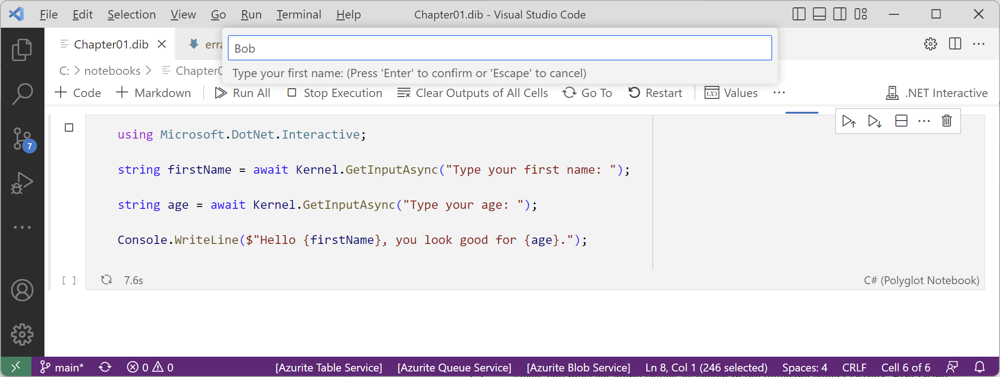
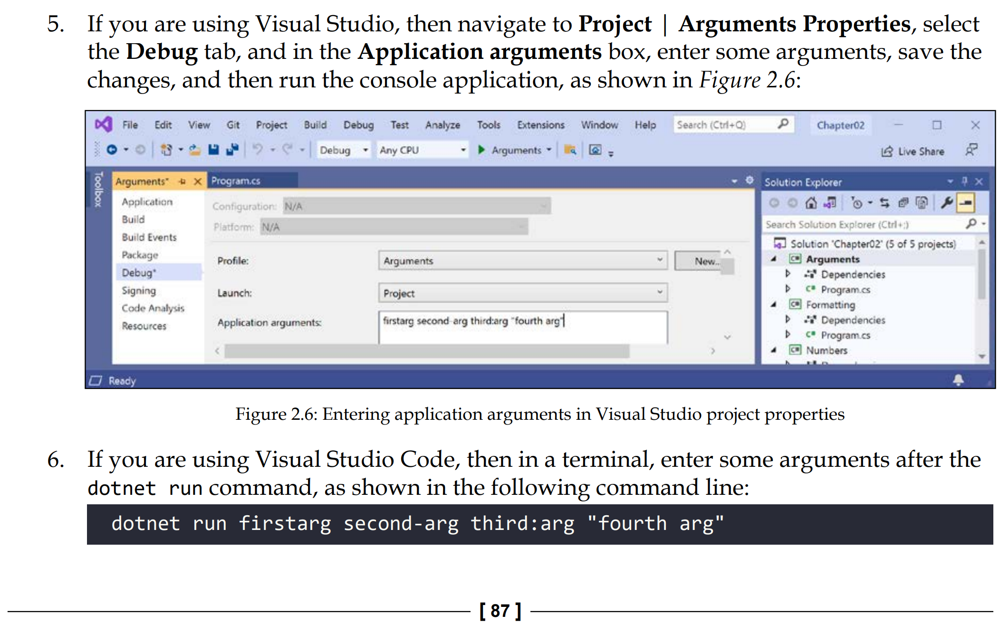

# Errata

If you find any mistakes in the sixth edition, *C# 10 and .NET 6 - Modern Cross-Platform Development*, then please [raise an issue in this repository](https://github.com/markjprice/cs10dotnet6/issues) or email me at markjprice (at) gmail.com.

- [Errata](#errata)
- [Print Book](#print-book)
  - [Page 3 - Pros and cons of the .NET Interactive Notebooks extension](#page-3---pros-and-cons-of-the-net-interactive-notebooks-extension)
  - [Page 7, 8 - Downloading and installing Visual Studio Code](#page-7-8---downloading-and-installing-visual-studio-code)
  - [Page 8 - Installing other extensions](#page-8---installing-other-extensions)
  - [Page 18, 19 - Writing code using Visual Studio 2022](#page-18-19---writing-code-using-visual-studio-2022)
  - [Page 25 - Writing code using Visual Studio Code](#page-25---writing-code-using-visual-studio-code)
  - [Page 28 - Adding a second project using Visual Studio Code](#page-28---adding-a-second-project-using-visual-studio-code)
  - [Page 32 - Adding Markdown and special commands to a notebook](#page-32---adding-markdown-and-special-commands-to-a-notebook)
  - [Page 82 - Formatting using interpolated strings](#page-82---formatting-using-interpolated-strings)
  - [Page 83 - Understanding format strings](#page-83---understanding-format-strings)
  - [Page 84 - Getting text input from the user](#page-84---getting-text-input-from-the-user)
  - [Page 87 - Passing arguments to a console app](#page-87---passing-arguments-to-a-console-app)
  - [Page 92 - Exercise 2.3 – Practice number sizes and ranges](#page-92---exercise-23--practice-number-sizes-and-ranges)
  - [Page 136 - Converting numbers from cardinal to ordinal](#page-136---converting-numbers-from-cardinal-to-ordinal)
  - [Page 137 - Calculating factorials with recursion](#page-137---calculating-factorials-with-recursion)
  - [Page 140 - Documenting functions with XML comments](#page-140---documenting-functions-with-xml-comments)
  - [Page 165 - Running unit tests using Visual Studio Code](#page-165---running-unit-tests-using-visual-studio-code)
  - [Page 183 - Importing a namespace to use a type](#page-183---importing-a-namespace-to-use-a-type)
  - [Page 187 - Storing a value using an enum type](#page-187---storing-a-value-using-an-enum-type)
  - [Page 192 - Making a field constant](#page-192---making-a-field-constant)
  - [Page 246 - Releasing unmanaged resources](#page-246---releasing-unmanaged-resources)
  - [Page 252 - Inheriting from classes](#page-252---inheriting-from-classes)
  - [Page 260 - Avoiding casting exceptions](#page-260---avoiding-casting-exceptions)
  - [Page 292 - Publishing a self-contained app, Page 316 - Exercise 7.3 – Explore PowerShell](#page-292---publishing-a-self-contained-app-page-316---exercise-73--explore-powershell)
  - [Page 297 - Decompiling using the ILSpy extension for Visual Studio Code](#page-297---decompiling-using-the-ilspy-extension-for-visual-studio-code)
  - [Page 311 - Understanding the .NET Portability Analyzer](#page-311---understanding-the-net-portability-analyzer)
  - [Page 316 - Exercise 7.2 – Explore topics](#page-316---exercise-72--explore-topics)
  - [Page 384 - Disposing of file resources](#page-384---disposing-of-file-resources)
  - [Page 391 - Encoding strings as byte arrays](#page-391---encoding-strings-as-byte-arrays)
  - [Page 396 - Serializing as XML](#page-396---serializing-as-xml)
  - [Page 402 - Controlling JSON processing](#page-402---controlling-json-processing)
  - [Page 417 - Database Provider for MySQL](#page-417---database-provider-for-mysql)
  - [Page 420 - Defining the Northwind database context class](#page-420---defining-the-northwind-database-context-class)
    - [If you are using (a) SQL Server or (b) SQLite with Visual Studio Code](#if-you-are-using-a-sql-server-or-b-sqlite-with-visual-studio-code)
    - [If you are using SQLite with Visual Studio 2022](#if-you-are-using-sqlite-with-visual-studio-2022)
  - [Page 428 - Setting up the dotnet-ef tool](#page-428---setting-up-the-dotnet-ef-tool)
  - [Page 437 - Filtering and sorting products](#page-437---filtering-and-sorting-products)
  - [Page 438 - Getting the generated SQL](#page-438---getting-the-generated-sql)
  - [Page 473 - Targeting a named method](#page-473---targeting-a-named-method)
  - [Page 509 - Implementing a Recorder class](#page-509---implementing-a-recorder-class)
  - [Page 510 - Implementing a Recorder class](#page-510---implementing-a-recorder-class)
  - [Page 535 - Improving responsiveness for GUI apps](#page-535---improving-responsiveness-for-gui-apps)
  - [Page 645 - Defining a typed view](#page-645---defining-a-typed-view)
  - [Page 688 - Controlling XML serialization](#page-688---controlling-xml-serialization)
  - [Page 701 - Enabling HTTP logging](#page-701---enabling-http-logging)
  - [Page 703 - Configuring HTTP clients using HttpClientFactory](#page-703---configuring-http-clients-using-httpclientfactory)
  - [Page 706 - Enabling Cross-Origin Resource Sharing](#page-706---enabling-cross-origin-resource-sharing)
  - [Page 708 - Implementing a Health Check API](#page-708---implementing-a-health-check-api)
  - [Page 712 - Building a weather service using minimal APIs](#page-712---building-a-weather-service-using-minimal-apis)
- [Bonus Content: Chapters 18 to 20 and Appendix](#bonus-content-chapters-18-to-20-and-appendix)
  - [Page 20 - Adding a services page to the Northwind MVC website](#page-20---adding-a-services-page-to-the-northwind-mvc-website)
  - [Page 35 - Building a client for GraphQL](#page-35---building-a-client-for-graphql)
  - [Page 41 - Testing a gRPC client to the gRPC service](#page-41---testing-a-grpc-client-to-the-grpc-service)
  - [Page 141 - Appendix A - Exercise 3.1 – Test your knowledge](#page-141---appendix-a---exercise-31--test-your-knowledge)
  - [Page 143 - Appendix A - Exercise 4.1 – Test your knowledge](#page-143---appendix-a---exercise-41--test-your-knowledge)

# Print Book

## Page 3 - Pros and cons of the .NET Interactive Notebooks extension

The **.NET Interactive Notebooks** extension has been renamed to **Polyglot Notebooks**. It still retains its original identifier `ms-dotnettools.dotnet-interactive-vscode`.

> Read more here: https://devblogs.microsoft.com/dotnet/dotnet-interactive-notebooks-is-now-polyglot-notebooks/#why-the-name-change

I wrote that "They cannot read input from the user, for example, you cannot use ReadLine or ReadKey." Although you cannot use the `Console` class methods, you can use the `Microsoft.DotNet.Interactive.Kernel` class and its `GetInputAsync` method. This uses the Visual Studio Code user interface to prompt the user for input.

## Page 7, 8 - Downloading and installing Visual Studio Code

The **.NET Interactive Notebooks** extension has been renamed to **Polyglot Notebooks**. It still retains its original identifier `ms-dotnettools.dotnet-interactive-vscode`.

In Step 2, I wrote to "install the .NET SDKs for versions 3.1, 5.0, and 6.0". You can continue to do so even after an SDK version reaches end-of-life because it will still work. However, you may prefer to install .NET 6 and .NET 7 SDKs once .NET Core 3.1 and .NET 5 reach their end-of-life.

https://dotnet.microsoft.com/en-us/download/dotnet/5.0

## Page 8 - Installing other extensions

> Thanks to [ifduyue](https://github.com/ifduyue) for raising this [issue on 14 November 2021](https://github.com/markjprice/cs10dotnet6/issues/1). 

In the table of extensions, the identifier for **MSBuild project tools** should be `tintoy` not `tinytoy`.

The **.NET Interactive Notebooks** extension has been renamed to **Polyglot Notebooks**. It still retains its original identifier `ms-dotnettools.dotnet-interactive-vscode`.

## Page 18, 19 - Writing code using Visual Studio 2022

In Step 3, the project template name has been changed from **Console Application** to **Console App** in the final release of Visual Studio 2022.

> Thanks to [Simon](https://github.com/simon4132) for raising this [issue on 23 November 2022](https://github.com/markjprice/cs10dotnet6/issues/110).

In Step 7, I wrote to "select **.NET 5.0 (Current)**". For this option to appear, you must have installed a version of .NET 5 SDK. If you have only installed .NET 6 then you will only see **.NET 6.0 (Long Term Support)** as an option.

You have three choices to proceed:

1. Treat this small section as theory and a reference to how it worked historically. There is no need to perform the steps yourself. I included it to help show the change in behavior between .NET 5 and .NET 6 and to show the code generated by the old template. The rest of the book just uses .NET 6 except for another small section in Chapter 8.
2. You can install the last version 5.0.408 that was released on May 10, 2022 from the following link: https://dotnet.microsoft.com/en-us/download/dotnet/5.0. .NET 5 has now reached end-of-life which means it is not supported by Microsoft *but it still works perfectly well* so for learning purposes its fine to use. 
3. You can install .NET 7 SDK from the following link: https://dotnet.microsoft.com/en-us/download/dotnet/7.0. Then when you get to Step 7, in the **Additional information** dialog, select the check box **Do not use top-level statements**. This option returns the behavior of the .NET 7 console app template back to similar behavior of .NET 5.

## Page 25 - Writing code using Visual Studio Code

In Step 12, I wrote to "create a new console app that targets .NET 5.0". For this option to be available, you must have installed a version of .NET 5 SDK. If you have only installed .NET 6 then you will get an error.

You have three choices to proceed:

1. Treat this small section as theory and a reference to how it worked historically. There is no need to perform the steps yourself. I included it to help show the change in behavior between .NET 5 and .NET 6 and to show the code generated by the old template. The rest of the book just uses .NET 6 except for another small section in Chapter 8.
2. You can install the last version 5.0.408 that was released on May 10, 2022 from the following link: https://dotnet.microsoft.com/en-us/download/dotnet/5.0. .NET 5 has now reached end-of-life which means it is not supported by Microsoft *but it still works perfectly well* so for learning purposes its fine to use. 
3. You can install .NET 7 SDK from the following link: https://dotnet.microsoft.com/en-us/download/dotnet/7.0. Then when you get to Step 12, enter the following command: `dotnet new console --use-program-main`. This option returns the behavior of the .NET 7 console app template back to similar behavior of .NET 5.

In Step 14, I say that the first time you open a code file, Visual Studio Code may have to download and install C# dependencies and so on. This will not happen if you do not trust the workspace. 

At the top of the window, in the blue bar, click **Manage**, as shown in the following screenshot:


Click the **Trust** button, as shown in the following screenshot:


You will then trust the workspace and extensions will activate as described in the book. 


## Page 28 - Adding a second project using Visual Studio Code

> This issue has now been resolved with the release of C# extension 1.24.0 on January 20, 2022: https://marketplace.visualstudio.com/items?itemName=ms-dotnettools.csharp

> Thanks to [johncflorida](https://github.com/johncflorida) for raising this [issue on 9 December 2021](https://github.com/markjprice/cs10dotnet6/issues/11). Also thanks to [Paul-Schroeder](https://github.com/Paul-Schroeder) and [ken-from-the-uk](https://github.com/ken-from-the-uk) who raised the same issue and made suggestions.

In Step 6, I say to select **OmniSharp: Select Project**. Unfortuately if you have installed version 1.23.17 of the C# extension (released on December 3, 2021) then it gives an error, as shown in the following screenshot and described in these issues: 


- https://github.com/markjprice/cs10dotnet6/issues/11
- https://github.com/markjprice/cs10dotnet6/issues/14

To avoid the issue, revert back to an earlier version or manually install version v1.24.0-beta1 by [downloading the VSIX](https://github.com/OmniSharp/omnisharp-vscode/releases/tag/v1.24.0-beta1) and then in Visual Studio Code **EXTENSIONS**, select the **Views and More Actions** menu (three dots) and then **Install from VSIX...**. 

I had hoped that the seriousness of this issue would prompt a non-beta fix by now but the holidays have probably slowed development down. I will leave both issues open and I have added this erratum to warn readers about this temporary issue.

## Page 32 - Adding Markdown and special commands to a notebook

> Thanks to [exzzy22](https://github.com/exzzy22) for raising this [issue on January 14, 2022](https://github.com/markjprice/cs10dotnet6/issues/34).

In Step 3, I wrote to "click **+ Markup** to add a Markdown cell." I should have 
written "click **+ Markdown** to add a Markdown cell." 

## Page 82 - Formatting using interpolated strings

> Thanks to [GregStevenson](https://github.com/GregStevenson) for raising this [issue on 26 November 2021](https://github.com/markjprice/cs10dotnet6/issues/6). 

In the last code block in this section, the string is missing the `$` prefix that makes it interpolated, as shown in the following code:
```cs
private const string fullname = "{firstname} {lastname}";
```
The code should be as follows:
```cs
private const string fullname = $"{firstname} {lastname}";
```

## Page 83 - Understanding format strings

> Thanks to [dpkwhan](https://github.com/dpkwhan) for raising this [issue on 2 January 2022](https://github.com/markjprice/cs10dotnet6/issues/20). 

In Step 1, the statement to output the column headings does not need the number 
format code `:N0` because it is a `string` value, although it does still need the 
right-alignment format code `,6` to position it within the six character width column. 

The following statement:
```cs
Console.WriteLine(
  format: "{0,-10} {1,6:N0}",
  arg0: "Name",
  arg1: "Count");
```

Should be:
```cs
Console.WriteLine(
  format: "{0,-10} {1,6}",
  arg0: "Name",
  arg1: "Count");
```

## Page 84 - Getting text input from the user

I wrote that a notebook "does not support reading input from the console using `Console.ReadLine()`." Although this is true, you can use the `Microsoft.DotNet.Interactive.Kernel` class and its `GetInputAsync` method instead. This uses the .NET Interactive integration with the Visual Studio Code user interface to prompt the user for input.

```cs
using Microsoft.DotNet.Interactive; // to use the Kernel class

string firstName = await Kernel.GetInputAsync("Type your first name: ");

string age = await Kernel.GetInputAsync("Type your age: ");

Console.WriteLine($"Hello {firstName}, you look good for {age}.");
```



## Page 87 - Passing arguments to a console app

> Thanks to Bob Molloy for emailing me this issue.

In Step 5, I say, "If you are using Visual Studio, then navigate to **Project** | **Arguments Properties**, select the **Debug** tab, and in the **Application arguments** box, enter some arguments". 

Microsoft changed the user interface of Visual Studio 2022 after that step was written. 

It should now say, "If you are using Visual Studio, then navigate to **Project** | **Arguments Properties**, select 
the **Debug** tab, click **Open debug launch profiles UI**, and in the **Command line arguments** box, enter some arguments", as shown in the following screenshot:


In *Figure 2.6*, it is difficult to see the hyphen in the second argument in the PDF edition (shown in the screenshot below) and impossible to see it in the Kindle edition. 

In Step 5, it would have been clearer if I had written out the arguments as I did in Step 6 instead of relying on Amazon's image processing to clearly show the hyphen! 

For example, `firstarg second-arg third:arg "fourth arg"`. 



## Page 92 - Exercise 2.3 – Practice number sizes and ranges

> Thanks to Bob Molloy for emailing me this issue.

In Exercise 2.3, I say, "create a console application project named Exercise02". I should have said, "create a console application project named Exercise03".

## Page 136 - Converting numbers from cardinal to ordinal

> Thanks to [Felix Namutare](https://github.com/namutare) for raising this issue.

The `CardinalToOrdinal` function fails to properly convert numbers larger than 100 like 111, 112, 113. The fix is to calculate the last two digits and then switch on that value instead, as shown in the following code:
```cs
static string CardinalToOrdinal(int number)
{
  int lastTwoDigits = number % 100;

  switch (lastTwoDigits)
  {
    case 11: // special cases from 11th to 13th
    case 12:
    case 13:
      return $"{number}th";
    default:
      int lastDigit = number % 10;

      string suffix = lastDigit switch
      {
        1 => "st",
        2 => "nd",
        3 => "rd",
        _ => "th"
      };
      return $"{number}{suffix}";
  }
}
```

## Page 137 - Calculating factorials with recursion

The factorial function is defined for non-negative integers only i.e. for 0, 1, 2, 3, and so on, and it is defined as:
```
0!=1 

n!=n×(n−1)!, for n∈{1,2,3,…}
```
So the implementation of the functions in the book, both for defining the function 
and for testing it, would be better as shown in the following code: 

```cs
static int Factorial(int number)
{
  if (number < 0)
  {
     throw new ArgumentException(
       message: $"The factorial function is defined for non-negative integers only. Input: {number}", 
       paramName: nameof(number));
  }
  else if (number == 0)
  {
    return 1;
  }
  else
  {
    checked // for overflow
    {
      return number * Factorial(number - 1);
    }
  }
}


static void RunFactorial()
{
  for (int i = -2; i < 15; i++)
  {
    try
    {
      WriteLine($"{i}! = {Factorial(i):N0}");
    }
    catch (System.OverflowException)
    {
      WriteLine($"{i}! is too big for a 32-bit integer.");
    }
    catch (Exception ex)
    {
      WriteLine($"{ex.GetType()}: {ex.Message}");
    }
  }
}
```

## Page 140 - Documenting functions with XML comments

> Thanks to Bob Molloy via email and [CoRB-ops](https://github.com/CoRB-ops) for raising this [issue on 21 November 2021](https://github.com/markjprice/cs10dotnet6/issues/3). 

First, it is worth emphasizing that this feature is primarily designed to be used with a tool that converts the comments into documentation like Sandcastle (https://github.com/EWSoftware/SHFB). The tooltips that appear while entering code or hovering over the function name are a secondary feature. Understanding this will help you understand the limitation involved with this errata item.

Second, in Step 4, I say that when calling the function you will see more details. However, when the .NET 6 project templates changed in Preview 7 to use top-level statements and an automatically generated `Program` class, the functions you write in the tasks became implemented as local functions declared inside the hidden automatically generated `<Main>$` method. Local functions do not support XML comments because local functions cannot be used outside the member in which they are declared so it makes no sense to generate documentation from them. Sadly, this also means no tooltip, which would still be useful, but neither Visual Studio 2022 nor Visual Studio Code recognize that.

To enable XML comments for the `CardinalToOrdinal` function, we must therefore define it inside a class. The easiest way to do this is to add the function to the automatically generated partial `Program` class by moving the function to the bottom of the `Program.cs` file and wrapping it in a partial `Program` class, as shown in the following code:

```cs
// This must be at the bottom of the Program.cs file to avoid compile errors.
// Or you could create a separate file, perhaps named Program.CardinalToOrdinal.cs
partial class Program
{
    /// <summary>
    /// Pass a 32-bit integer and it will be converted into its ordinal equivalent.
    /// </summary>
    /// <param name="number">Number is a cardinal value e.g. 1, 2, 3, and so on.</param>
    /// <returns>Number as an ordinal value e.g. 1st, 2nd, 3rd, and so on.</returns>
    static string CardinalToOrdinal(int number)
    {
        switch (number)
        {
            case 11: // special cases for 11th to 13th
            case 12:
            case 13:
                return $"{number}th";
            default:
                int lastDigit = number % 10;
                string suffix = lastDigit switch
                {
                    1 => "st",
                    2 => "nd",
                    3 => "rd",
                    _ => "th"
                };
                return $"{number}{suffix}";
        }
    }
}
```

## Page 165 - Running unit tests using Visual Studio Code

> Thanks to [kwatsonkairosmgt](https://github.com/kwatsonkairosmgt) for raising this [issue on 27 October 2022](https://github.com/markjprice/cs10dotnet6/issues/106).

In Step 1, the project name `CalculatorLibUnitTest` should be `CalculatorLibUnitTests`.

## Page 183 - Importing a namespace to use a type

In Step 3, I wrote a comment with the older C# syntax and a statement with the newer syntax for instantiating a new object, as shown in the following code:
```cs
// var bob = new Person(); // C# 1.0 or later
Person bob = new(); // C# 9.0 or later
```
The `var` keyword was not introduced until C# 3.0, so I should have written the following:
```cs
// Person bob = new Person(); // C# 1.0 or later
// var bob = new Person(); // C# 3.0 or later
Person bob = new(); // C# 9.0 or later
```

## Page 187 - Storing a value using an enum type

> Thanks to [dpkwhan](https://github.com/dpkwhan) for raising this [issue on 5 January 2022](https://github.com/markjprice/cs10dotnet6/issues/29). 
 
In the **Good Practice** box, the text "If you use are writing code" should be "If you are writing code"

## Page 192 - Making a field constant

> Thanks to Bob Molloy for emailing me this issue.

In Step 1, the assigned `string` literal should be `"Homo Sapiens"`. 
In Step 3, the output should be `Bob Smith is a Homo Sapiens`.

## Page 246 - Releasing unmanaged resources

> Thanks to `Wuu#0348` on the Discord channel for raising this issue.

In the second bullet point after the large code block, I wrote, "It needs to check the `disposing` parameter and `disposed` field because if the finalizer thread has already run and it called the `~Animal` method, then only unmanaged resources need to be deallocated." I should have written **managed** not **unmanaged**. 

It might be clearer if I wrote, "It needs to check the `disposing` parameter and `disposed` field because if the finalizer thread has already run and it called the `~Animal` method, then unmanaged resources will already have been deallocated and only managed resources remain to be deallocated by the garbage collector." This same typo is in the 7th edition. I will fix this in the 8th edition due to be published in November 2023.

## Page 252 - Inheriting from classes

> Thanks to Nick Tsiatinis for emailing me this issue.

In Step 3, I wrote, "In `Program.cs`, ...", but at that point there are now two 
console app projects with a `Program.cs` file. I should have said, 
"In the `PeopleApp` project, in `Program.cs`, ..."

## Page 260 - Avoiding casting exceptions

> Thanks to Nick Tsiatinis for emailing me this issue.

In Step 3, I wrote, "In `Main`, ...", but there is no `Main` method. 
I should have written, "In `Program.cs`, ..."

## Page 292 - Publishing a self-contained app, Page 316 - Exercise 7.3 – Explore PowerShell

In the **Good Practice** box on page 292, I wrote about how you can automate commands using scripts written in the PowerShell language. My original plan was to write content about PowerShell in the GitHub repository. But PowerShell is a massive topic and there will always be higher priority content to create that is specifically about C# and .NET. In the 8th edition, I will just reference the official PowerShell documentation: https://learn.microsoft.com/en-us/powershell/ And I will remove **Exercise 7.3** that suggests exploring PowerShell.

## Page 297 - Decompiling using the ILSpy extension for Visual Studio Code

> Thanks to [Dreamoochy](https://github.com/Dreamoochy) for raising this 
> [issue on 24 June 2022](https://github.com/markjprice/cs10dotnet6/issues/86).

The  ILSpy .NET Decompiler extension for Visual Studio Code has changed behavior. It no longer 
shows two edit panes side-by-side. Instead, you can only see one language at a time. You can 
toggle between C# and IL code by clicking the **Output language** button in the top right corner.

In the next edition, I will tell the reader to open a different assembly so it works with the latest version of ILSpy. Probably the `System.Linq` assembly and decompile the `Enumerable` class and its `Average` method for a sequence of `int` values:


And then show how to toggle between C# and IL code by clicking **Output language**:


## Page 311 - Understanding the .NET Portability Analyzer

> Thanks to [Hoshyar Karimi](https://github.com/HoshyarKarimi) for raising this [issue on 28 May 2022](https://github.com/markjprice/cs10dotnet6/issues/68).

The link to the demonstration video has changed to: https://docs.microsoft.com/en-us/shows/seth-juarez/brief-look-net-portability-analyzer

## Page 316 - Exercise 7.2 – Explore topics

> Thanks to [Hoshyar Karimi](https://github.com/HoshyarKarimi) for raising this [issue on 28 May 2022](https://github.com/markjprice/cs10dotnet6/issues/69).

The link to the chapter links has changed to: https://github.com/markjprice/cs10dotnet6/blob/main/book-links.md#chapter-7---packaging-and-distributing-net-types

## Page 384 - Disposing of file resources

> Thanks to [Dreamoochy](https://github.com/Dreamoochy) for raising this [issue on 5 July 2022](https://github.com/markjprice/cs10dotnet6/issues/90).

In the `finally` block, I tell the reader to dispose of the XmlWriter and the FileStream, as shown in the following code:
```cs
if (xml != null)
{
  xml.Dispose();
  WriteLine("The XML writer's unmanaged resources have been disposed.");
  if (xmlFileStream != null)
  {
    xmlFileStream.Dispose();
    WriteLine("The file stream's unmanaged resources have been disposed.");
  }
}
```
But the file stream will only be disposed if the XML writer is successfully created and therefore not null. It would be better to not nest the `if` statements, as shown in the following code:
```cs
if (xml != null)
{
  xml.Dispose();
  WriteLine("The XML writer's unmanaged resources have been disposed.");
}
if (xmlFileStream != null)
{
  xmlFileStream.Dispose();
  WriteLine("The file stream's unmanaged resources have been disposed.");
}
```

## Page 391 - Encoding strings as byte arrays

> Thanks to [KlarenAlexander](https://github.com/KlarenAlexander) for raising this [issue on 17 December 2021](https://github.com/markjprice/cs10dotnet6/issues/12). 

In Step 4, you write code to detect numbers 1 to 5 entered on the keyboard to select between encodings. But the code only accepts numbers entered from the top row of the keyboard. To accept numbers entered on the number pad on an extended keyboard, the code needs to be modified, as shown in the following code:

```cs
Encoding encoder = number switch
{
  ConsoleKey.D1 or ConsoleKey.NumPad1 => Encoding.ASCII,
  ConsoleKey.D2 or ConsoleKey.NumPad2 => Encoding.UTF7,
  ConsoleKey.D3 or ConsoleKey.NumPad3 => Encoding.UTF8,
  ConsoleKey.D4 or ConsoleKey.NumPad4 => Encoding.Unicode,
  ConsoleKey.D5 or ConsoleKey.NumPad5 => Encoding.UTF32,
  _                                   => Encoding.Default
};
```

## Page 396 - Serializing as XML

> Thanks to [Dreamoochy](https://github.com/Dreamoochy) for raising this [issue on 6 July 2022](https://github.com/markjprice/cs10dotnet6/issues/91).

In Step 8, I show the XML output but I manually formatted it to be easier to read. The output you will see is all on one line.

## Page 402 - Controlling JSON processing

> Thanks to [KlarenAlexander](https://github.com/KlarenAlexander) for raising this [issue on 17 December 2021](https://github.com/markjprice/cs10dotnet6/issues/13). 

In Step 5, you write code to configure options for serializing JSON. The code was written in the spring of 2021 when the previews of .NET 6 at the time supported working with the new `DateOnly` type, although in an inefficient format as shown in the book. Over the summer, the System.Text.Json team added source generator support to improve performance and decided to remove support for `DateOnly`. 

When you run the code in the book with the final release of .NET 6, it throws an, "Unhandled exception. System.NotSupportedException: Serialization and deserialization of 'System.DateOnly' instances are not supported. Path: $.PublishDate."

There is a request to add support for `DateOnly` and `TimeOnly` but it seems that we will have to wait for .NET 7 until it is officially supported. **Support DateOnly and TimeOnly in JsonSerializer #53539**: https://github.com/dotnet/runtime/issues/53539

Meanwhile, we have to implement our own custom `JsonConverter` classes, like **Jørn H. Dalvik (jornhd)** suggests in the comments: 
https://github.com/dotnet/runtime/issues/53539#issuecomment-965275504

> **DO NOT USE THIS IN PRODUCTION CODE.** Any custom converter implementation that you use is likely to be different from the official implementation so it will break if you serialize data today with your custom implementation and then try to deseralize it later with the official implementation. 

I have used Jørn's code to add a new class file to the code solutions that defines converters for `DateOnly` and `DateOnly?`, as shown in the following code:

```cs
using System.Text.Json;
using System.Text.Json.Serialization;
using System.Text.RegularExpressions;

namespace WorkingWithJson
{
  public class DateOnlyConverter : JsonConverter<DateOnly>
  {
    public override DateOnly Read(ref Utf8JsonReader reader, Type typeToConvert, JsonSerializerOptions options)
    {
      if (reader.TryGetDateTime(out var dt))
      {
        return DateOnly.FromDateTime(dt);
      };
      var value = reader.GetString();
      if (value == null)
      {
        return default;
      }
      var match = new Regex("^(\\d\\d\\d\\d)-(\\d\\d)-(\\d\\d)(T|\\s|\\z)").Match(value);
      return match.Success
          ? new DateOnly(int.Parse(match.Groups[1].Value), int.Parse(match.Groups[2].Value), int.Parse(match.Groups[3].Value))
          : default;
    }

    public override void Write(Utf8JsonWriter writer, DateOnly value, JsonSerializerOptions options)
        => writer.WriteStringValue(value.ToString("yyyy-MM-dd"));
  }

  public class DateOnlyNullableConverter : JsonConverter<DateOnly?>
  {
    public override DateOnly? Read(ref Utf8JsonReader reader, Type typeToConvert, JsonSerializerOptions options)
    {
      if (reader.TryGetDateTime(out var dt))
      {
        return DateOnly.FromDateTime(dt);
      };
      var value = reader.GetString();
      if (value == null)
      {
        return default;
      }
      var match = new Regex("^(\\d\\d\\d\\d)-(\\d\\d)-(\\d\\d)(T|\\s|\\z)").Match(value);
      return match.Success
          ? new DateOnly(int.Parse(match.Groups[1].Value), int.Parse(match.Groups[2].Value), int.Parse(match.Groups[3].Value))
          : default;
    }

    public override void Write(Utf8JsonWriter writer, DateOnly? value, JsonSerializerOptions options)
        => writer.WriteStringValue(value?.ToString("yyyy-MM-dd"));
  }
}
```

Then you must add the `DateOnly` (and optionally `DateOnly?`) converters to the JSON `options` to fix this issue. 

```cs
// existing code to configure JSON options
JsonSerializerOptions options = new()
{
  IncludeFields = true, // includes all fields
  PropertyNameCaseInsensitive = true,
  WriteIndented = true,
  PropertyNamingPolicy = JsonNamingPolicy.CamelCase,
};

// add converters to enable working with DateOnly and DateOnly?
options.Converters.Add(new DateOnlyConverter());
options.Converters.Add(new DateOnlyNullableConverter());
```

## Page 417 - Database Provider for MySQL

The table shows for MySQL the `deprecated` NuGet package "MySQL.`Data`.EntityFrameworkCore".
The new one is "MySQL.EntityFrameworkCore"

## Page 420 - Defining the Northwind database context class

> Thanks to [Hoshyar Karimi](https://github.com/HoshyarKarimi) for raising this [issue on 1 June 2022](https://github.com/markjprice/cs10dotnet6/issues/73)

> Thanks to Dylan Sclanders for raising a related issue about losing changes to the database file if you choose to **Copy always** which will later cause exceptions to be thrown.

After step 7, steps 8 to 10 are only needed for SQLite and its `Northwind.db` file 
if you are running the project using Visual Studio 2022. 

Step 11 is needed for both SQLite and SQL Server. I should have made that clearer. 

For example:

### If you are using (a) SQL Server or (b) SQLite with Visual Studio Code

If you are using SQL Server then the data is stored in a database outside the project. 
It will be found if the connection string is valid for the server name and database name.

If you are using SQLite then the data is stored in a `.db` database file in the project. 
If you run the project with Visual Studio Code and the `dotnet run` command, 
then the compiled application executes in the `WorkingWithEFCore` folder. It will 
be found if the connection string path is valid for the database file.

In both cases:

1. Run the console application.
2. Note the output showing which database provider you chose to use.

### If you are using SQLite with Visual Studio 2022

If you are using **SQLite** with **Visual Studio 2022**, then you need to ensure 
that the `Northwind.db` file is in the correct folder. The compiled application executes in 
the `WorkingWithEFCore\bin\Debug\net6.0` folder so it will not find the database file
and an exception will be thrown. We need to copy it to the output directory, either 
only when the database file is newer or each time we run the project:
  1. In **Solution Explorer**, right-click the `Northwind.db` file and select **Properties**.
  2. In **Properties**, set **Copy to Output Directory** to **Copy if newer**.
  3. Run the console application and note the output showing which database provider you chose to use.
  4. Optionally, open `WorkingWithEFCore.csproj` and note the new elements, as shown in the following markup:

```xml
<ItemGroup>
  <None Update="Northwind.db">
    <CopyToOutputDirectory>PreserveNewest</CopyToOutputDirectory>
  </None>
</ItemGroup>
```

> Note that in the book I say to set it to **Copy always** but this means that you will lose changes made since the last time you ran the project. For example, later in this exercise, you will write code to add a new product and then update it. If you choose to always copy then when you stop and restart the project you will lose the newly added product and so your code to update it will throw an exception.

## Page 428 - Setting up the dotnet-ef tool

> Thanks to [Nick Tsiatinis](https://github.com/ntsiatinis) for raising this [issue on 30 March 2022](https://github.com/markjprice/cs10dotnet6/issues/45)

If you have an M1 Mac and you choose to install the .NET SDK 6 for Arm64, then beware there is an installer bug that means when you install the `dotnet-ef` tool, it installs the tool for Intel x64 architecture instead of Arm64. You will not see any problem until you try to run `dotnet-ef` commands, at which point you see the following error:
```
A fatal error occurred. The required library libhostfxr.dylib could not be found.
If this is a self-contained application, that library should exist in [/Users/[name]/.dotnet/tools/.store/dotnet-ef/6.0.0/dotnet-ef/6.0.0/tools/netcoreapp3.1/any/].
If this is a framework-dependent application, install the runtime in the global location [/usr/local/share/dotnet/x64] or use the DOTNET_ROOT environment variable to specify the runtime location or register the runtime location in [/etc/dotnet].
```
To fix this problem:

1. Uninstall the x86 version using: `dotnet tool uninstall --global dotnet-ef`.
2. Force the install of the ARM version using: `dotnet tool install --global dotnet-ef -a arm64`.

## Page 437 - Filtering and sorting products

> Thanks to Arendjan Hoek for emailing this issue on 17 August 2022.

In Step 1, I tell you to enter code that queries for products. It checks for a `null` value and outputs a message to say there were no matches. But if you enter a price like `9999` that should have no matches, the query is empty but it is not `null`, so no message is output.

The problem is that as far as the compiler knows, the query could return `null` or a sequence of `Product` entities (that could be empty). If we attempt to access any member of products, like `Count()` or `Any()`, then that would throw a `NullReferenceException` when `products` is `null`. The best approach is therefore to check for both `null` or "not any", as shown in the following code:

```cs
if ((products is null) || (!products.Any()))
{
  WriteLine("No products found.");
  return;
}
```

Checking for "not any" is more efficient than checking for a count of zero using the following code: `(products.Count() == 0)`.

> Note that the order of the clauses in the `if` statement is important. We must check that `products is null` first. If it is `true`, then it will never execute the second clause and therefore it won't throw a `NullReferenceException` when accessing the `Count()` member.

## Page 438 - Getting the generated SQL

> Thanks to Bob Molloy for emailing this issue.

In Step 3, the `ORDER BY` clause shows the SQL sorts by `CategoryId` and then by `ProductId`:
```
ORDER BY "c"."CategoryId", "t"."ProductId"
```
The `ORDER BY` clause should only show the SQL sorts by `CategoryId`:
```
ORDER BY "c"."CategoryId"
```

## Page 473 - Targeting a named method

In Step 2, I say "Above the `NameLongerThanFour` method, pass the method's name into the `Func<string, 
bool>` delegate, and then loop through the query items". But earlier, you would already have looped 
through the items, and you would have modified Jim to Jimmy. So you should comment out the statement 
that assigns Jimmy, as shown in the following code:

```cs
var query = names.Where(
  new Func<string, bool>(NameLongerThanFour));

foreach (string item in query)
{
  WriteLine(item);// outputs Pam
  // names[2] = "Jimmy"; // change Jim to Jimmy
  // on the second iteration Jimmy does not end with an M 
}
```

## Page 509 - Implementing a Recorder class

> Thanks to [HoshyarKarimi](https://github.com/HoshyarKarimi) for raising this [issue on 5 June 2022](https://github.com/markjprice/cs10dotnet6/issues/76). 

In Step 1, the implementation of the Stop method includes "elapsed" spelled wrong in the output text:
```cs
WriteLine("{0} time span ellapsed.", timer.Elapsed);

WriteLine("{0:N0} total milliseconds ellapsed.",
  timer.ElapsedMilliseconds);
```
The code should be:
```cs
WriteLine("{0} time span elapsed.", timer.Elapsed);

WriteLine("{0:N0} total milliseconds elapsed.",
  timer.ElapsedMilliseconds);
```

## Page 510 - Implementing a Recorder class

> Thanks to [akrsnr](https://github.com/akrsnr) for raising this [issue on 30 December 2021](https://github.com/markjprice/cs10dotnet6/issues/16). 

In Step 3, we see the result of generating an array of 10,000 integers in terms of memory usage. 
On an M1 Mac you might see a negative value for the physical bytes used, as shown in the following output:

```
Processing. Please wait...
-1,867,776 physical bytes used.
14,041,088 virtual bytes used.
00:00:06.0042556 time span ellapsed.
6,004 total milliseconds ellapsed.
```

This could be a bug but I am investigating.

## Page 535 - Improving responsiveness for GUI apps

> Thanks to [Chang-Ping](https://github.com/Chang-Ping) for raising this [issue on 27 April 2022](https://github.com/markjprice/cs10dotnet6/issues/50).

If you get the error, `"The certificate chain was issued by an authority that is not trusted."`, 
then either add the following to the database connection string:

```
"TrustServerCertificate=True;" +
```

Or run the following at the command line:

```
dotnet dev-certs https --trust
```

## Page 645 - Defining a typed view

> Thanks to [johncflorida](https://github.com/johncflorida) for raising this issue. 

In Step 3, I say to "add new markup to output categories in a carousel" but the 
attribute names that I use are for Bootstrap 4 rather than Bootstrap 5 that is 
included with the ASP.NET Core 6 MVC project template. 

In Bootstrap 5, to avoid conflicts with other attribute names:

- `data-ride` becomes `data-bs-ride`
- `data-interval` becomes `data-bs-interval`
- `data-target` becomes `data-bs-target`
- `data-slide-to` becomes `data-bs-slide-to`
- `data-slide` becomes `data-bs-slide`

The four corrected elements are as shown in the following markup:

```xml
<div id="categories" class="carousel slide" data-bs-ride="carousel"
     data-bs-interval="3000" data-keyboard="true">
```

```xml
<li data-bs-target="#categories" data-bs-slide-to="@c" 
    class="@currentItem"></li>
```

```xml
<a class="carousel-control-prev" href="#categories"
   role="button" data-bs-slide="prev">
```

```xml
<a class="carousel-control-next" href="#categories"
   role="button" data-bs-slide="next">
```

## Page 688 - Controlling XML serialization

In Step 4, I say, "In the `Northwind.Common.EntityModels.SqlServer` project, decorate the 
`CustomerCustomerDemos` property with `[XmlIgnore]` too." 

This should say, "In the `Northwind.Common.EntityModels.SqlServer` project, in `Customers.cs`, decorate the `CustomerTypes` property with `[XmlIgnore]` too."

## Page 701 - Enabling HTTP logging

> Thanks to [Nick Tsiatinis](https://github.com/ntsiatinis) for raising this [issue on 27 April 2022](https://github.com/markjprice/cs10dotnet6/issues/47).

The book misses an important step to enable HTTP logging. You must configure the level of ASP.NET Core logging to `Information` because it usually is configured as `Warning` and therefore does not output.

1. Open `appsettings.Development.json`.
2. Add an entry or modify the log level of `Microsoft.AspNetCore` to `Information`:

```json
{
  "Logging": {
    "LogLevel": {
      "Default": "Information",
      "Microsoft": "Warning",
      "Microsoft.AspNetCore": "Information",
      "Microsoft.Hosting.Lifetime": "Information"
    }
  }
}
```

> Note: Although the `Default` log level might be set to `Information`, more specific configurations take priority. For example, any logging systems in the `Microsoft` namespace will use `Warning` level. Any logging systems in the `Microsoft.AspNetCore` namespace will now use `Information.`

## Page 703 - Configuring HTTP clients using HttpClientFactory

> Thanks to [Nick Tsiatinis](https://github.com/ntsiatinis) for raising this [issue on 27 April 2022](https://github.com/markjprice/cs10dotnet6/issues/48).

In Step 1, I tell you to configure the Web API service to use port 5002 by calling the `UseUrls` method, as shown in the following code:

```cs
builder.WebHost.UseUrls("https://localhost:5002/");
```

But there is a bug in .NET 6 that causes it to ignore this configuration and continue to use the configuration in the `launchSettings.json` file, as explained at the following link: https://github.com/dotnet/aspnetcore/issues/38185

To fix this, modify `applicationUrl` setting in the `launchSettings.json` file, as shown in the following configuration:

```json
"profiles": {
    "Northwind.WebApi": {
      "commandName": "Project",
      "dotnetRunMessages": true,
      "launchBrowser": false,
      "launchUrl": "swagger",
      "applicationUrl": "https://localhost:5002",
      "environmentVariables": {
        "ASPNETCORE_ENVIRONMENT": "Development"
      }
    },
```

## Page 706 - Enabling Cross-Origin Resource Sharing

> Thanks to [Dreamoochy](https://github.com/Dreamoochy) for raising this [issue on 3 August 2022](https://github.com/markjprice/cs10dotnet6/issues/98).

In Step 3, I say, "Add a statement in the HTTP pipeline configuration section, before calling 
UseEndpoints, to use CORS" but there is no call to `UseEndpoints`. 

Add the code immediately after the `app` object is built, as shown in the following code:

```cs
var app = builder.Build();

// Configure the HTTP request pipeline.

app.UseCors(configurePolicy: options =>
{
  options.WithMethods("GET", "POST", "PUT", "DELETE");
  options.WithOrigins(
    "https://localhost:5001" // allow requests from the MVC client
  );
});
```

In Step 4, I say, "Start the Northwind.WebApi project and confirm that the web service is listening only on 
port 5002." In the next edition I will add that if you are using Visual Studio then you should start it without debugging.

> **Good Practice**: Always start your Visual Studio 2022 projects *without debugging* unless you are *actually debugging*. This is for two good reasons. First, starting a project with the debugger attached is much slower, and second, it prevents that copy of Visual Studio from starting another project at the same time. If you start a project *without* the debugger attached then you can use that single copy of Visual Studio to start as many projects as you need.

## Page 708 - Implementing a Health Check API

In Step 8, I say to note the SQL statement that is executed to check the health of the service. This behavior was removed late in the process. To add it back, you can install the following package to your `Northwind.WebApi` project file:
```xml
<PackageReference Include="AspNetCore.HealthChecks.SqlServer" Version="6.0.2" />
```
And then in your `Program.cs` file, in the section for configuring services, 
add a call to the `AddSqlServer` method to use it:
```cs
builder.Services.AddHealthChecks()
  .AddDbContextCheck<NorthwindContext>()
  // execute SELECT 1 using the specified connection string
  .AddSqlServer("Data Source=.;Initial Catalog=Northwind;Integrated Security=true;");
```

> **Warning!** The `AspNetCore.HealthChecks.SqlServer` is not officially supported by Microsoft.

## Page 712 - Building a weather service using minimal APIs

> Thanks to [Nick Tsiatinis](https://github.com/ntsiatinis) for raising this [issue on 27 April 2022](https://github.com/markjprice/cs10dotnet6/issues/49).

In Step 1, I tell you to configure the Minimal Web API service to use port 5003 by calling the `UseUrls` method, as shown in the following code:

```cs
builder.WebHost.UseUrls("https://localhost:5003/");
```

But there is a bug in .NET 6 that causes it to ignore this configuration and continue to use the configuration in the `launchSettings.json` file, as explained at the following link: https://github.com/dotnet/aspnetcore/issues/38185

To fix this, modify `applicationUrl` setting in the `launchSettings.json` file, as shown in the following configuration:

```json
"profiles": {
    "Minimal.WebApi": {
      "commandName": "Project",
      "dotnetRunMessages": true,
      "launchBrowser": true,
      "launchUrl": "api/weather",
      "applicationUrl": "https://localhost:5003",
      "environmentVariables": {
        "ASPNETCORE_ENVIRONMENT": "Development"
      }
    },
```

# Bonus Content: Chapters 18 to 20 and Appendix

## Page 20 - Adding a services page to the Northwind MVC website

> Thanks to [Dreamoochy](https://github.com/Dreamoochy) for raising this [issue on 11 August 2022](https://github.com/markjprice/cs10dotnet6/issues/99).

In Step 3, I say to "add a new empty view named `Services.cshtml` and modify its contents 
to render the products". The code uses the older Bootstrap 4 class names of `badge badge-info` 
but it should use the newer Bootstrap 5 classes named of `badge bg-info`, as shown in 
the following markup:
```xml
<h2>Products that start with Cha using OData</h2>
  <p>
  @if (products is null)
  {
    <span class="badge bg-info">No products found.</span>
  }
  else
  {
    @foreach (Product p in products)
   {
     <span class="badge bg-info">
       @p.ProductId 
       @p.ProductName
```

## Page 35 - Building a client for GraphQL

In Step 5, I say to "render the Seafood products". The code uses the older Bootstrap 4 class names of `badge badge-success` 
but it should use the newer Bootstrap 5 classes named of `badge bg-success`, as shown in 
the following markup:

```xml
<h2>Seafood products using GraphQL</h2>
<p>
  @foreach (Product p in seafoodProducts)
  {
    <span class="badge bg-success">
      @p.ProductId
      @p.ProductName
      -
      @(p.UnitsInStock is null ? "0" : p.UnitsInStock.Value) in stock
    </span>
  }
</p>
```

## Page 41 - Testing a gRPC client to the gRPC service

In Step 8, I say to "View the command prompt or terminal for the gRPC service and 
note the info messages" but you will only see this output if you have enabled Info 
level logging as described in [Page 703 - Configuring HTTP clients using HttpClientFactory](#page-703---configuring-http-clients-using-httpclientfactory).

## Page 141 - Appendix A - Exercise 3.1 – Test your knowledge

> Thanks to [zeier](https://github.com/zeier) for raising this [issue on 1 December 2021](https://github.com/markjprice/cs10dotnet6/issues/10). 

Question 6 asked, "What are the three parts of a `for` statement and which of them are required?"

Answer: The three parts of a `for` statement are the *initializer*, *condition*, and 
*incrementer* expressions. The condition expression is required to evaluate to `true` or 
`false`, but the other two are optional.

But the conditional expression is NOT required to evaluate to `true` or `false`. Like the other two parts, it is optional. If it is missing then the `for` statement will loop forever. 

Question 8 asked, "Does the following statement compile? for ( ; true; ) ;"

For the same reasons, the description in the answer should read, "Yes. The `for` statement does not require any of the three parts to be defined. The initializer, condition, and incrementer expressions are optional. Even if the `true` value was missing, this `for` statement will execute the empty `;` statement after the close brace, forever. It is an 
example of an infinite loop."

## Page 143 - Appendix A - Exercise 4.1 – Test your knowledge

> Thanks to [jbeale1 John Beale](https://github.com/jbeale1) for raising this [issue on 3 January 2022](https://github.com/markjprice/cs10dotnet6/issues/24). 
 
Question 3 asked, "In Visual Studio Code or Visual Studio, what is the difference between pressing F5, Ctrl
or Cmd + F5, Shift + F5, and Ctrl or Cmd + Shift + F5?"

The answer included a typo: the word "with" instead of the correct "without", as shown in the following text:

**Answer**: F5 saves, compiles, runs, and attaches the debugger; Ctrl or Cmd + F5 saves, 
compiles, and runs the application with**out** the debugger attached; Shift + F5 stops the 
debugger and running application; and Ctrl or Cmd + Shift + F5 restarts the application 
with**out** the debugger attached.

<!---
## Conflicting build servers for Omnisharp with Visual Studio Code

If you have Visual Studio for Windows and Visual Studio Code and the C# extension installed on the same computer, the build process can sometimes conflict. This is because Visual Studio has its own non-standard build server that is different from the standard build server used by .NET SDK and Omnisharp.

You can determine if you have this issue by reviewing the Omnisharp logs. 

For example, as shown in the following output:
```
TODO
```

You can control where Omnisharp looks for the build server by creating a configuration file. 

1. In the installation folder for Omnisharp: xxx
2. Create a file named omnisharp.json.
3. Contents of the file:
```
TODO
```
Read more about this issue: https://github.com/OmniSharp/omnisharp-roslyn/wiki/Configuration-Options
--->
