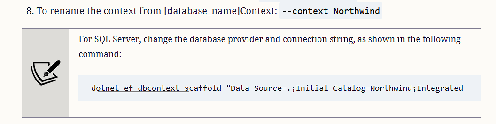
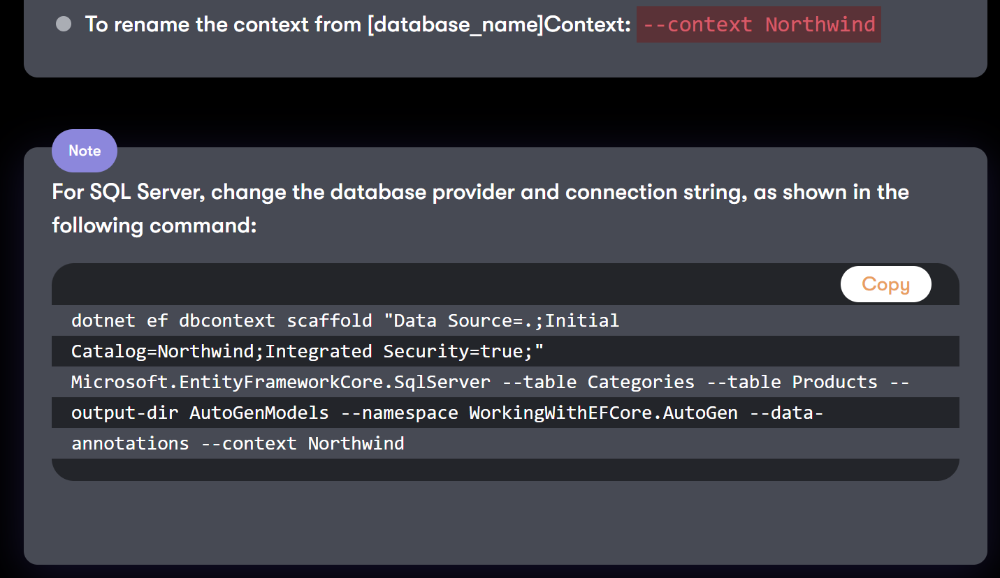

**Improvements** (33 items)

If you have suggestions for improvements, then please [raise an issue in this repository](https://github.com/markjprice/cs10dotnet6/issues) or email me at markjprice (at) gmail.com.

- [Page 16 - Understanding .NET Standard](#page-16---understanding-net-standard)
- [Page 20 - Compiling and running code using Visual Studio](#page-20---compiling-and-running-code-using-visual-studio)
- [Page 29 - Exploring code using .NET Interactive Notebooks](#page-29---exploring-code-using-net-interactive-notebooks)
- [Page 57 - Changing the color scheme for C# syntax](#page-57---changing-the-color-scheme-for-c-syntax)
- [Page 62 - Implicitly and globally importing namespaces](#page-62---implicitly-and-globally-importing-namespaces)
- [Page 78 - Using target-typed new to instantiate objects](#page-78---using-target-typed-new-to-instantiate-objects)
- [Page 84 - Simplifying the usage of the console](#page-84---simplifying-the-usage-of-the-console)
- [Page 88 - Setting options with arguments](#page-88---setting-options-with-arguments)
- [Page 110 - Understanding iteration statements](#page-110---understanding-iteration-statements)
- [Page 135 - Writing a function that returns a value](#page-135---writing-a-function-that-returns-a-value)
- [Page 152 - Customizing breakpoints](#page-152---customizing-breakpoints)
- [Page 162 - Creating a class library that needs testing](#page-162---creating-a-class-library-that-needs-testing)
- [Page 168 - Understanding the call stack](#page-168---understanding-the-call-stack)
- [Page 172 - Rethrowing exceptions](#page-172---rethrowing-exceptions)
- [Page 203 - Controlling how parameters are passed](#page-203---controlling-how-parameters-are-passed)
- [Page 208 - Defining settable properties](#page-208---defining-settable-properties)
- [Page 225 - Implementing functionality using local functions](#page-225---implementing-functionality-using-local-functions)
- [Page 233 - Comparing objects when sorting](#page-233---comparing-objects-when-sorting)
- [Page 235 - Comparing objects using a separate class](#page-235---comparing-objects-using-a-separate-class)
- [Page 289 - Creating a console application to publish](#page-289---creating-a-console-application-to-publish)
- [Page 347 - Using immutable collections](#page-347---using-immutable-collections)
- [Page 360 - Working with images](#page-360---working-with-images)
- [Page 402 - Controlling JSON processing](#page-402---controlling-json-processing)
- [Page 414 - Setting Up SQLite for Windows](#page-414---setting-up-sqlite-for-windows)
- [Page 429 - Scaffolding models using an existing database](#page-429---scaffolding-models-using-an-existing-database)
- [Page 435 - Filtering included entities](#page-435---filtering-included-entities)
- [Page 452 - Updating entities](#page-452---updating-entities)
- [Page 662 - Making controller action methods asynchronous](#page-662---making-controller-action-methods-asynchronous)
- [Page 664 - Exercise 15.2 – Practice implementing MVC by implementing a category detail page](#page-664---exercise-152--practice-implementing-mvc-by-implementing-a-category-detail-page)
- [Page 683 - Configuring the customer repository and Web API controller](#page-683---configuring-the-customer-repository-and-web-api-controller)
- [Page 692 - Making other requests using REST Client](#page-692---making-other-requests-using-rest-client)
- [Page 709 - Implementing Open API analyzers and conventions](#page-709---implementing-open-api-analyzers-and-conventions)
- [Page 768 - Exercise 17.3 – Practice by creating a country navigation item](#page-768---exercise-173--practice-by-creating-a-country-navigation-item)

# Page 16 - Understanding .NET Standard

I wrote. ".NET 6 has a single BCL and two CLRs: CoreCLR is optimized for server or desktop scenarios like websites and Windows desktop apps, and the Mono runtime is optimized for mobile and web browser apps that have limited resources."

In August 2021, Stephen Toub (Partner Software Engineer, .NET) wrote the article, "Performance Improvements in .NET 6". It has a section about Blazor and mono where he wrote, "The runtime is itself compiled to WASM, downloaded to the browser, and used to execute the application and library code on which the app depends. I say “the runtime” here, but in reality there are actually multiple incarnations of a runtime for .NET. In .NET 6, all of the .NET core libraries for all of the .NET app models, whether it be console apps or ASP.NET Core or Blazor WASM or mobile apps, come from the same source in dotnet/runtime, but there are actually two runtime implementations in dotnet/runtime: “coreclr” and “mono”."

Read more at the following link: https://devblogs.microsoft.com/dotnet/performance-improvements-in-net-6/#blazor-and-mono

# Page 20 - Compiling and running code using Visual Studio

In Step 1, I say, "In Visual Studio, navigate to Debug | Start Without Debugging."

I do not explain why it is best to start without debugging, or that the alternative is to start a project with the Visual Studio 2022 debugger attached. Some developers get into a bad habit of always starting their projects with the debugger attached.

Always start your Visual Studio 2022 projects *without debugging* unless you are *actually debugging*. This is for two good reasons. First, starting a project with the debugger attached is much slower, and second, it prevents that copy of Visual Studio from starting another project at the same time. If you start a project *without* the debugger attached then you can use that single copy of Visual Studio to start as many projects as you need. This is useful when a solution is composed of multiple projects like web services, websites, and client apps.

If you start a project with the debugger attached then you must start another copy of Visual Studio if you want to run another project at the same time.

# Page 29 - Exploring code using .NET Interactive Notebooks

Although the **.NET Interactive Notebooks** extension requires Visual Studio Code, 
Microsoft's ML.NET team have created a similar extension for Visual Studio 2022. 
It is not as capable as the extension for Visual Studio Code so I still recommend 
installing Visual Studio Code alongside Visual Studio 2022 but some readers may 
find it useful.

To install it:

1. In **Visual Studio 2022**, navigate to **Extensions** | **Manage Extensions**.
2. Search for `Notebook Editor`.


3. Click **Install**.
4. Restart Visual Studio 2022.

To create a new notebook:

1. In **Visual Studio 2022**, navigate to **Project** | **Add New Item**.
2. Search for `Notebook`.
3. Enter a filename.

# Page 57 - Changing the color scheme for C# syntax

In Step 1, I say, "In Visual Studio Code, navigate to **Code** | **Preferences** | **Color Theme** (it is on the **File**
menu on Windows)." 

In  the next edition, I will swap this around since Windows is more commonly used than macOS. 
For example, "In Visual Studio Code, navigate to **File** | **Preferences** | **Color Theme** 
(it is in the **Code** menu on macOS)."

# Page 62 - Implicitly and globally importing namespaces

After Step 9, I say that you can disable implicit usings by **removing the entry**, as shown in the following screenshot: 


It would have been clearer to say, "You can disable the implicitly imported namespaces feature for all SDKs by removing the `<ImplicitUsings>` element completely from the project file, or changing its value to `disable`, as shown in the following markup:"
```xml
<ImplicitUsings>disable</ImplicitUsings>
```

# Page 78 - Using target-typed new to instantiate objects

I show an example of how target-typed new works, as shown in the following code:
```cs
class Person
{
 public DateTime BirthDate;
}

Person kim = new();
kim.BirthDate = new(1967, 12, 26); // instead of: new DateTime(1967, 12, 26)
```

I did not expect readers to type the code, so I did not give step-by-step instructions. 
If a reader wants to try the code, note that the class must be declared either 
at the bottom of the file, below the statements that use it, or in a separate file.
If you enter the code as shown in the book you will get a compiler error: 
`Error CS8803: Top-level statements must precede namespace and type declarations.`

# Page 84 - Simplifying the usage of the console

> Thanks to [Fercho](https://github.com/theFissh) for raising this [issue on 12 June 2022](https://github.com/markjprice/cs10dotnet6/issues/80). 

In Step 1, I wrote, "At the top of the `Program.cs` file, add a statement to statically import the 
`System.Console` class, as shown in the following code:
```cs
using static System.Console;
```
Earlier in the chapter, in the **Implicitly and globally importing namespaces** section starting on page 59, I introduced the *implicit usings* feature of the .NET 6 SDK. But I did not show how to import a type statically using it. You will need to import the `System.Console` class a lot throughout the book, and in multiple class files, so a better way is to use the *implicit usings* feature to do it once at the project level, as shown in the following markup:
```xml
<Project Sdk="Microsoft.NET.Sdk">

  <PropertyGroup>
    <TargetFramework>net7.0</TargetFramework>
    <ImplicitUsings>enable</ImplicitUsings>
    <Nullable>enable</Nullable>
  </PropertyGroup>

  <ItemGroup>
    <Using Include="System.Console" Static="true" />
  </ItemGroup>

</Project>
```
Note the `<ImplicitUsings>` element must be set to `enable` and the `<Using>` element must have its `Static` attribute set to `true`.

In the seventh edition, I have changed the instructions throughout the book to do it this way, for example:
https://github.com/markjprice/cs11dotnet7/blob/main/vs4win/Chapter06/PacktLibrary/PacktLibrary.csproj#L10

# Page 88 - Setting options with arguments

> Thanks to [dpkwhan](https://github.com/dpkwhan) for raising this [issue on 2 January 2022](https://github.com/markjprice/cs10dotnet6/issues/21). 

It would have been clearer if I had explained that `ForegroundColor`, `BackgroundColor` and 
`CursorSize` are all properties of `Console`, and that we had earlier statically imported the 
`Console` type so that we can call methods like `WriteLine` and access all its properties 
without explicitly typing the `Console` class name. 

# Page 110 - Understanding iteration statements

I wrote, "Iteration statements repeat a block of statements either while a condition is true or for each item in a collection."

Some readers do not realize that the `for` statement does not iterate a specific number of times; it uses a while condition, or loops forever if the while condition is missing. To make that clearer, the sentence could be, "Iteration statements repeat a block of statements either while a condition is `true` (`while` and `for` statements) or for each item in a collection (`foreach` statement)."

# Page 135 - Writing a function that returns a value

At the end of this section there is a note box that explains that we could use the `C` format code to format the output as currency. If you are running on a computer in a culture that uses Euros then to show the Euro currency symbol you must enable UTF-8 encoding. Add the following statement before doing any writing to the console:
```cs
Console.OutputEncoding = System.Text.Encoding.UTF8;
```

# Page 152 - Customizing breakpoints

> Thanks to [ghlouwho](https://github.com/ghlouwho) for raising this [issue on 1 January 2022](https://github.com/markjprice/cs10dotnet6/issues/18). 

In Steps 5 or 6, after typing the condition expression, press *Enter* to ensure
the condition expression has been accepted before starting debugging. If you do not, it might look
like the condition expression is defined but it might not be and the breakpoint could always be hit.

# Page 162 - Creating a class library that needs testing

> Thanks to [ghlouwho](https://github.com/ghlouwho) for raising this [issue on 3 January 2022](https://github.com/markjprice/cs10dotnet6/issues/23). 
 
At this point, readers have created at least a dozen new console app projects and added them to a Visual Studio Code workspace or Visual Studio 2022 solution. For example, to create the previous project I said, "Use your preferred coding tool to add a new Console Application to the Chapter04
workspace/solution named Instrumenting."

In Step 1, I tell the reader to "Use your preferred coding tool to add a new Class Library to the Chapter04
workspace/solution named CalculatorLib. The dotnet new template is named classlib."

The only difference when creating a Class Library/classlib is to select a different project template. The rest of the steps are exactly the same as creating a Console App/console project. Remember that you can refer to Chapter 1 for step-by-step instructions. 

# Page 168 - Understanding the call stack

> Thanks to Bob Molloy for emailing me this issue.

In Step 8, on page 170, I say to run the console app. Unless you need to step through your code to debug it, you should always run your code without the debugger attached. In this case it is especially important not to attach the debugger because if you do, then it will catch the exception and show it in a GUI dialog box instead of outputting it as shown in the book. 

# Page 172 - Rethrowing exceptions

> Thanks to [ghlouwho](https://github.com/ghlouwho) for raising this [issue on 5 January 2022](https://github.com/markjprice/cs10dotnet6/issues/28). 
 
In Step 4, instead of saying, "Delete the `ex` when rethrowing", it would be clearer to say, "Remove the `ex` by replacing the statement `throw ex;` with `throw;`"

# Page 203 - Controlling how parameters are passed

> Thanks to Rajiv Sonik for emailing me this improvement.

In Step 1, the code comment explains why the `z` parameter must be initialized inside the method: (a) `out` parameters cannot have a default value assigned in the parameter declaration, and (b) `out` parameters cannot be left uninitialised so they must be set inside the method.

Like `out` parameters, `ref` parameters also cannot have default values, but since they can already be set outside the method, they do not need to be set inside the method.

In future editions I will add a note to say that both `out` and `ref` parameters cannot have default values in the bullets above the code example.

# Page 208 - Defining settable properties

> Thanks to Amer Cejudo for emailing me this issue on 27 August 2022.

In Step 2, the `FavoritePrimaryColor` property setter could throw an exception if the value being set is not one of: red, green, or blue.

In Step 3, we set the `FavoritePrimaryColor` property to a valid value, as shown in the following code:
```cs
sam.FavoritePrimaryColor = "Red";
```

If you set an invalid value, like `Black`, then the code will throw an unhandled exception. The code would be better with a `try-catch` statement, as shown in the following code:
```cs
try
{
  sam.FavoritePrimaryColor = "Red"; // change to Black to make the exception handling code execute
}
catch (Exception ex)
{
  WriteLine($"{ex.GetType()} says: {ex.Message}.");
}
```

> The print book is limited to 820 pages. If I added exception handling code to all code examples then I would have to remove at least one chapter from the book to make enough space. I do think it's worth me explicitly explaining that in a note box, so I will add one in the exception handling section in Chapter 4 of the 7th edition. Then reader will know to add their own exception handling throughout all code. But those seven extra lines are very boring to repeat in every code block.

# Page 225 - Implementing functionality using local functions

> Thanks to Amer Cejudo for emailing me this issue on 27 August 2022.

In Step 1, the `Factorial` function could throw an exception if the number parameter passed is less than zero.

In Step 2, we pass the value 5, as shown in the following code:
```cs
WriteLine($"5! is {Person.Factorial(5)}");
```

If you set an invalid value, like `-1`, then the code will throw an unhandled exception. The code would be better with a `try-catch` statement, as shown in the following code:
```cs
try
{
  int number = 5; // change to -1 to make the exception handling code execute
  WriteLine($"{number}! is {Person.Factorial(number)}"); 
}
catch (Exception ex)
{
  WriteLine($"{ex.GetType()} says: {ex.Message}.");
}
```

> The print book is limited to 820 pages. If I added exception handling code to all code examples then I would have to remove at least one chapter from the book to make enough space. I do think it's worth me explicitly explaining that in a note box, so I will add one in the exception handling section in Chapter 4 of the 7th edition. Then reader will know to add their own exception handling throughout all code. But those seven extra lines are very boring to repeat in every code block.

# Page 233 - Comparing objects when sorting

In Step 1, I say to add statements to create an array of `Person` instances and write the 
items to the console. But the array of `Person` instances does not allow `null` values and
it would be more interesting to write the example to include `null` values for both a
`Person` instance and an instance with a `null` value for its `Name`, as shown in the following code:

```cs
Person?[] people =
{
  new() { Name = "Simon" },
  null,
  new() { Name = "Jenny" },
  new() { Name = "Adam" },
  new() { Name = null },
  new() { Name = "Richard" }
};

WriteLine("Initial list of people:");
foreach (Person? p in people)
{
  WriteLine($"  {(p is null ? "<null> Person" : p.Name ?? "<null> Name")}");
}

WriteLine("Use Person's IComparable implementation to sort:");
Array.Sort(people);
foreach (Person? p in people)
{
  WriteLine($"  {(p is null ? "<null> Person" : p.Name ?? "<null> Name")}");
}
```

In Step 3, it would be better to implement the `IComparable<T>` 
interface for a nullable `Person`, as shown in the following code:

```cs
public class Person : object, IComparable<Person?>
```

In Step 5, I say to add a statement to call the `CompareTo` method of the 
`Name` field. This does not properly account for scenarios where the 
`other` instance of the `Person` class might be `null`, or various 
combinations of `null` values for the `Name` field. A better implementation 
is shown in the following code that handles null values and positions them 
at the end of the sort order:

```cs
public int CompareTo(Person? other)
{
  if ((this is not null) && (other is not null))
  {
    if (Name is null)
    {
      // if both this and the other person have null
      // Name values then we occur at the same position
      if (other.Name is null) return 0;

      // else this follows other
      return 1;
    }
    else
    {
      if (other.Name is null)
      {
        return -1;
      }
    }

    // if both Name values are not null,
    // use the string implementation of CompareTo
    return Name.CompareTo(other.Name);
  }
  else if ((this is not null) && (other is null))
  {
    return -1; // this precedes other
  }
  else if ((this is null) && (other is not null))
  {
    return 1; // this follows other
  }
  else
  {
    return 0; // this and other are at same position
  }
}
```

# Page 235 - Comparing objects using a separate class

As with the erratum item above, the implementation could be improved to 
better handle `null` values, as shown in the following code:

```cs
namespace Packt.Shared;

public class PersonComparer : IComparer<Person?>
{
  public int Compare(Person? x, Person? y)
  {
    if ((x is not null) && (y is not null))
    {
      if (x.Name is null)
      {
        // if both x and y person instances have null
        // Name values then they occur at the same position
        if (y.Name is null) return 0;

        // else x follows y
        return 1;
      }
      else
      {
        if (y.Name is null)
        {
          return -1;
        }
      }

      // if both Name values are not null...

      // Compare the Name lengths...
      int result = x.Name.Length
        .CompareTo(y.Name.Length);

      /// ...if they are equal... 
      if (result == 0)
      {
        // ...then compare by the Names...
        return x.Name.CompareTo(y.Name);
      }
      else
      {
        // ...otherwise compare by the lengths.
        return result;
      }
    }
    else if ((x is not null) && (y is null))
    {
      return -1; // x precedes y
    }
    else if ((x is null) && (y is not null))
    {
      return 1; // x follows y
    }
    else
    {
      return 0; // x and y are at same position
    }
  }
}
```

Then in `Program.cs`:

```cs
// Comparing objects using a separate class

WriteLine("Use PersonComparer's IComparer implementation to sort:");
Array.Sort(people, new PersonComparer());
foreach (Person? p in people)
{
  WriteLine($"  {(p is null ? "<null> Person" : p.Name ?? "<null> Name")}");
}
```

The output will now be:

```
Use PersonComparer's IComparer implementation to sort:
  Adam
  Jenny
  Simon
  Richard
  <null> Name
  <null> Person
```

# Page 289 - Creating a console application to publish

> Thanks to [Hoshyar Karimi](https://github.com/HoshyarKarimi) for raising this 
> [issue on 27 May 2022](https://github.com/markjprice/cs10dotnet6/issues/66).

In Step 5, I tell you to "add the runtime identifiers to target three 
operating systems inside the `<PropertyGroup>` element." It is easy to miss that 
the element name must be plural, not singular. It must be 
`<RuntimeIdentifiers>`, not `<RuntimeIdentifier>`.

# Page 347 - Using immutable collections

> Thanks to Bob Molloy for emailing me this issue.

In Step 4, I wrote, "note that the immutable list of cities does not get 
modified when you call the `Add` method on it; instead, it returns a new 
list with the newly added city"

It would have been clearer to write that it returns a new list containing 
the members from the old list plus the newly added city.

# Page 360 - Working with images

> Thanks to Bob Molloy for emailing me this issue.

In Step 3, I tell the reader to create an `images` folder but I do not specify where. 

- For Visual Studio 2022, the `images` folder must be in the `WorkingWithImages\bin\Debug\net6.0` folder.
- For Visual Studio Code that uses `dotnet run`, the `images` folder must be in the `WorkingWithImages` folder.

I have extended the code in the GitHub solution to warn if the folder is in the wrong location, and to output when a file has already been converted and so should be skipped, and when each image file is converted, as shown in the following code:

```cs
using SixLabors.ImageSharp;
using SixLabors.ImageSharp.Processing;

using static System.Console;

string imagesFolder = Path.Combine(
  Environment.CurrentDirectory, "images");

WriteLine($"I will look for images in the following folder:\n{imagesFolder}");
WriteLine();

if (!Directory.Exists(imagesFolder))
{
  WriteLine();
  WriteLine("Folder does not exist!");
  return;
}

IEnumerable<string> images =
  Directory.EnumerateFiles(imagesFolder);

foreach (string imagePath in images)
{
  if (Path.GetFileNameWithoutExtension(imagePath).EndsWith("-thumbnail"))
  {
    WriteLine($"Skipping:\n  {imagePath}");
    WriteLine();
    continue; // this file has already been converted
  }

  string thumbnailPath = Path.Combine(
    Environment.CurrentDirectory, "images",
    Path.GetFileNameWithoutExtension(imagePath)
    + "-thumbnail" + Path.GetExtension(imagePath));

  using (Image image = Image.Load(imagePath))
  {
    WriteLine($"Converting:\n  {imagePath}");
    WriteLine($"To:\n  {thumbnailPath}");
    image.Mutate(x => x.Resize(image.Width / 10, image.Height / 10));
    image.Mutate(x => x.Grayscale());
    image.Save(thumbnailPath);
    WriteLine();
  }
}

WriteLine("Image processing complete. View the images folder.");
```

# Page 402 - Controlling JSON processing

> Thanks to [KlarenAlexander](https://github.com/KlarenAlexander) for raising this [issue on 17 December 2021](https://github.com/markjprice/cs10dotnet6/issues/13). 

In Step 5, you write code to configure options for serializing JSON. The code was written in the spring of 2021 when the previews of .NET 6 at the time supported working with the new `DateOnly` type, although in an inefficient format as shown in the book. Over the summer, the System.Text.Json team added source generator support to improve performance and decided to remove support for `DateOnly`. 

When you run the code in the book with the final release of .NET 6, it throws an, "Unhandled exception. System.NotSupportedException: Serialization and deserialization of 'System.DateOnly' instances are not supported. Path: $.PublishDate."

There is a request to add support for `DateOnly` and `TimeOnly` but it seems that we will have to wait for .NET 7 until it is officially supported. **Support DateOnly and TimeOnly in JsonSerializer #53539**: https://github.com/dotnet/runtime/issues/53539

Meanwhile, we have to implement our own custom `JsonConverter` classes, like **Jørn H. Dalvik (jornhd)** suggests in the comments: 
https://github.com/dotnet/runtime/issues/53539#issuecomment-965275504

> **DO NOT USE THIS IN PRODUCTION CODE.** Any custom converter implementation that you use is likely to be different from the official implementation so it will break if you serialize data today with your custom implementation and then try to deseralize it later with the official implementation. 

I have used Jørn's code to add a new class file to the code solutions that defines converters for `DateOnly` and `DateOnly?`, as shown in the following code:

```cs
using System.Text.Json;
using System.Text.Json.Serialization;
using System.Text.RegularExpressions;

namespace WorkingWithJson
{
  public class DateOnlyConverter : JsonConverter<DateOnly>
  {
    public override DateOnly Read(ref Utf8JsonReader reader, Type typeToConvert, JsonSerializerOptions options)
    {
      if (reader.TryGetDateTime(out var dt))
      {
        return DateOnly.FromDateTime(dt);
      };
      var value = reader.GetString();
      if (value == null)
      {
        return default;
      }
      var match = new Regex("^(\\d\\d\\d\\d)-(\\d\\d)-(\\d\\d)(T|\\s|\\z)").Match(value);
      return match.Success
          ? new DateOnly(int.Parse(match.Groups[1].Value), int.Parse(match.Groups[2].Value), int.Parse(match.Groups[3].Value))
          : default;
    }

    public override void Write(Utf8JsonWriter writer, DateOnly value, JsonSerializerOptions options)
        => writer.WriteStringValue(value.ToString("yyyy-MM-dd"));
  }

  public class DateOnlyNullableConverter : JsonConverter<DateOnly?>
  {
    public override DateOnly? Read(ref Utf8JsonReader reader, Type typeToConvert, JsonSerializerOptions options)
    {
      if (reader.TryGetDateTime(out var dt))
      {
        return DateOnly.FromDateTime(dt);
      };
      var value = reader.GetString();
      if (value == null)
      {
        return default;
      }
      var match = new Regex("^(\\d\\d\\d\\d)-(\\d\\d)-(\\d\\d)(T|\\s|\\z)").Match(value);
      return match.Success
          ? new DateOnly(int.Parse(match.Groups[1].Value), int.Parse(match.Groups[2].Value), int.Parse(match.Groups[3].Value))
          : default;
    }

    public override void Write(Utf8JsonWriter writer, DateOnly? value, JsonSerializerOptions options)
        => writer.WriteStringValue(value?.ToString("yyyy-MM-dd"));
  }
}
```

Then you must add the `DateOnly` (and optionally `DateOnly?`) converters to the JSON `options` to fix this issue. 

```cs
// existing code to configure JSON options
JsonSerializerOptions options = new()
{
  IncludeFields = true, // includes all fields
  PropertyNameCaseInsensitive = true,
  WriteIndented = true,
  PropertyNamingPolicy = JsonNamingPolicy.CamelCase,
};

// add converters to enable working with DateOnly and DateOnly?
options.Converters.Add(new DateOnlyConverter());
options.Converters.Add(new DateOnlyNullableConverter());
```

# Page 414 - Setting Up SQLite for Windows

> Thanks to John David Bowman for emailing this issue.

In Step 4, I wrote, "Extract the ZIP file into a folder named `C:\SQLite`." It would be clearer to add the following, "Make sure that the extracted  `sqlite3.exe` file is directly inside the `C:\SQLite` folder or the executable will not be found later when you try to use it."

# Page 429 - Scaffolding models using an existing database

Be careful when entering the command to scaffold the models if you are using O'Reilly's online version because their formatting does not show long lines and they do not show a scroll bar to indicate there is more, as shown in the following screenshot:



The print book and PDF look like this:


The Packt online version looks like this:



# Page 435 - Filtering included entities

In Step 1, I tell you to add code to define a `FilteredIncludes` method, and prompt the user to enter a minimum value for units in stock. The code assumes that if the user enters nothing then `ReadLine` returns `null` so it uses a null-coallesing operator to replace that with `10`, as shown in the following code:
```cs
Write("Enter a minimum for units in stock: ");
string unitsInStock = ReadLine() ?? "10";
int stock = int.Parse(unitsInStock);
```
But `ReadLine` returns an empty string if the user enters nothing. A better way to check would be to loop while the `TryParse` method returns not `true`:
```cs
string? input;
int stock;

do
{
  Write("Enter a minimum for units in stock: ");
  input = ReadLine();
} while (!int.TryParse(input, out stock));

```

# Page 452 - Updating entities

In Step 1, the code finds a product to update by specifying the start of a product name and just returns the first match. There isn't a particular reason why I chose to do it that way, I was just trying to show different methods to add some variety. If you need to update a specific product then you must use a unique identifier like `ProductId` instead. 

But I cannot know what the product ID will be for the products that a reader adds. I do know that there are no products that start with "Bob" in the existing Northwind database. So oding it this way avoids having to tell the reader to first discover what the product ID is for the products they've added. It is likely to be 78 because there are already 77 products in the table, but once you've added that and then deleted it, the next product to be added would be 79 and it all gets out of sync.

In the next edition, I will add a note to say this.

# Page 662 - Making controller action methods asynchronous

> Thanks to [Dreamoochy](https://github.com/Dreamoochy) for raising this issue on [29 July 2022](https://github.com/markjprice/cs10dotnet6/issues/96). 

In Step 1, if you follow the instructions and only add the highlighted code to 
make the action method asynchronous, then it will work. However, the setting of 
the property values shown in the code block mistakenly use = instead of :. 
The code block should look like this:
```cs
[ResponseCache(Duration = 10, Location = ResponseCacheLocation.Any)]
public async Task<IActionResult> Index()
{
  _logger.LogError("This is a serious error (not really!)");
  _logger.LogWarning("This is your first warning!");
  _logger.LogWarning("Second warning!");
  _logger.LogInformation("I am in the Index method of the HomeController.");

  HomeIndexViewModel model = new
  (
    VisitorCount: (new Random()).Next(1, 1001),
    Categories: await db.Categories.ToListAsync(),
    Products: await db.Products.ToListAsync()
  );
  return View(model); // pass model to view
}
```

# Page 664 - Exercise 15.2 – Practice implementing MVC by implementing a category detail page

Earlier in the chapter, and in Exercise 15.2, the link generated for a category detail page looks like this:
```
https://localhost:5001/category/1
```

Although it is possible to configure a route to respond to that format of link, it would be easier if the link used the following format:
```
https://localhost:5001/home/categorydetail/1
```

In `Index.cshtml`, change how the links are generated to match the improved format, as shown in the following markup:
```xml
<a class="btn btn-primary"
  href="/home/categorydetail/@Model.Categories[c].CategoryId">View</a>
```

This would then allow you to add an action method to the `HomeController` class as shown in the following code:
```cs
public async Task<IActionResult> CategoryDetail(int? id)
{
  if (!id.HasValue)
  {
    return BadRequest("You must pass a category ID in the route, for example, /Home/CategoryDetail/6");
  }

  Category? model = await db.Categories.Include(p => p.Products)
    .SingleOrDefaultAsync(p => p.CategoryId == id);

  if (model is null)
  {
    return NotFound($"CategoryId {id} not found.");
  }

  return View(model); // pass model to view and then return result
}
```

And create a view that matches the name `CategoryDetail.cshtml`, as shown in the following markup:
```xml
@model Packt.Shared.Category 
@{
  ViewData["Title"] = "Category Detail - " + Model.CategoryName;
}
<h2>Category Detail</h2>
<div>
  <dl class="dl-horizontal">
    <dt>Category Id</dt>
    <dd>@Model.CategoryId</dd>
    <dt>Product Name</dt>
    <dd>@Model.CategoryName</dd>
    <dt>Products</dt>
    <dd>@Model.Products.Count</dd>
    <dt>Description</dt>
    <dd>@Model.Description</dd>
  </dl>
</div>
```

> Note: You could also use the simpler link format `https://localhost:5001/home/category/1` but then both the action method and the view filename must be just `Category` instead of `CategoryDetail`.

If you want to keep the original link format, then you would need to decorate the action method as shown in the following code:
```cs
[Route("category/{id}")]
public async Task<IActionResult> CategoryDetail(int? id)
```

# Page 683 - Configuring the customer repository and Web API controller

In Step 4, you add a `CustomersController.cs` file and define a `CustomersController` class, as shown in the following partial code:
```cs
// base address: api/customers
[Route("api/[controller]")]
[ApiController]
public class CustomersController : ControllerBase
{
```

In the 8th edition, I will add more explanation about how the route is defined by the `[Route]` attribute. The `[controller]` part is automatically replaced with the class name with the `Controller` suffix removed. Therefore the base address of the route to the `CustomersController` is `api/customers`.

# Page 692 - Making other requests using REST Client

> Thanks to [Tim](https://github.com/tcrum06) for raising this [issue on 27 May 2022](https://github.com/markjprice/cs10dotnet6/issues/67). 

In Step 1, I say to define a `POST` request to create a new customer, as shown in the following document:
```
POST https://localhost:5001/api/customers/ HTTP/1.1 
Content-Type: application/json
Content-Length: 301

{
 "customerID": "ABCXY",
 "companyName": "ABC Corp",
 "contactName": "John Smith",
 "contactTitle": "Sir",
 "address": "Main Street",
 "city": "New York",
 "region": "NY",
 "postalCode": "90210",
 "country": "USA",
 "phone": "(123) 555-1234",
 "fax": null,
 "orders": null
}
```
The `POST` document would be better without the `fax` and `orders` since they are `null` anyway and this avoids errors if the service expects `orders` to not be `null`. Change the `POST` to request to remove those two properties, as shown in the following document:
```
POST https://localhost:5001/api/customers/ HTTP/1.1 
Content-Type: application/json
Content-Length: 266

{
 "customerID": "ABCXY",
 "companyName": "ABC Corp",
 "contactName": "John Smith",
 "contactTitle": "Sir",
 "address": "Main Street",
 "city": "New York",
 "region": "NY",
 "postalCode": "90210",
 "country": "USA",
 "phone": "(123) 555-1234"
}
```
> Note the `Content-Length` has had to change too.

# Page 709 - Implementing Open API analyzers and conventions

> Thanks to [Andrei Tarutin](https://github.com/tarurar) for raising this [issue on 24 December 2022](https://github.com/markjprice/cs10dotnet6/issues/111). 

In this section, I explain how to enable Open API analyzers by adding an entry to the project file, as shown in the following markup and in this GitHub code file: https://github.com/markjprice/cs10dotnet6/blob/main/vs4win/PracticalApps/Northwind.WebApi/Northwind.WebApi.csproj#L7

```xml
<PropertyGroup>
  <TargetFramework>net6.0</TargetFramework>
  <Nullable>enable</Nullable>
  <ImplicitUsings>enable</ImplicitUsings>
  <IncludeOpenAPIAnalyzers>true</IncludeOpenAPIAnalyzers>
</PropertyGroup>
```
This whole chapter is about Web API projects but I did not explicitly say that the Open API analyzers only work with web projects. In the eighth edition I will show more of the project markup with a note to make this clearer, as shown in the following markup:
```xml
<Project Sdk="Microsoft.NET.Sdk.Web">

  <PropertyGroup>
    <TargetFramework>net6.0</TargetFramework>
    <Nullable>enable</Nullable>
    <ImplicitUsings>enable</ImplicitUsings>
    <IncludeOpenAPIAnalyzers>true</IncludeOpenAPIAnalyzers>
  </PropertyGroup>
```

# Page 768 - Exercise 17.3 – Practice by creating a country navigation item

This exercise is probably too difficult to complete for Blazor WebAssembly 
with the knowledge that I cover in the chapter because it requires you to extend 
the service and then dynamically create components at runtime, as documented here: 
https://docs.microsoft.com/en-us/aspnet/core/blazor/components/dynamiccomponent

I am also looking at using pre-rendered components to solve the exercise for
Blazor WebAssembly.

Instead, try to complete the exercise for Blazor Server. For example...

In the `Northwind.BlazorServer` project, in `INorthwindService.cs`, I added the following:
```cs
List<string?> GetCountries();
```
In `NorthwindService.cs`, I added the following:
```cs
public List<string?> GetCountries()
{
  return db.Customers.Select(c => c.Country).Distinct().OrderBy(country => country).ToList();
}
```
In `NavMenu.razor`, I added the following:
```cs
@inject INorthwindService northwind
```
```cs
@foreach(string? country in northwind.GetCountries())
{
    string countryLink = "customers/" + country;

    <div class="nav-item px-3">
        <NavLink class="nav-link" href="@countryLink">
        <span class="oi oi-people" aria-hidden="true"></span>
        Customers in @country
        </NavLink>
    </div>
}
```
You cannot use `<NavLink class="nav-link" href="customers/@c">` because Blazor does 
not allow combined text and @ expression in components. That is why my code above 
creates a local variable to do the combining to make the country URL.
