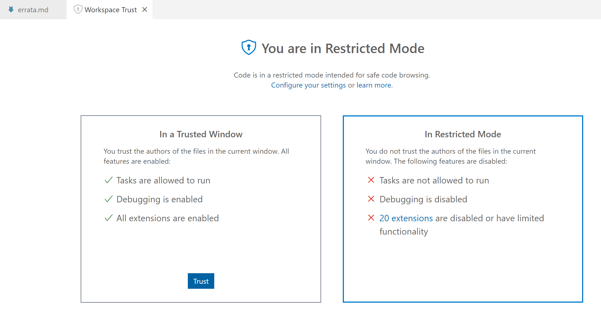
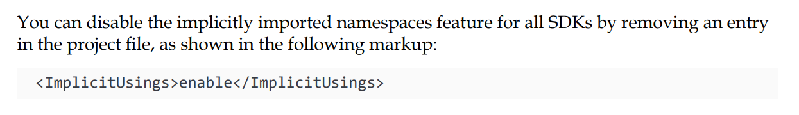

# Errata, Improvements and Troubleshooting

If you find any mistakes in the sixth edition, *C# 10 and .NET 6 - Modern Cross-Platform Development*, or if you have suggestions for improvements, then please [raise an issue in this repository](https://github.com/markjprice/cs10dotnet6/issues) or email me at markjprice (at) gmail.com.

- [Errata, Improvements and Troubleshooting](#errata-improvements-and-troubleshooting)
- [Print Book](#print-book)
  - [Page 8 - Installing other extensions](#page-8---installing-other-extensions)
  - [Page 16 - Understanding .NET Standard](#page-16---understanding-net-standard)
  - [Page 18 - Writing code using Visual Studio 2022](#page-18---writing-code-using-visual-studio-2022)
  - [Page 25 - Writing code using Visual Studio Code](#page-25---writing-code-using-visual-studio-code)
  - [Page 28 - Adding a second project using Visual Studio Code](#page-28---adding-a-second-project-using-visual-studio-code)
  - [Page 32 - Adding Markdown and special commands to a notebook](#page-32---adding-markdown-and-special-commands-to-a-notebook)
  - [Page 57 - Changing the color scheme for C# syntax](#page-57---changing-the-color-scheme-for-c-syntax)
  - [Page 62 - Implicitly and globally importing namespaces](#page-62---implicitly-and-globally-importing-namespaces)
  - [Page 78 - Using target-typed new to instantiate objects](#page-78---using-target-typed-new-to-instantiate-objects)
  - [Page 82 - Formatting using interpolated strings](#page-82---formatting-using-interpolated-strings)
  - [Page 83 - Understanding format strings](#page-83---understanding-format-strings)
  - [Page 87 - Passing arguments to a console app](#page-87---passing-arguments-to-a-console-app)
  - [Page 88 - Setting options with arguments](#page-88---setting-options-with-arguments)
  - [Page 92 - Exercise 2.3 – Practice number sizes and ranges](#page-92---exercise-23--practice-number-sizes-and-ranges)
  - [Page 110 - Understanding iteration statements](#page-110---understanding-iteration-statements)
  - [Page 137 - Calculating factorials with recursion](#page-137---calculating-factorials-with-recursion)
  - [Page 140 - Documenting functions with XML comments](#page-140---documenting-functions-with-xml-comments)
  - [Page 152 - Customizing breakpoints](#page-152---customizing-breakpoints)
  - [Page 162 - Creating a class library that needs testing](#page-162---creating-a-class-library-that-needs-testing)
  - [Page 168 - Understanding the call stack](#page-168---understanding-the-call-stack)
  - [Page 172 - Rethrowing exceptions](#page-172---rethrowing-exceptions)
  - [Page 183 - Importing a namespace to use a type](#page-183---importing-a-namespace-to-use-a-type)
  - [Page 187 - Storing a value using an enum type](#page-187---storing-a-value-using-an-enum-type)
  - [Page 192 - Making a field constant](#page-192---making-a-field-constant)
  - [Page 233 - Comparing objects when sorting](#page-233---comparing-objects-when-sorting)
  - [Page 235 - Comparing objects using a separate class](#page-235---comparing-objects-using-a-separate-class)
  - [Page 347 - Using immutable collections](#page-347---using-immutable-collections)
  - [Page 360 - Working with images](#page-360---working-with-images)
  - [Page 391 - Encoding strings as byte arrays](#page-391---encoding-strings-as-byte-arrays)
  - [Page 402 - Controlling JSON processing](#page-402---controlling-json-processing)
  - [Page 417 - Database Provider for MySQL](#page-417---database-provider-for-mysql)
  - [Page 438 - Getting the generated SQL](#page-438---getting-the-generated-sql)
  - [Page 510 - Implementing a Recorder class](#page-510---implementing-a-recorder-class)
  - [Page 645 - Defining a typed view](#page-645---defining-a-typed-view)
- [Bonus Content](#bonus-content)
  - [Page 141 - Appendix A - Exercise 3.1 – Test your knowledge](#page-141---appendix-a---exercise-31--test-your-knowledge)
  - [Page 143 - Appendix A - Exercise 4.1 – Test your knowledge](#page-143---appendix-a---exercise-41--test-your-knowledge)

# Print Book

## Page 8 - Installing other extensions

> Thanks to [ifduyue](https://github.com/ifduyue) for raising this [issue on 14 November 2021](https://github.com/markjprice/cs10dotnet6/issues/1). 

In the table of extensions, the identifier for **MSBuild project tools** should be `tintoy` not `tinytoy`.

## Page 16 - Understanding .NET Standard

I wrote. ".NET 6 has a single BCL and two CLRs: CoreCLR is optimized for server or desktop scenarios like websites and Windows desktop apps, and the Mono runtime is optimized for mobile and web browser apps that have limited resources."

In August 2021, Stephen Toub (Partner Software Engineer, .NET) wrote the article, "Performance Improvements in .NET 6". It has a section about Blazor and mono where he wrote, "The runtime is itself compiled to WASM, downloaded to the browser, and used to execute the application and library code on which the app depends. I say “the runtime” here, but in reality there are actually multiple incarnations of a runtime for .NET. In .NET 6, all of the .NET core libraries for all of the .NET app models, whether it be console apps or ASP.NET Core or Blazor WASM or mobile apps, come from the same source in dotnet/runtime, but there are actually two runtime implementations in dotnet/runtime: “coreclr” and “mono”."

Read more at the following link: https://devblogs.microsoft.com/dotnet/performance-improvements-in-net-6/#blazor-and-mono

## Page 18 - Writing code using Visual Studio 2022

In Step 3, the project template name has been changed from **Console Application** to **Console App** in the final release of Visual Studio 2022.

## Page 25 - Writing code using Visual Studio Code

In Step 14, I say that the first time you open a code file, Visual Studio Code may have to download and install C# dependencies and so on. This will not happen if you do not trust the workspace. 

At the top of the window, in the blue bar, click **Manage**, as shown in the following screenshot:


Click the **Trust** button, as shown in the following screenshot:



You will then trust the workspace and extensions will activate as described in the book. 


## Page 28 - Adding a second project using Visual Studio Code

> This issue has now been resolved with the release of C# extension 1.24.0 on January 20, 2022: https://marketplace.visualstudio.com/items?itemName=ms-dotnettools.csharp

> Thanks to [johncflorida](https://github.com/johncflorida) for raising this [issue on 9 December 2021](https://github.com/markjprice/cs10dotnet6/issues/11). Also thanks to [Paul-Schroeder](https://github.com/Paul-Schroeder) and [ken-from-the-uk](https://github.com/ken-from-the-uk) who raised the same issue and made suggestions.

In Step 6, I say to select **OmniSharp: Select Project**. Unfortuately if you have installed version 1.23.17 of the C# extension (released on December 3, 2021) then it gives an error, as shown in the following screenshot and described in these issues: 


- https://github.com/markjprice/cs10dotnet6/issues/11
- https://github.com/markjprice/cs10dotnet6/issues/14

To avoid the issue, revert back to an earlier version or manually install version v1.24.0-beta1 by [downloading the VSIX](https://github.com/OmniSharp/omnisharp-vscode/releases/tag/v1.24.0-beta1) and then in Visual Studio Code **EXTENSIONS**, select the **Views and More Actions** menu (three dots) and then **Install from VSIX...**. 

I had hoped that the seriousness of this issue would prompt a non-beta fix by now but the holidays have probably slowed development down. I will leave both issues open and I have added this erratum to warn readers about this temporary issue.

## Page 32 - Adding Markdown and special commands to a notebook

> Thanks to [exzzy22](https://github.com/exzzy22) for raising this [issue on January 14, 2022](https://github.com/markjprice/cs10dotnet6/issues/34).

In Step 3, I wrote to "click **+ Markup** to add a Markdown cell." I should have 
written "click **+ Markdown** to add a Markdown cell." 

## Page 57 - Changing the color scheme for C# syntax

In Step 1, I say, "In Visual Studio Code, navigate to **Code** | **Preferences** | **Color Theme** (it is on the **File**
menu on Windows)." 

In  the next edition, I will swap this around since Windows is more commonly used than macOS. 
For example, "In Visual Studio Code, navigate to **File** | **Preferences** | **Color Theme** 
(it is in the **Code** menu on macOS)."

## Page 62 - Implicitly and globally importing namespaces

After Step 9, I say that you can disable implicit usings by **removing the entry**, as shown in the following screenshot: 



It would have been clearer to say, "You can disable the implicitly imported namespaces feature for all SDKs by removing the `<ImplicitUsings>` element completely from the project file, or changing its value to `disable`, as shown in the following markup:"
```xml
<ImplicitUsings>disable</ImplicitUsings>
```

## Page 78 - Using target-typed new to instantiate objects

I show an example of how target-typed new works, as shown in the following code:
```cs
class Person
{
 public DateTime BirthDate;
}

Person kim = new();
kim.BirthDate = new(1967, 12, 26); // instead of: new DateTime(1967, 12, 26)
```

I did not expect readers to type the code, so I did not give step-by-step instructions. 
If a reader wants to try the code, note that the class must be declared either 
at the bottom of the file, below the statements that use it, or in a separate file.
If you enter the code as shown in the book you will get a compiler error: 
`Error CS8803: Top-level statements must precede namespace and type declarations.`

## Page 82 - Formatting using interpolated strings

> Thanks to [GregStevenson](https://github.com/GregStevenson) for raising this [issue on 26 November 2021](https://github.com/markjprice/cs10dotnet6/issues/6). 

In the last code block in this section, the string is missing the `$` prefix that makes it interpolated, as shown in the following code:
```cs
private const string fullname = "{firstname} {lastname}";
```
The code should be as follows:
```cs
private const string fullname = $"{firstname} {lastname}";
```

## Page 83 - Understanding format strings

> Thanks to [dpkwhan](https://github.com/dpkwhan) for raising this [issue on 2 January 2022](https://github.com/markjprice/cs10dotnet6/issues/20). 

In Step 1, the statement to output the column headings does not need the number 
format code `:N0` because it is a `string` value, although it does still need the 
right-alignment format code `,6` to position it within the six character width column. 

The following statement:
```cs
Console.WriteLine(
  format: "{0,-10} {1,6:N0}",
  arg0: "Name",
  arg1: "Count");
```

Should be:
```cs
Console.WriteLine(
  format: "{0,-10} {1,6}",
  arg0: "Name",
  arg1: "Count");
```

## Page 87 - Passing arguments to a console app

> Thanks to Bob Molloy for emailing me this issue.

In Step 5, I say, "If you are using Visual Studio, then navigate to **Project** | **Arguments Properties**, select the **Debug** tab, and in the **Application arguments** box, enter some arguments". 

Microsoft changed the user interface of Visual Studio 2022 after that step was written. 

It should now say, "If you are using Visual Studio, then navigate to **Project** | **Arguments Properties**, select 
the **Debug** tab, click **Open debug launch profiles UI**, and in the **Command line arguments** box, enter some arguments", as shown in the following screenshot:


In *Figure 2.6*, it is difficult to see the hyphen in the second argument in the PDF edition (shown in the screenshot below) and impossible to see it in the Kindle edition. 

In Step 5, it would have been clearer if I had written out the arguments as I did in Step 6 instead of relying on Amazon's image processing to clearly show the hyphen! 

For example, `firstarg second-arg third:arg "fourth arg"`. 


## Page 88 - Setting options with arguments

> Thanks to [dpkwhan](https://github.com/dpkwhan) for raising this [issue on 2 January 2022](https://github.com/markjprice/cs10dotnet6/issues/21). 

It would have been clearer if I had explained that `ForegroundColor`, `BackgroundColor` and 
`CursorSize` are all properties of `Console`, and that we had earlier statically imported the 
`Console` type so that we can call methods like `WriteLine` and access all its properties 
without explicitly typing the `Console` class name. 

## Page 92 - Exercise 2.3 – Practice number sizes and ranges

> Thanks to Bob Molloy for emailing me this issue.

In Exercise 2.3, I say, "create a console application project named Exercise02". I should have said, "create a console application project named Exercise03".

## Page 110 - Understanding iteration statements

I wrote, "Iteration statements repeat a block of statements either while a condition is true or for each item in a collection."

Some readers do not realize that the `for` statement does not iterate a specific number of times; it uses a while condition, or loops forever if the while condition is missing. To make that clearer, the sentence could be, "Iteration statements repeat a block of statements either while a condition is `true` (`while` and `for` statements) or for each item in a collection (`foreach` statement)."

## Page 137 - Calculating factorials with recursion

The factorial function is defined for non-negative integers only i.e. for 0, 1, 2, 3, and so on, and it is defined as:
```
0!=1 

n!=n×(n−1)!, for n∈{1,2,3,…}
```
So the implementation of the function in the book should be as shown in the following code: 

```cs
static int Factorial(int number)
{
  if (number < 0)
  {
     throw new ArgumentException(
       message: "The factorial function is defined for non-negative integers only.", 
       paramName: "number");
  }
  else if (number == 0)
  {
    return 1;
  }
  else
  {
    return number * Factorial(number - 1);
  }
}
```

## Page 140 - Documenting functions with XML comments

> Thanks to Bob Molloy via email and [CoRB-ops](https://github.com/CoRB-ops) for raising this [issue on 21 November 2021](https://github.com/markjprice/cs10dotnet6/issues/3). 

First, it is worth emphasizing that this feature is primarily designed to be used with a tool that converts the comments into documentation like Sandcastle (https://github.com/EWSoftware/SHFB). The tooltips that appear while entering code or hovering over the function name are a secondary feature. Understanding this will help you understand the limitation involved with this errata item.

Second, in Step 4, I say that when calling the function you will see more details. However, when the .NET 6 project templates changed in Preview 7 to use top-level statements and an automatically generated `Program` class, the functions you write in the tasks became implemented as local functions declared inside the hidden automatically generated `<Main>$` method. Local functions do not support XML comments because local functions cannot be used outside the member in which they are declared so it makes no sense to generate documentation from them. Sadly, this also means no tooltip, which would still be useful, but neither Visual Studio 2022 nor Visual Studio Code recognize that.

To enable XML comments for the `CardinalToOrdinal` function, we must therefore define it inside a class. The easiest way to do this is to add the function to the automatically generated partial `Program` class by moving the function to the bottom of the `Program.cs` file and wrapping it in a partial `Program` class, as shown in the following code:

```cs
// This must be at the bottom of the Program.cs file to avoid compile errors.
// Or you could create a separate file, perhaps named Program.CardinalToOrdinal.cs
partial class Program
{
    /// <summary>
    /// Pass a 32-bit integer and it will be converted into its ordinal equivalent.
    /// </summary>
    /// <param name="number">Number is a cardinal value e.g. 1, 2, 3, and so on.</param>
    /// <returns>Number as an ordinal value e.g. 1st, 2nd, 3rd, and so on.</returns>
    static string CardinalToOrdinal(int number)
    {
        switch (number)
        {
            case 11: // special cases for 11th to 13th
            case 12:
            case 13:
                return $"{number}th";
            default:
                int lastDigit = number % 10;
                string suffix = lastDigit switch
                {
                    1 => "st",
                    2 => "nd",
                    3 => "rd",
                    _ => "th"
                };
                return $"{number}{suffix}";
        }
    }
}
```

## Page 152 - Customizing breakpoints

> Thanks to [ghlouwho](https://github.com/ghlouwho) for raising this [issue on 1 January 2022](https://github.com/markjprice/cs10dotnet6/issues/18). 

In Steps 5 or 6, after typing the condition expression, press *Enter* to ensure
the condition expression has been accepted before starting debugging. If you do not, it might look
like the condition expression is defined but it might not be and the breakpoint could always be hit.

## Page 162 - Creating a class library that needs testing

> Thanks to [ghlouwho](https://github.com/ghlouwho) for raising this [issue on 3 January 2022](https://github.com/markjprice/cs10dotnet6/issues/23). 
 
At this point, readers have created at least a dozen new console app projects and added them to a Visual Studio Code workspace or Visual Studio 2022 solution. For example, to create the previous project I said, "Use your preferred coding tool to add a new Console Application to the Chapter04
workspace/solution named Instrumenting."

In Step 1, I tell the reader to "Use your preferred coding tool to add a new Class Library to the Chapter04
workspace/solution named CalculatorLib. The dotnet new template is named classlib."

The only difference when creating a Class Library/classlib is to select a different project template. The rest of the steps are exactly the same as creating a Console App/console project. Remember that you can refer to Chapter 1 for step-by-step instructions. 

## Page 168 - Understanding the call stack

> Thanks to Bob Molloy for emailing me this issue.

In Step 8, on page 170, I say to run the console app. Unless you need to step through your code to debug it, you should always run your code without the debugger attached. In this case it is especially important not to attach the debugger because if you do, then it will catch the exception and show it in a GUI dialog box instead of outputting it as shown in the book. 

## Page 172 - Rethrowing exceptions

> Thanks to [ghlouwho](https://github.com/ghlouwho) for raising this [issue on 5 January 2022](https://github.com/markjprice/cs10dotnet6/issues/28). 
 
In Step 4, instead of saying, "Delete the `ex` when rethrowing", it would be clearer to say, "Remove the `ex` by replacing the statement `throw ex;` with `throw;`"

## Page 183 - Importing a namespace to use a type

In Step 3, I wrote a comment with the older C# syntax and a statement with the newer syntax for instantiating a new object, as shown in the following code:
```cs
// var bob = new Person(); // C# 1.0 or later
Person bob = new(); // C# 9.0 or later
```
The `var` keyword was not introduced until C# 3.0, so I should have written the following:
```cs
// Person bob = new Person(); // C# 1.0 or later
// var bob = new Person(); // C# 3.0 or later
Person bob = new(); // C# 9.0 or later
```

## Page 187 - Storing a value using an enum type

> Thanks to [dpkwhan](https://github.com/dpkwhan) for raising this [issue on 5 January 2022](https://github.com/markjprice/cs10dotnet6/issues/29). 
 
In the **Good Practice** box, the text "If you use are writing code" should be "If you are writing code"

## Page 192 - Making a field constant

> Thanks to Bob Molloy for emailing me this issue.

In Step 1, the assigned `string` literal should be `"Homo Sapiens"`. 
In Step 3, the output should be `Bob Smith is a Homo Sapiens`.

## Page 233 - Comparing objects when sorting

In Step 1, I say to add statements to create an array of `Person` instances and write the 
items to the console. But the array of `Person` instances does not allow `null` values and
it would be more interesting to write the example to include `null` values for both a
`Person` instance and an instance with a `null` value for its `Name`, as shown in the following code:

```cs
Person?[] people =
{
  new() { Name = "Simon" },
  null,
  new() { Name = "Jenny" },
  new() { Name = "Adam" },
  new() { Name = null },
  new() { Name = "Richard" }
};

WriteLine("Initial list of people:");
foreach (Person? p in people)
{
  WriteLine($"  {(p is null ? "<null> Person" : p.Name ?? "<null> Name")}");
}

WriteLine("Use Person's IComparable implementation to sort:");
Array.Sort(people);
foreach (Person? p in people)
{
  WriteLine($"  {(p is null ? "<null> Person" : p.Name ?? "<null> Name")}");
}
```

In Step 3, it would be better to implement the `IComparable<T>` 
interface for a nullable `Person`, as shown in the following code:

```cs
public class Person : object, IComparable<Person?>
```

In Step 5, I say to add a statement to call the `CompareTo` method of the 
`Name` field. This does not properly account for scenarios where the 
`other` instance of the `Person` class might be `null`, or various 
combinations of `null` values for the `Name` field. A better implementation 
is shown in the following code that handles null values and positions them 
at the end of the sort order:

```cs
public int CompareTo(Person? other)
{
  if ((this is not null) && (other is not null))
  {
    if (Name is null)
    {
      // if both this and the other person have null
      // Name values then we occur at the same position
      if (other.Name is null) return 0;

      // else this follows other
      return 1;
    }
    else
    {
      if (other.Name is null)
      {
        return -1;
      }
    }

    // if both Name values are not null,
    // use the string implementation of CompareTo
    return Name.CompareTo(other.Name);
  }
  else if ((this is not null) && (other is null))
  {
    return -1; // this precedes other
  }
  else if ((this is null) && (other is not null))
  {
    return 1; // this follows other
  }
  else
  {
    return 0; // this and other are at same position
  }
}
```

## Page 235 - Comparing objects using a separate class

As with the erratum item above, the implementation could be improved to 
better handle `null` values, as shown in the following code:

```cs
namespace Packt.Shared;

public class PersonComparer : IComparer<Person?>
{
  public int Compare(Person? x, Person? y)
  {
    if ((x is not null) && (y is not null))
    {
      if (x.Name is null)
      {
        // if both x and y person instances have null
        // Name values then they occur at the same position
        if (y.Name is null) return 0;

        // else x follows y
        return 1;
      }
      else
      {
        if (y.Name is null)
        {
          return -1;
        }
      }

      // if both Name values are not null...

      // Compare the Name lengths...
      int result = x.Name.Length
        .CompareTo(y.Name.Length);

      /// ...if they are equal... 
      if (result == 0)
      {
        // ...then compare by the Names...
        return x.Name.CompareTo(y.Name);
      }
      else
      {
        // ...otherwise compare by the lengths.
        return result;
      }
    }
    else if ((x is not null) && (y is null))
    {
      return -1; // x precedes y
    }
    else if ((x is null) && (y is not null))
    {
      return 1; // x follows y
    }
    else
    {
      return 0; // x and y are at same position
    }
  }
}
```

Then in `Program.cs`:

```cs
// Comparing objects using a separate class

WriteLine("Use PersonComparer's IComparer implementation to sort:");
Array.Sort(people, new PersonComparer());
foreach (Person? p in people)
{
  WriteLine($"  {(p is null ? "<null> Person" : p.Name ?? "<null> Name")}");
}
```

The output will now be:

```
Use PersonComparer's IComparer implementation to sort:
  Adam
  Jenny
  Simon
  Richard
  <null> Name
  <null> Person
```

## Page 347 - Using immutable collections

> Thanks to Bob Molloy for emailing me this issue.

In Step 4, I wrote, "note that the immutable list of cities does not get 
modified when you call the `Add` method on it; instead, it returns a new 
list with the newly added city"

It would have been clearer to write that it returns a new list containing 
the members from the old list plus the newly added city.

## Page 360 - Working with images

> Thanks to Bob Molloy for emailing me this issue.

In Step 3, I tell the reader to create an `images` folder but I do not specify where. 

- For Visual Studio 2022, the `images` folder must be in the `WorkingWithImages\bin\Debug\net6.0` folder.
- For Visual Studio Code that uses `dotnet run`, the `images` folder must be in the `WorkingWithImages` folder.

I have extended the code in the GitHub solution to warn if the folder is in the wrong location, and to output when a file has already been converted and so should be skipped, and when each image file is converted, as shown in the following code:

```cs
using SixLabors.ImageSharp;
using SixLabors.ImageSharp.Processing;

using static System.Console;

string imagesFolder = Path.Combine(
  Environment.CurrentDirectory, "images");

WriteLine($"I will look for images in the following folder:\n{imagesFolder}");
WriteLine();

if (!Directory.Exists(imagesFolder))
{
  WriteLine();
  WriteLine("Folder does not exist!");
  return;
}

IEnumerable<string> images =
  Directory.EnumerateFiles(imagesFolder);

foreach (string imagePath in images)
{
  if (Path.GetFileNameWithoutExtension(imagePath).EndsWith("-thumbnail"))
  {
    WriteLine($"Skipping:\n  {imagePath}");
    WriteLine();
    continue; // this file has already been converted
  }

  string thumbnailPath = Path.Combine(
    Environment.CurrentDirectory, "images",
    Path.GetFileNameWithoutExtension(imagePath)
    + "-thumbnail" + Path.GetExtension(imagePath));

  using (Image image = Image.Load(imagePath))
  {
    WriteLine($"Converting:\n  {imagePath}");
    WriteLine($"To:\n  {thumbnailPath}");
    image.Mutate(x => x.Resize(image.Width / 10, image.Height / 10));
    image.Mutate(x => x.Grayscale());
    image.Save(thumbnailPath);
    WriteLine();
  }
}

WriteLine("Image processing complete. View the images folder.");
```

## Page 391 - Encoding strings as byte arrays

> Thanks to [KlarenAlexander](https://github.com/KlarenAlexander) for raising this [issue on 17 December 2021](https://github.com/markjprice/cs10dotnet6/issues/12). 

In Step 4, you write code to detect numbers 1 to 5 entered on the keyboard to select between encodings. But the code only accepts numbers entered from the top row of the keyboard. To accept numbers entered on the number pad on an extended keyboard, the code needs to be modified, as shown in the following code:

```cs
Encoding encoder = number switch
{
  ConsoleKey.D1 or ConsoleKey.NumPad1 => Encoding.ASCII,
  ConsoleKey.D2 or ConsoleKey.NumPad2 => Encoding.UTF7,
  ConsoleKey.D3 or ConsoleKey.NumPad3 => Encoding.UTF8,
  ConsoleKey.D4 or ConsoleKey.NumPad4 => Encoding.Unicode,
  ConsoleKey.D5 or ConsoleKey.NumPad5 => Encoding.UTF32,
  _                                   => Encoding.Default
};
```

## Page 402 - Controlling JSON processing

> Thanks to [KlarenAlexander](https://github.com/KlarenAlexander) for raising this [issue on 17 December 2021](https://github.com/markjprice/cs10dotnet6/issues/13). 

In Step 5, you write code to configure options for serializing JSON. The code was written in the spring of 2021 when the previews of .NET 6 at the time supported working with the new `DateOnly` type, although in an inefficient format as shown in the book. Over the summer, the System.Text.Json team added source generator support to improve performance and decided to remove support for `DateOnly`. 

When you run the code in the book with the final release of .NET 6, it throws an, "Unhandled exception. System.NotSupportedException: Serialization and deserialization of 'System.DateOnly' instances are not supported. Path: $.PublishDate."

There is a request to add support for `DateOnly` and `TimeOnly` but it seems that we will have to wait for .NET 7 until it is officially supported. **Support DateOnly and TimeOnly in JsonSerializer #53539**: https://github.com/dotnet/runtime/issues/53539

Meanwhile, we have to implement our own custom `JsonConverter` classes, like **Jørn H. Dalvik (jornhd)** suggests in the comments: 
https://github.com/dotnet/runtime/issues/53539#issuecomment-965275504

> **DO NOT USE THIS IN PRODUCTION CODE.** Any custom converter implementation that you use is likely to be different from the official implementation so it will break if you serialize data today with your custom implementation and then try to deseralize it later with the official implementation. 

I have used Jørn's code to add a new class file to the code solutions that defines converters for `DateOnly` and `DateOnly?`, as shown in the following code:

```cs
using System.Text.Json;
using System.Text.Json.Serialization;
using System.Text.RegularExpressions;

namespace WorkingWithJson
{
  public class DateOnlyConverter : JsonConverter<DateOnly>
  {
    public override DateOnly Read(ref Utf8JsonReader reader, Type typeToConvert, JsonSerializerOptions options)
    {
      if (reader.TryGetDateTime(out var dt))
      {
        return DateOnly.FromDateTime(dt);
      };
      var value = reader.GetString();
      if (value == null)
      {
        return default;
      }
      var match = new Regex("^(\\d\\d\\d\\d)-(\\d\\d)-(\\d\\d)(T|\\s|\\z)").Match(value);
      return match.Success
          ? new DateOnly(int.Parse(match.Groups[1].Value), int.Parse(match.Groups[2].Value), int.Parse(match.Groups[3].Value))
          : default;
    }

    public override void Write(Utf8JsonWriter writer, DateOnly value, JsonSerializerOptions options)
        => writer.WriteStringValue(value.ToString("yyyy-MM-dd"));
  }

  public class DateOnlyNullableConverter : JsonConverter<DateOnly?>
  {
    public override DateOnly? Read(ref Utf8JsonReader reader, Type typeToConvert, JsonSerializerOptions options)
    {
      if (reader.TryGetDateTime(out var dt))
      {
        return DateOnly.FromDateTime(dt);
      };
      var value = reader.GetString();
      if (value == null)
      {
        return default;
      }
      var match = new Regex("^(\\d\\d\\d\\d)-(\\d\\d)-(\\d\\d)(T|\\s|\\z)").Match(value);
      return match.Success
          ? new DateOnly(int.Parse(match.Groups[1].Value), int.Parse(match.Groups[2].Value), int.Parse(match.Groups[3].Value))
          : default;
    }

    public override void Write(Utf8JsonWriter writer, DateOnly? value, JsonSerializerOptions options)
        => writer.WriteStringValue(value?.ToString("yyyy-MM-dd"));
  }
}
```

Then you must add the `DateOnly` (and optionally `DateOnly?`) converters to the JSON `options` to fix this issue. 

```cs
// existing code to configure JSON options
JsonSerializerOptions options = new()
{
  IncludeFields = true, // includes all fields
  PropertyNameCaseInsensitive = true,
  WriteIndented = true,
  PropertyNamingPolicy = JsonNamingPolicy.CamelCase,
};

// add converters to enable working with DateOnly and DateOnly?
options.Converters.Add(new DateOnlyConverter());
options.Converters.Add(new DateOnlyNullableConverter());
```

## Page 417 - Database Provider for MySQL

The table shows for MySQL the `deprecated` NuGet package "MySQL.`Data`.EntityFrameworkCore".
The new one is "MySQL.EntityFrameworkCore"

## Page 438 - Getting the generated SQL

> Thanks to Bob Molloy for emailing this issue.

In Step 3, the `ORDER BY` clause shows the SQL sorts by `CategoryId` and then by `ProductId`:
```
ORDER BY "c"."CategoryId", "t"."ProductId"
```
The `ORDER BY` clause should only show the SQL sorts by `CategoryId`:
```
ORDER BY "c"."CategoryId"
```

## Page 510 - Implementing a Recorder class

> Thanks to [akrsnr](https://github.com/akrsnr) for raising this [issue on 30 December 2021](https://github.com/markjprice/cs10dotnet6/issues/16). 

In Step 3, we see the result of generating an array of 10,000 integers in terms of memory usage. 
On an M1 Mac you might see a negative value for the physical bytes used, as shown in the following output:

```
Processing. Please wait...
-1,867,776 physical bytes used.
14,041,088 virtual bytes used.
00:00:06.0042556 time span ellapsed.
6,004 total milliseconds ellapsed.
```

This could be a bug but I am investigating.

## Page 645 - Defining a typed view

> Thanks to [johncflorida](https://github.com/johncflorida) for raising this issue. 

In Step 3, I say to "add new markup to output categories in a carousel" but the 
attribute names that I use are for Bootstrap 4 rather than Bootstrap 5 that is 
included with the ASP.NET Core 6 MVC project template. 

In Bootstrap 5, to avoid conflicts with other attribute names:

- `data-ride` becomes `data-bs-ride`
- `data-interval` becomes `data-bs-interval`
- `data-target` becomes `data-bs-target`
- `data-slide-to` becomes `data-bs-slide-to`
- `data-slide` becomes `data-bs-slide`

The four corrected elements are as shown in the following markup:

```xml
<div id="categories" class="carousel slide" data-bs-ride="carousel"
     data-bs-interval="3000" data-keyboard="true">
```

```xml
<li data-bs-target="#categories" data-bs-slide-to="@c" 
    class="@currentItem"></li>
```

```xml
<a class="carousel-control-prev" href="#categories"
   role="button" data-bs-slide="prev">
```

```xml
<a class="carousel-control-next" href="#categories"
   role="button" data-bs-slide="next">
```

# Bonus Content 

## Page 141 - Appendix A - Exercise 3.1 – Test your knowledge

> Thanks to [zeier](https://github.com/zeier) for raising this [issue on 1 December 2021](https://github.com/markjprice/cs10dotnet6/issues/10). 

Question 6 asked, "What are the three parts of a `for` statement and which of them are required?"

Answer: The three parts of a `for` statement are the *initializer*, *condition*, and 
*incrementer* expressions. The condition expression is required to evaluate to `true` or 
`false`, but the other two are optional.

But the conditional expression is NOT required to evaluate to `true` or `false`. Like the other two parts, it is optional. If it is missing then the `for` statement will loop forever. 

Question 8 asked, "Does the following statement compile? for ( ; true; ) ;"

For the same reasons, the description in the answer should read, "Yes. The `for` statement does not require any of the three parts to be defined. The initializer, condition, and incrementer expressions are optional. Even if the `true` value was missing, this `for` statement will execute the empty `;` statement after the close brace, forever. It is an 
example of an infinite loop."

## Page 143 - Appendix A - Exercise 4.1 – Test your knowledge

> Thanks to [jbeale1 John Beale](https://github.com/jbeale1) for raising this [issue on 3 January 2022](https://github.com/markjprice/cs10dotnet6/issues/24). 
 
Question 3 asked, "In Visual Studio Code or Visual Studio, what is the difference between pressing F5, Ctrl
or Cmd + F5, Shift + F5, and Ctrl or Cmd + Shift + F5?"

The answer included a typo: the word "with" instead of the correct "without", as shown in the following text:

**Answer**: F5 saves, compiles, runs, and attaches the debugger; Ctrl or Cmd + F5 saves, 
compiles, and runs the application with**out** the debugger attached; Shift + F5 stops the 
debugger and running application; and Ctrl or Cmd + Shift + F5 restarts the application 
with**out** the debugger attached.

<!---
## Conflicting build servers for Omnisharp with Visual Studio Code

If you have Visual Studio for Windows and Visual Studio Code and the C# extension installed on the same computer, the build process can sometimes conflict. This is because Visual Studio has its own non-standard build server that is different from the standard build server used by .NET SDK and Omnisharp.

You can determine if you have this issue by reviewing the Omnisharp logs. 

For example, as shown in the following output:
```
TODO
```

You can control where Omnisharp looks for the build server by creating a configuration file. 

1. In the installation folder for Omnisharp: xxx
2. Create a file named omnisharp.json.
3. Contents of the file:
```
TODO
```
Read more about this issue: https://github.com/OmniSharp/omnisharp-roslyn/wiki/Configuration-Options
--->
